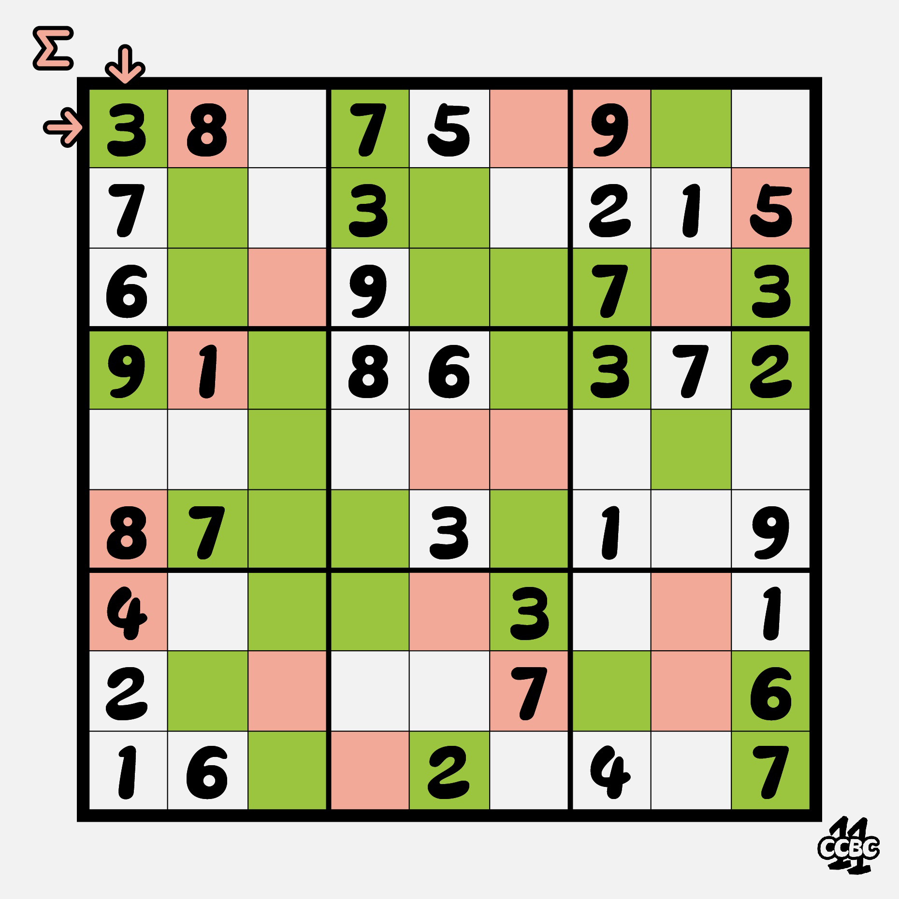
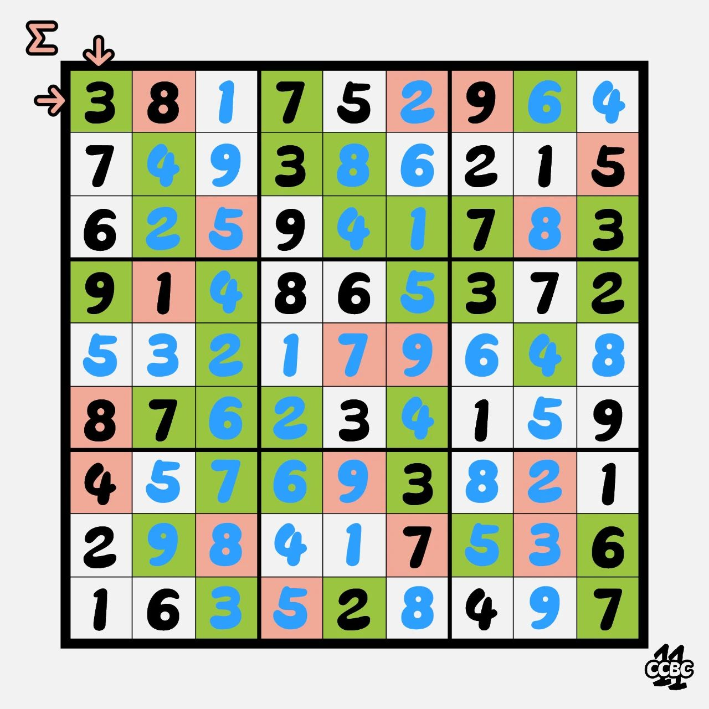

# #1 - CCBC 11

## 题面

这是今天《西西比西日报》每日数独栏目上剪下来的一小块。你不禁在想，这为什么会和案情相关？

## 答案

`CONFLUXES`

## 解析

首先完成数独：

左上角符号提示了求和操作，即对每行、列的红色格子分别求和，得出的数字转换成提示单词：LIME PRIME / SEMAPHORE，意为绿黄色、质数、旗语。根据提示找出黄绿色质数格子的位置，得出答案：CONFLUXES。

## 提示

### 1. 关于左上角符号的含义

首先完成数独，然后对每行、列的红色部分分别求和

### 2. 关于最后一步

两个单词提示了需要看的数字，一个单词提示了如何把这些数字转换成答案

## 中间答案

| 提交 | 回复 | 附加信息 |
| --- | --- | --- |
| SEMAPHORE | 你解出了第一步（的一部分）。加油！ |  |
| LIMEPRIME | 你解出了第一步（的一部分）。加油！ |  |

## 本地附件

- [answer1.jpg](../../../assets/archive.cipherpuzzles.com/ccbc11/images/answer/answer1.jpg)
- [5361c32d09fb4b3bb4cbcde24ffd9cd3.jpg](../../../assets/archive.cipherpuzzles.com/ccbc11/images/problems/5361c32d09fb4b3bb4cbcde24ffd9cd3.jpg)

来源：[https://archive.cipherpuzzles.com/ccbc11/problems/1.yaml](https://archive.cipherpuzzles.com/ccbc11/problems/1.yaml)
