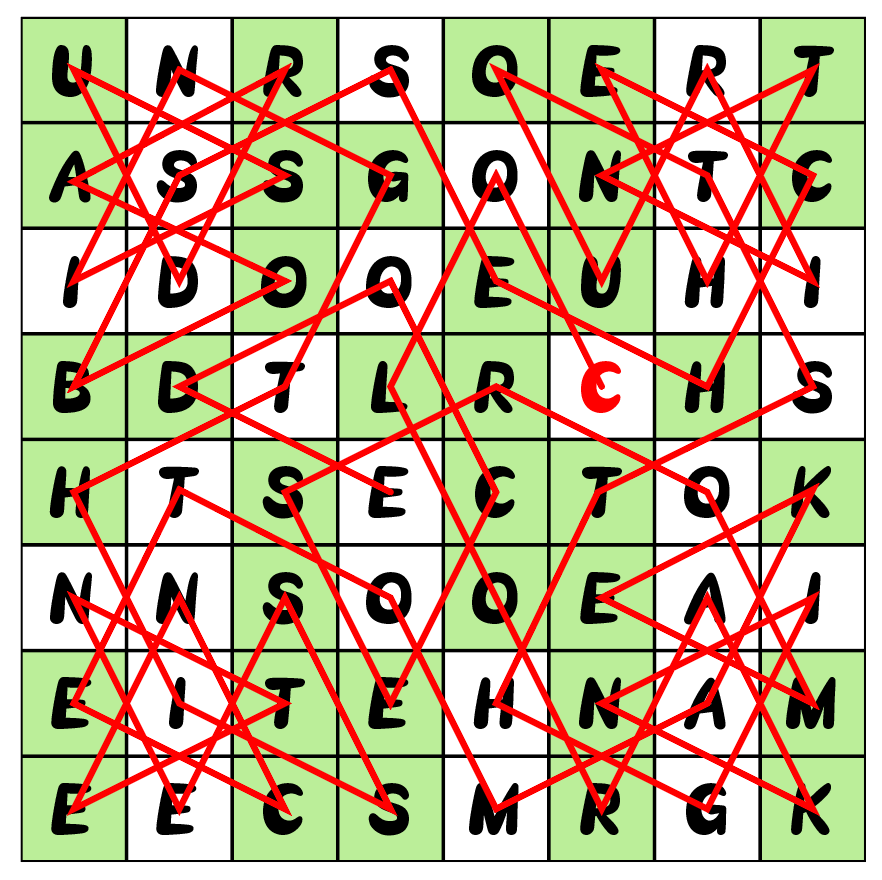

# #10 - CCBC 11

## 题面

这是一张神秘的小纸条，上面画着许多格子……

<table id="grid10_1">
  <tbody>
    <tr><td>U</td><td>N</td><td>R</td><td>S</td><td>O</td><td>E</td><td>R</td><td>T</td></tr>
    <tr><td>A</td><td>S</td><td>S</td><td>G</td><td>O</td><td>N</td><td>T</td><td>C</td></tr>
    <tr><td>I</td><td>D</td><td>O</td><td>O</td><td>E</td><td>U</td><td>H</td><td>I</td></tr>
    <tr><td>B</td><td>D</td><td>T</td><td>L</td><td>R</td><td>C</td><td>H</td><td>S</td></tr>
    <tr><td>H</td><td>T</td><td>S</td><td>E</td><td>C</td><td>T</td><td>O</td><td>K</td></tr>
    <tr><td>N</td><td>N</td><td>S</td><td>O</td><td>O</td><td>E</td><td>A</td><td>I</td></tr>
    <tr><td>E</td><td>I</td><td>T</td><td>E</td><td>H</td><td>N</td><td>A</td><td>M</td></tr>
    <tr><td>E</td><td>E</td><td>C</td><td>S</td><td>M</td><td>R</td><td>G</td><td>K</td></tr>
  </tbody>
</table>

<table id="grid10_2">
  <tbody>
    <tr style="height: 32px"><td class="s0">A</td><td class="s0">K</td><td class="s0">B</td><td class="s0">O</td><td class="s0">A</td><td class="s0">N</td><td class="s0">A</td><td class="s0">E</td><td class="s0">E</td><td class="s0">C</td><td class="s0">C</td><td class="s0">E</td><td class="s0">D</td><td class="s0">C</td><td class="s0">H</td><td class="s0">E</td></tr>
    <tr style="height: 32px"><td class="s0">C</td><td class="s0">O</td><td class="s0">E</td><td class="s0">O</td><td class="s0">E</td><td class="s0">O</td><td class="s0">D</td><td class="s0">N</td><td class="s0">K</td><td class="s0">N</td><td class="s0">E</td><td class="s0">G</td><td class="s0">G</td><td class="s0">E</td><td class="s0">T</td><td class="s0">H</td></tr>
    <tr style="height: 32px"><td class="s0">I</td><td class="s0">S</td><td class="s0">L</td><td class="s0">S</td><td class="s0">M</td><td class="s0">R</td><td class="s0">I</td><td class="s0">S</td><td class="s0">N</td><td class="s0">S</td><td class="s0">H</td><td class="s0">N</td><td class="s0">H</td><td class="s0">O</td><td class="s0"></td><td class="s0">M</td></tr>
    <tr style="height: 32px"><td class="s0">S</td><td class="s0">S</td><td class="s0">O</td><td class="s0">U</td><td class="s0">R</td><td class="s0"></td><td class="s0">R</td><td class="s0"></td><td class="s0">U</td><td class="s0">T</td><td class="s0">I</td><td class="s0">O</td><td class="s0">T</td><td class="s0">T</td><td class="s0"></td><td class="s0">S</td></tr>
    <tr style="height: 32px"><td class="s0"></td><td class="s0">T</td><td class="s0"></td><td class="s0"></td><td class="s0">R</td><td class="s0"></td><td class="s0">T</td><td class="s0"></td><td class="s0"></td><td class="s0"></td><td class="s0">I</td><td class="s0"></td><td class="s0"></td><td class="s0"></td><td class="s0"></td><td class="s0"></td></tr>
    <tr style="height: 32px"><td class="s2"></td><td class="s2"></td><td class="s3"></td><td class="s3"></td><td class="s3"></td><td class="s4"></td><td class="s2"></td><td class="s4"></td><td class="s3"></td><td class="s3"></td><td class="s2"></td><td class="s2"></td><td class="s2"></td><td class="s3"></td><td class="s4">&#39;</td><td class="s2"></td></tr>
    <tr style="height: 32px"><td class="s4"></td><td class="s2"></td><td class="s3"></td><td class="s3"></td><td class="s2"></td><td class="s4"></td><td class="s2"></td><td class="s3"></td><td class="s4"></td><td class="s3"></td><td class="s2"></td><td class="s3"></td><td class="s4"></td><td class="s3"></td><td class="s3"></td><td class="s3"></td></tr>
    <tr style="height: 32px"><td class="s2"></td><td class="s2"></td><td class="s3"></td><td class="s3"></td><td class="s3"></td><td class="s3"></td><td class="s2"></td><td class="s4"></td><td class="s3"></td><td class="s3"></td><td class="s2"></td><td class="s2"></td><td class="s3"></td><td class="s4"></td><td class="s2"></td><td class="s3"></td></tr>
    <tr style="height: 32px"><td class="s2"></td><td class="s3"></td><td class="s4"></td><td class="s3"></td><td class="s2"></td><td class="s2"></td><td class="s3"></td><td class="s3"></td><td class="s2"></td><td class="s3"></td><td class="s3"></td><td class="s4"></td><td class="s2"></td><td class="s2"></td><td class="s4"></td><td class="s2"></td></tr>
    <tr style="height: 32px"><td class="s2"></td><td class="s3"></td><td class="s3"></td><td class="s4"></td><td class="s3"></td><td class="s2"></td><td class="s3"></td><td class="s3"></td><td class="s3"></td><td class="s4"></td><td class="s3"></td><td class="s2"></td><td class="s3"></td><td class="s2"></td><td class="s4"></td><td class="s4"></td></tr>
  </tbody>
</table>

## 答案

`FLAGFALL`

## 解析

首先观察题中右表，将上方的字母填到下面的格子中，尝试拼凑成一句完整的英文句子：

COLOR A KNIGHT'S TOUR IN THE CHESSBOARD USING THIS SENTENCE TO MAKE MORSE CODE

（用这句话在棋盘中为骑士周游路线着色，形成摩斯电码）。

在原题左表中按照解出的句子为路径，将右图的颜色填入其中，填入后将每一行的填色格子按照摩斯电码的方式读取，可得答案：**FLAGFALL**。

## 提示

### 1. 关于首先要做的事

用右侧上方的字母填到下面的格子里，形成一句完整的英文句子。

## 本地附件

- [answer10.png](../../../assets/archive.cipherpuzzles.com/ccbc11/images/answer/answer10.png)

来源：[https://archive.cipherpuzzles.com/ccbc11/problems/10.yaml](https://archive.cipherpuzzles.com/ccbc11/problems/10.yaml)
