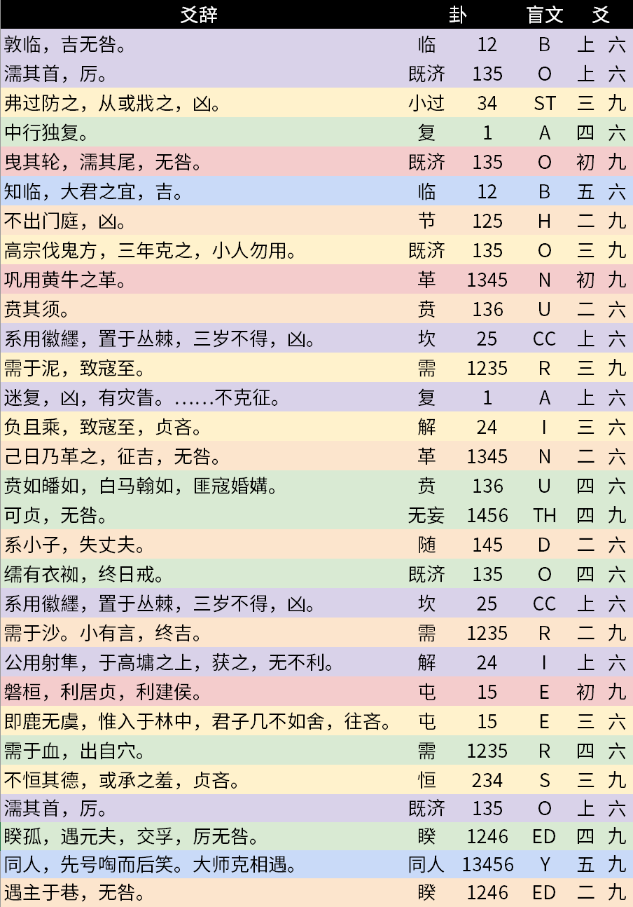

# #12 - CCBC 11

## 题面

这是本地有名的算命大师周瞎子最近一段时间的占卜记录。据说这些神秘的记录原本分为六个部分，但一名粗心的警员把它们混杂在了一起…………

敦临，吉无咎。  
濡其首，厉。  
弗过防之，从或戕之，凶。   
中行独复。  
曳其轮，濡其尾，无咎。   
知临，大君之宜，吉。   
不出门庭，凶。   
高宗伐鬼方，三年克之，小人勿用。  
巩用黄牛之革。   
贲其须。  
系用徽纆，置于丛棘，三岁不得，凶。  
需于泥，致寇至。   
迷复，凶，有灾眚。用行师，终有大败，以其国君，凶；至于十年，不克征。   
负且乘，致寇至，贞吝。  
己日乃革之，征吉，无咎。  
贲如皤如，白马翰如，匪寇婚媾。  
可贞，无咎。   
系小子，失丈夫。  
𦈡有衣袽，终日戒。  
系用徽纆，置于丛棘，三岁不得，凶。  
需于沙。小有言，终吉。  
公用射隼，于高墉之上，获之，无不利。  
磐桓，利居贞，利建侯。   
即鹿无虞，惟入于林中，君子几不如舍，往吝。   
需于血，出自穴。  
不恒其德，或承之羞，贞吝。  
濡其首，厉。  
睽孤，遇元夫，交孚，厉无咎。  
同人，先号啕而后笑。大师克相遇。  
遇主于巷，无咎。   

__ __ __   
__ __ __ __ __ _____   
_____ __ __ __ __ __  
__ __ _____ __ __ _____   
__ __  
__ __ _____ __ _____ __ __  

<b>
__ __ __&nbsp;&nbsp;&nbsp;__ __ __ __ __ __ __ __ __
</b>

## 答案

`THE DECAMERON`

## 解析

通过搜索可知，题中文字出自《周易》中六十四卦的爻(yáo)辞，而六十四卦的卦图由下至上对应了六位二进制（阳爻—为1，阴爻- -为0）。

将转换后的六位二进制转换为盲文（英语扩展版，部分盲文对应多个字母），再通过爻辞的分类进行分组带入题中的空线中，得出的结果是：ONE HUNDRED STORIES AUTHORED BY BOCCACCIO（作者为薄伽丘的一百个故事）。

该书书名既为本题答案：**THE DECAMERON**（《十日谈》）。

## 提示

### 1. “分为六个部分”怎么分？

这些爻辞的来源有明显的1-6编号

### 2. 我已经大概理解怎么做了，但是有一些翻译不出来？

这些对应的是双字母，可以查阅英语扩展版

### 3. 嗯，我查到来源并且分好组了，之后怎么做？

六十四卦是六位二进制（注意六爻正确的阅读顺序）。再将其对应盲文。

## 本地附件

- [answer12.png](../../../assets/archive.cipherpuzzles.com/ccbc11/images/answer/answer12.png)

来源：[https://archive.cipherpuzzles.com/ccbc11/problems/12.yaml](https://archive.cipherpuzzles.com/ccbc11/problems/12.yaml)
