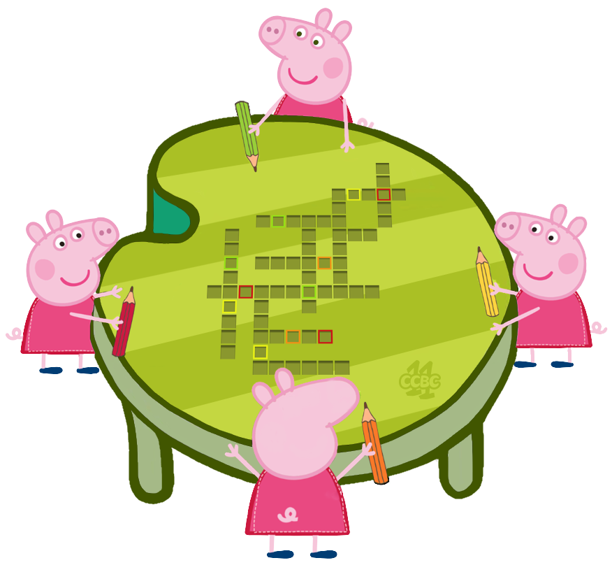
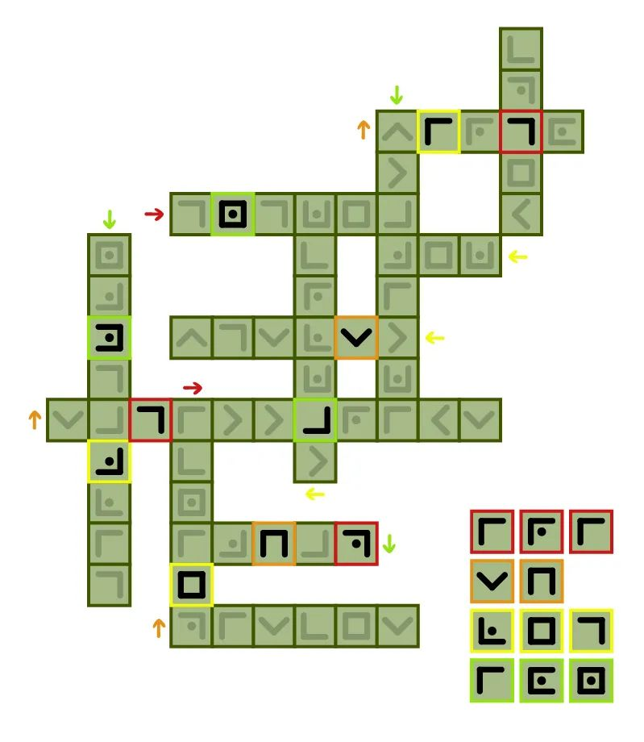

# #14 - CCBC 11

## 题面

刊登在报纸上的填词游戏，只是不知道这四只小猪为什么都抬着头，在仰望星空研究自己的运势吗？

## 答案

`IRISH LEGION`

## 解析

> “本届比赛的最佳人气题，大家都爱佩奇”

根据题设提示可知要填入的词是十二星座的名称，且填入的是猪笔符号而不是字母。每只小猪需要填三个词，但是填的符号都是从各自方向看去的。也就是说同样的猪笔符号在不同的猪眼里代表不同的字母。

填好后分别提取有颜色外框的字母，红色框里的字母要从红笔小猪的方向去读，以此类推提取红橙黄绿四个方向，最终按顺序得出答案为：**IRISH LEGION**。

## 提示

### 1. 要填的是什么词？

一个系列的十二个东西，再联系题目描述想一想？

### 2. 填的时候有矛盾？

填的是猪笔符号而不是字母。每只小猪需要填三个词，但是填的符号都是从各自方向看去的。也就是说同样的猪笔符号在不同的猪眼里代表不同的字母。

### 3. 如何提取？

填好后分别提取有颜色外框的字母，红色框里的字母要从红笔小猪的方向去读，以此类推提取红橙黄绿四个方向。

## 本地附件

- [answer14.jpg](../../../assets/archive.cipherpuzzles.com/ccbc11/images/answer/answer14.jpg)
- [29eaca5cdec5486d84b7e7312e49e3ae.png](../../../assets/archive.cipherpuzzles.com/ccbc11/images/problems/29eaca5cdec5486d84b7e7312e49e3ae.png)

来源：[https://archive.cipherpuzzles.com/ccbc11/problems/14.yaml](https://archive.cipherpuzzles.com/ccbc11/problems/14.yaml)
