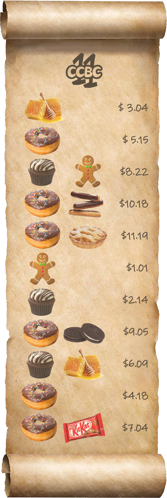

# #17 - CCBC 11

## 题面

这是一张来自安德罗伊德酒吧的陈旧的酒水单，奇怪的是上面却只点甜品，真是个甜食爱好者啊。

## 答案

`CALLS BARMAN`

## 解析

将右侧价格按照整数部分进行排序，得出：

1. 01

2. 14

3. 04

4. 18

5. 15

6. 09

7. 04

8. 22

9. 05

10. 18

11. 19

整数部分是1-11的数列，提取小数部分的数字转换为字母为：Android Ver，即安卓系统版本名之意（题设中的安德罗伊德同样提示了Android）。

搜索可知图中的甜食均为安卓系统的版本名，根据对应关系将甜食替换为数字再转换为英文即可得出答案：**CALLS BARMAN**。

## 提示

### 1. 关于第一步要做的事

将价格按照整数部分排序，再看小数部分的提示。

## 中间答案

| 提交 | 回复 | 附加信息 |
| --- | --- | --- |
| android vers | 思路正确，请继续。 |  |

## 本地附件

- [192d6011320d4d52a7de59d7a349a312.png](../../../assets/archive.cipherpuzzles.com/ccbc11/images/problems/192d6011320d4d52a7de59d7a349a312.png)

来源：[https://archive.cipherpuzzles.com/ccbc11/problems/17.yaml](https://archive.cipherpuzzles.com/ccbc11/problems/17.yaml)
