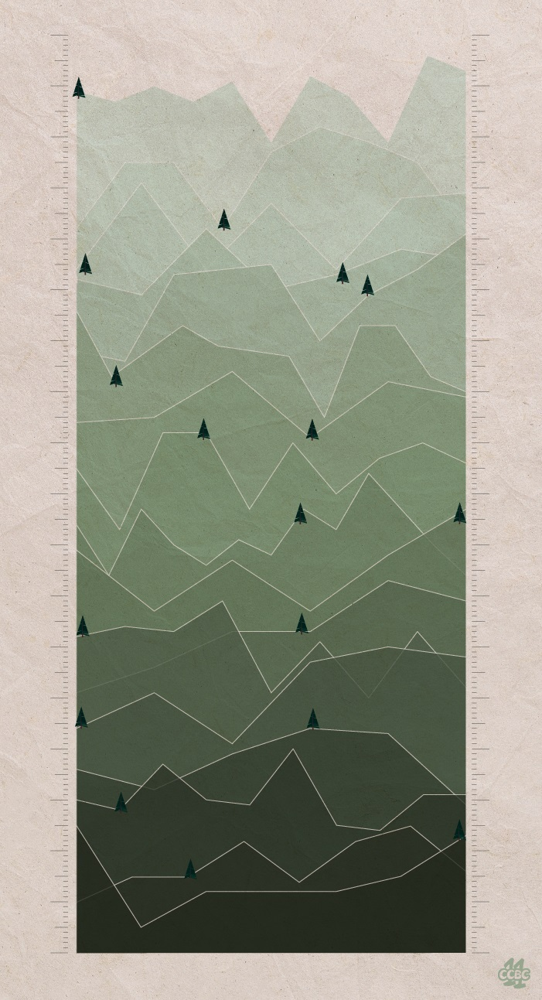

# #19 - CCBC 11

## 题面

这是一张户外活动的宣传海报，这么多山，该去哪里玩好呢？

## 答案

`WHITE MOUNTAIN PEAK`

## 解析

将两侧刻度连线确定每个折线的拐点位置，每个拐点都代表了一个字母，根据点的相对位置来进行凯撒密码的转化（每条折线的凯撒位数不同），可得出十七座著名的山峰名字。

如最下一条折线，按照相对位置可写作21,1,8,8,11,19，经过凯撒位移后得出的结果是Yellow（黄山）。

> 十七座山峰的名字分别是：黄山(Yellow)、乔戈里峰(Chhogori)、冰岛草帽山(Kirkjufell)、洛子峰(Lhotse)、厄尔布鲁士峰(Elbrus)、勃朗峰(Montblanc)、卓奥友峰(Chooyu)、马卡鲁峰(Makalu)、干城章嘉峰(Kangchenjunga)、马特洪峰(Matterhorn)、德纳里山(Denali)、文森峰(Vinsonmassif)、查亚峰(Carstensz)、奥林匹斯山(Olympus)、珠穆朗玛峰(Everest)、安纳普尔纳峰(Annapurna)、乞力马扎罗山(Kilimanjaro)。

由下至上依次提取松树位置的字母，可得最终答案：**WHITE MOUNTAIN PEAK**。

## 提示

### 1. 如果你不知道第一步该做什么

需要根据刻度精准画线，确定每个折线的拐点位置，十七条折线是十七座著名的山峰名字

### 2. 如果你只会第一条折线而不会后面的……

做法都是一样的，只是每条线的0点不同

## 本地附件

- [0db9368e675e4e159979e8c7cf7c9183.jpg](../../../assets/archive.cipherpuzzles.com/ccbc11/images/problems/0db9368e675e4e159979e8c7cf7c9183.jpg)

来源：[https://archive.cipherpuzzles.com/ccbc11/problems/19.yaml](https://archive.cipherpuzzles.com/ccbc11/problems/19.yaml)
