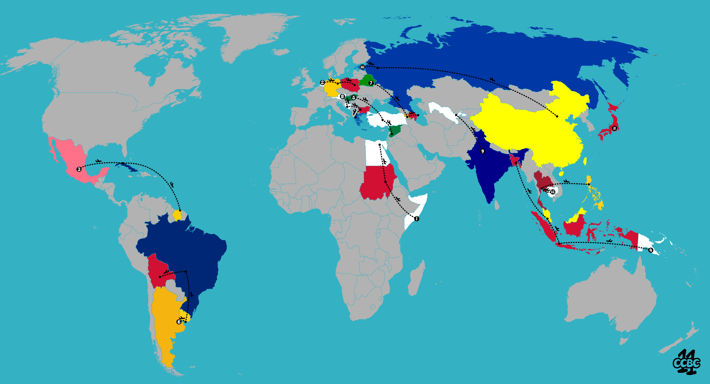

# #2 - CCBC 11

## 题面

这是今天的航班的信息吧，怎么也混在卷宗里了？

## 答案

`WORLD VOYAGER`

## 解析

每个国家的颜色代表了该国旗中出现的一种颜色，观察这种颜色在国旗上的形状可获得对应的点与线。

如第1条航线：由白色索马里出发，途径红色苏丹，抵达白色埃及，根据三个国家的国旗颜色提取点或线：

（索马里：蓝底色，中间一颗白色五角星，提取点；苏丹：红白黑三色横线，左侧有绿色三角形，提取线；埃及：红白黑三色横线，中间黄色鹰，提取线）

`*--` 即为W，对照摩斯电码可得：**WORLD VOYAGER**。

## 提示

### 1. 需要注意的关键点

每个国家的颜色代表了该国旗中出现的一种颜色，观察这种颜色在国旗上的形状

### 2. 最后一步

摩尔斯

## 本地附件

- [cdc4acd4958e40a3a93728dba6542353.jpg](../../../assets/archive.cipherpuzzles.com/ccbc11/images/problems/cdc4acd4958e40a3a93728dba6542353.jpg)

来源：[https://archive.cipherpuzzles.com/ccbc11/problems/2.yaml](https://archive.cipherpuzzles.com/ccbc11/problems/2.yaml)
