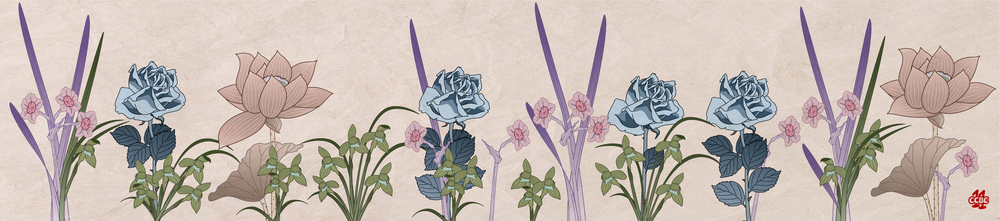

# #20 - CCBC 11

## 题面

一幅美丽的花卉画作，据说出自名家之手。你闭上眼贪婪地嗅了嗅，仿佛能透过画卷闻到迷人的香气。

## 答案

`POWER ECONOMY`

## 解析

图中的花均为第五套人民币背面的花卉，花卉的颜色也按照对应的面值进行了修改，分别对应了1元-兰花，5元-水仙，10元-月季，20元-荷花。将所有花卉的金额按分组相加，得出的数字转换为字母即可。最终答案是：**POWER ECONOMY**。

## 提示

### 1. 关于首先要做的事

打开你的钱包吧（当然，这个时代你的钱包里可能会没有这种东西）

## 本地附件

- [e3b7c5566a364989a28bc82f5b7d85b6.jpg](../../../assets/archive.cipherpuzzles.com/ccbc11/images/problems/e3b7c5566a364989a28bc82f5b7d85b6.jpg)

来源：[https://archive.cipherpuzzles.com/ccbc11/problems/20.yaml](https://archive.cipherpuzzles.com/ccbc11/problems/20.yaml)
