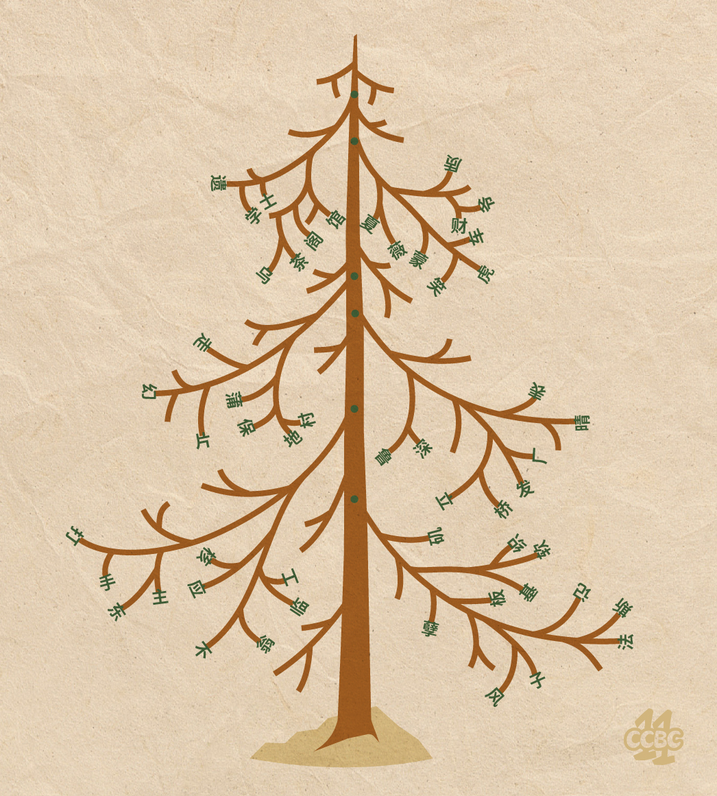
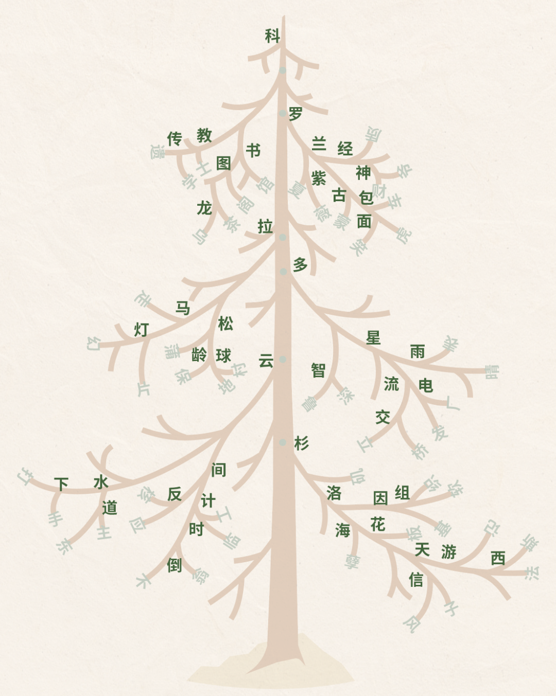

# #23 - CCBC 11

## 题面

一张植物明信片被人胡乱写上了字，这是一棵什么树来着？

__ __ __ __ __ __ __ __ &nbsp;&nbsp; __ __ __ __ __ __ 

## 答案

`COLORADO SPRUCE`

## 解析

组词题，需要补充三字词语的中间的字。按照树杈结构逐层向上组词：

取树干的字：科罗拉多云杉。根据题目下方单词长度的提示进行翻译，答案是：**COLORADO SPRUCE**。

## 提示

### 1. 关于第一步要做的事

尝试着组词试试看

## 中间答案

| 提交 | 回复 | 附加信息 |
| --- | --- | --- |
| 科罗拉多云杉 | 请提交英文答案（8 6）。 |  |

## 本地附件

- [answer23.png](../../../assets/archive.cipherpuzzles.com/ccbc11/images/answer/answer23.png)
- [233812cb75f6497f9689c9ddf5ccfeaa.jpg](../../../assets/archive.cipherpuzzles.com/ccbc11/images/problems/233812cb75f6497f9689c9ddf5ccfeaa.jpg)

来源：[https://archive.cipherpuzzles.com/ccbc11/problems/23.yaml](https://archive.cipherpuzzles.com/ccbc11/problems/23.yaml)
