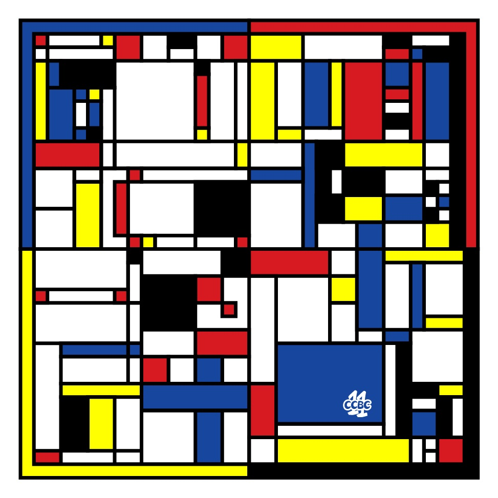
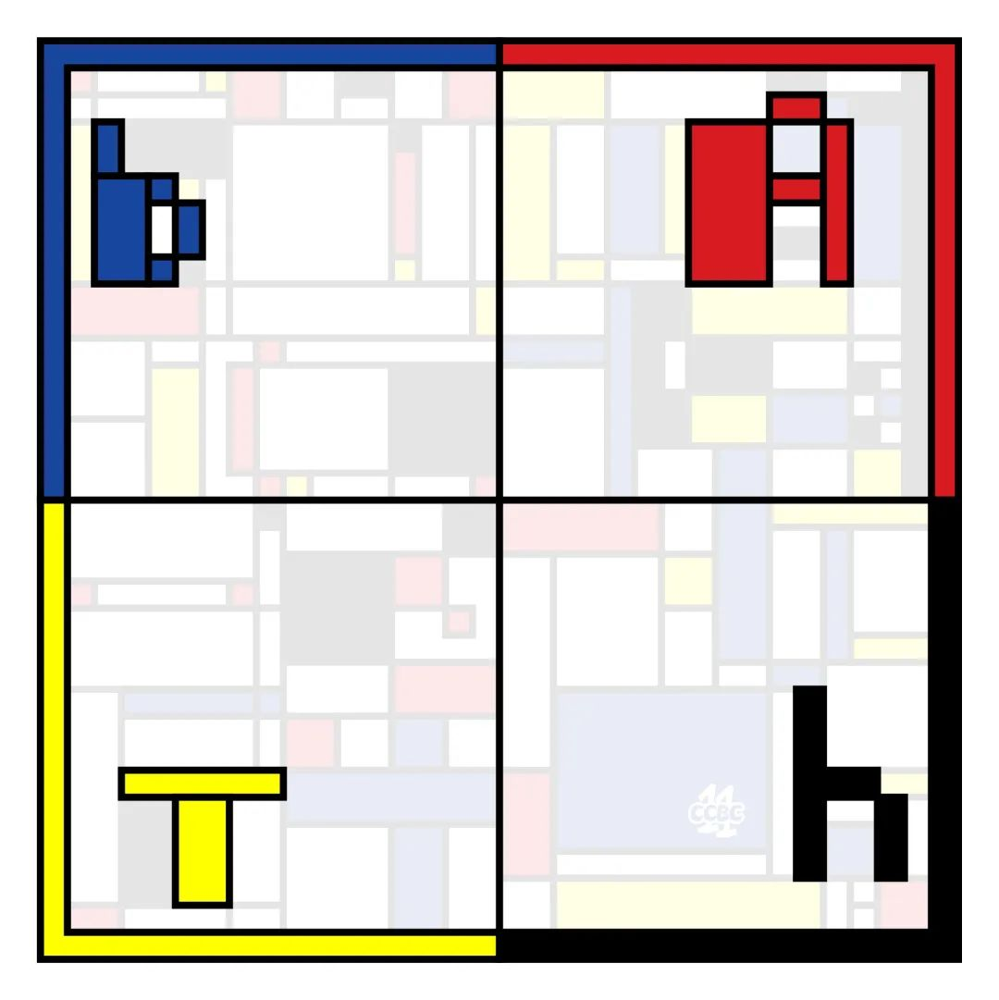

# #28 - CCBC 11

## 题面

据说是名家绘制的画作，规则的线条中透露出简单的秩序感。

## 答案

`BATH`

## 解析

看穿后非常简单的象形题目，按照边角的颜色将图四等分，再提取边角对应的颜色即可。

答案是**BATH**。

## 提示

### 1. 思路

将画作四等分，然后注意颜色

## 本地附件

- [answer28.jpg](../../../assets/archive.cipherpuzzles.com/ccbc11/images/answer/answer28.jpg)
- [7265ae266d554752ac5e950161dc4588.jpg](../../../assets/archive.cipherpuzzles.com/ccbc11/images/problems/7265ae266d554752ac5e950161dc4588.jpg)

来源：[https://archive.cipherpuzzles.com/ccbc11/problems/28.yaml](https://archive.cipherpuzzles.com/ccbc11/problems/28.yaml)
