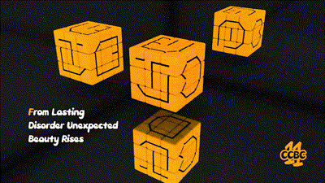

# #6 - CCBC 11

## 题面

这是一个魔方，上面刻着奇怪的图案和一行神秘的小字：

From lasting disorder unexpected beauty rises...

## 答案

`BUDGED`

## 解析

根据题设提示提取首字母`FLDUBR`，这是魔方的旋转公式，如图所示进行还原，再按照首字母对应的面提取字母即得答案：**BUDGED**。

## 提示

### 1. 关于魔方的复原

剧情中的英文首字母提示了复原的方法

### 2. 关于答案的字母顺序

剧情中的英文首字母提示了提取字母的顺序

## 本地附件

- [answer6.gif](../../../assets/archive.cipherpuzzles.com/ccbc11/images/answer/answer6.gif)
- [c40d6be5e64d472aaacf3c5d03d37cef.jpg](../../../assets/archive.cipherpuzzles.com/ccbc11/images/problems/c40d6be5e64d472aaacf3c5d03d37cef.jpg)

来源：[https://archive.cipherpuzzles.com/ccbc11/problems/6.yaml](https://archive.cipherpuzzles.com/ccbc11/problems/6.yaml)
