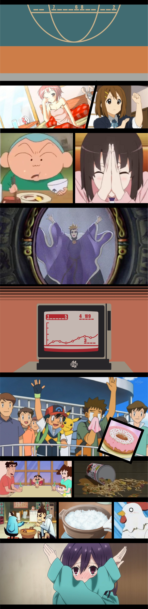

# #7 - CCBC 11

## 题面

一堆可爱的图片，似乎是某个mv影片的草图。

## 答案

`CUTTERHEAD`

## 解析

根据图示的关键词甜甜圈，珍珠奶茶，方便面，火锅，米饭……联想到歌曲《卡路里》的歌词，搜索其MV，对照MV画面，找到图中数字处的字母，并按数字排序，得：**CUTTERHEAD**。

## 提示

### 1. 关于画面的识别

这些图画并不需要了解出处，重要的是歌词

### 2. 关于字母的提取

观察MV找找和给出的图中比较相似的地方

## 本地附件

- [03f61aa10a994a0abf5b84771e29c248.jpg](../../../assets/archive.cipherpuzzles.com/ccbc11/images/problems/03f61aa10a994a0abf5b84771e29c248.jpg)

来源：[https://archive.cipherpuzzles.com/ccbc11/problems/7.yaml](https://archive.cipherpuzzles.com/ccbc11/problems/7.yaml)
