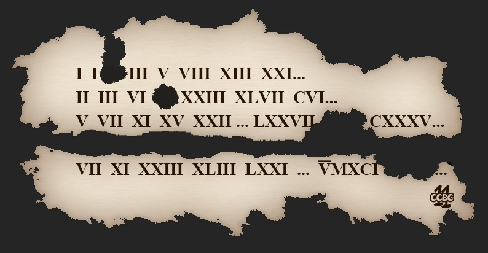

# #8 - CCBC 11

## 题面

一张数学草稿纸，可惜某些地方洒上了墨水，原来的数字难以辨认。

## 答案

`MIX`

## 解析

将图中罗马数字转换为阿拉伯数字，寻找数列规律。（可使用在线找规律工具进行搜索：oeis.org）补出缺失的数字依次为：2，11，101，？，10007，再次找规律为1009，转化成罗马数字即MIX。

## 提示

### 1. 关于序列的识别

OEIS是你的好朋友

## 本地附件

- [f30e58ac2b4244d39991683d038e42d9.jpg](../../../assets/archive.cipherpuzzles.com/ccbc11/images/problems/f30e58ac2b4244d39991683d038e42d9.jpg)

来源：[https://archive.cipherpuzzles.com/ccbc11/problems/8.yaml](https://archive.cipherpuzzles.com/ccbc11/problems/8.yaml)
