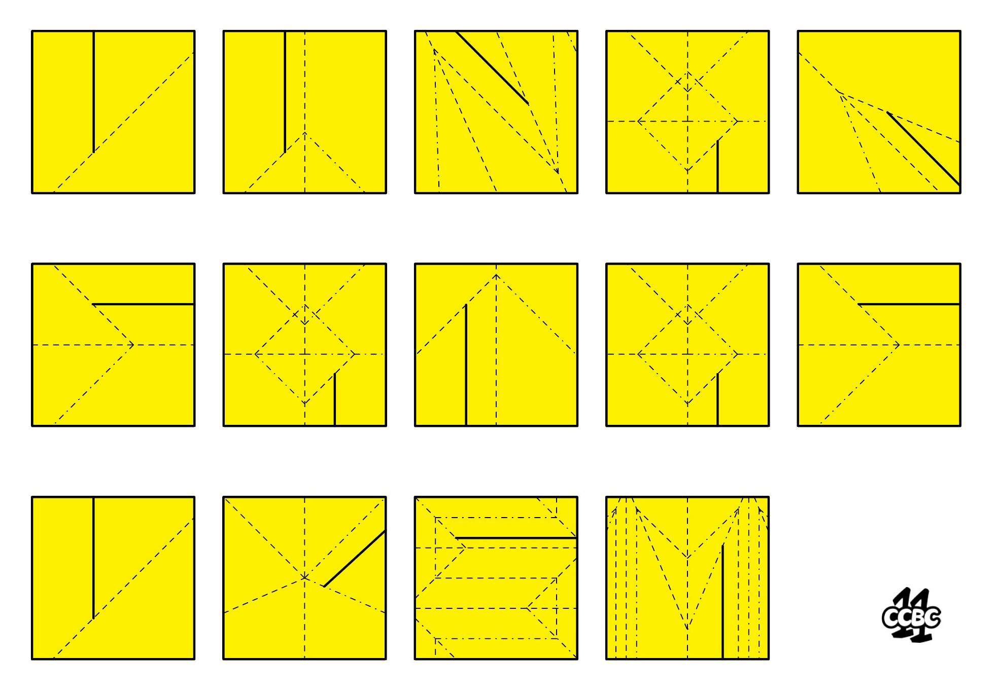

# #9 - CCBC 11

## 题面

好像是给小孩子的手工材料，竟然也能隐藏惊天动地的秘密？

## 答案

`LUNAR CATACLYSM`

## 解析

图中每个方块为一个折纸，实线为裁切线，虚线为谷折，虚点线为峰折，按图依次进行折纸并沿裁切线剪开，即可得出结果：**LUNAR CATACLYSM**

## 提示

### 1. 关于这是啥玩意？

“手工材料”。从一张方形的纸出发，能做什么样的手工呢……？

### 2. 关于不同线条的区别

分别代表了谷折、峰折和裁切

## 本地附件

- [fcb7aca11a664211ba7ca31cf3e69bf9.jpg](../../../assets/archive.cipherpuzzles.com/ccbc11/images/problems/fcb7aca11a664211ba7ca31cf3e69bf9.jpg)

来源：[https://archive.cipherpuzzles.com/ccbc11/problems/9.yaml](https://archive.cipherpuzzles.com/ccbc11/problems/9.yaml)
