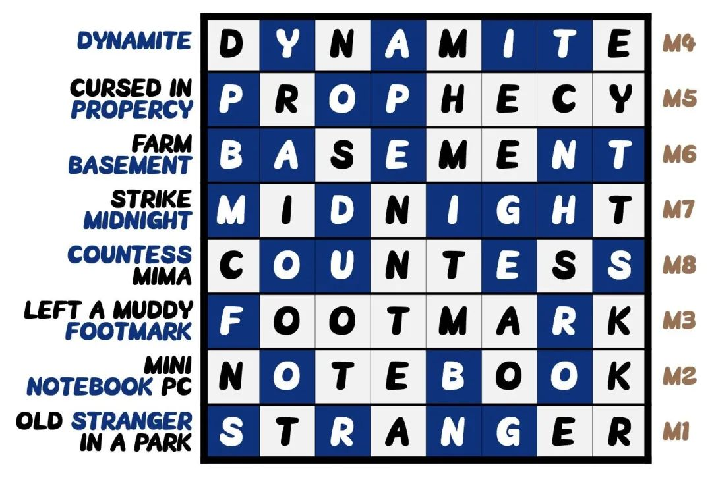

# #结案 - CCBC 11

## 题面

局长严肃地说：“这次案件事关重大，全局<b>从上到下</b>都很关心。<b>随着线索越来越多</b>，案情也越来越明朗，但是身为执法人员，我们不能滥用职权，一定要在调查清楚证据确凿的时候才能逮捕嫌犯。等你找到确认嫌犯的证据，我立刻签署逮捕令！我在此替西西比西市先谢谢你了！”

“<b>babababababababa</b>……”你诧异地环顾四周，周围的警察都站了起来为你鼓掌，他们的掌声让你充满了信心，你一定很快就能找到决定性证据！

## 解题后内容

<button class="btn btn-primary btn-lg" onclick="goLink('fe')">前往结局→</button>

## 答案

`FOUND BOMB PROTOTYPES IN HIS GARAGE`

## 解析

观察所有Meta的答案，发现都含有8个字母的关键词，而案情分析板恰好呈现8*8的分布。

Meta对应的小题数量分别是4、5、6、7、8、9、10、11，恰好构成数列，结案剧情中也提示了“从上到下，越来越多”，以此作为排序依据，由上至下依次将关键词填入Shikaku网格里：

按照题号顺序依次提取1-30个字母最后最终答案：**FOUND BOMB PROTOTYPES IN HIS GARAGE**。

## 提示

### 1. 没有理解案情总结，五大要素不知从何做起怎么办

在网上搜索shikaku，并且在小题描述里搜索隐藏剧情的关键词“神秘的”

### 2. babababababababa 到底是什么意思？

提示需要填入案情分析板的8个8字母单词。

### 3. 越来越多 是什么意思？

每个 meta 用到的小题题数不等，以此对 meta 答案进行排序。

## 本地附件

- [answerfm.jpg](../../../assets/archive.cipherpuzzles.com/ccbc11/images/answer/answerfm.jpg)

来源：[https://archive.cipherpuzzles.com/ccbc11/problems/fm.yaml](https://archive.cipherpuzzles.com/ccbc11/problems/fm.yaml)
