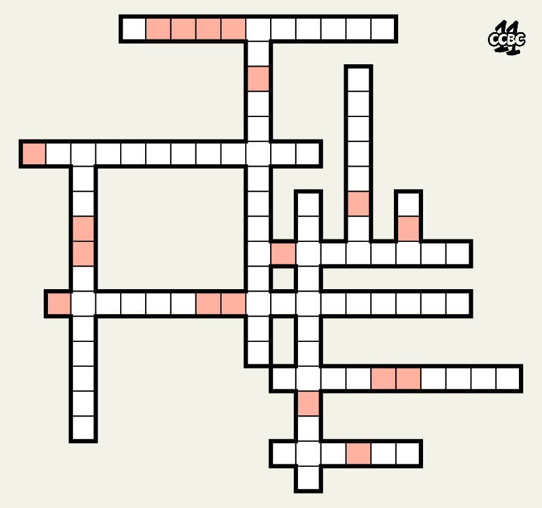
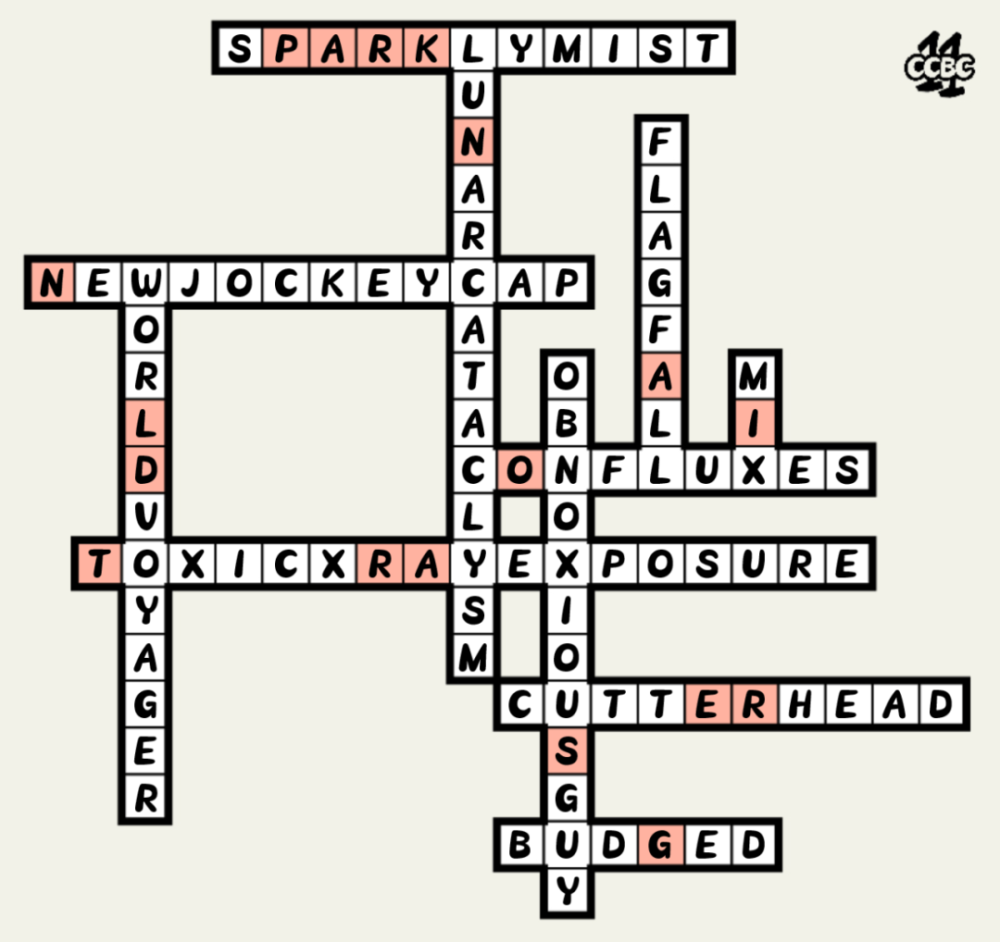

# #1-11小结 - CCBC 11

## 题面

“这是我对犯罪分子行踪的一点想法，结合之前的线索或许会带来突破。”某位警员这样说道。

## 解题后内容

“听说公园附近有人目击了一个举止可疑的老头，说不定跟这次案情相关……”   
“干得好！”局长拍了拍你的肩膀，“我这就派人去公园调查！”

## 答案

`OLD STRANGER IN A PARK`

## 解析

将第一轮全部小题的答案填入表格中，按按照题号顺序取红色格子中的字母可得：**OLD STRANGER IN A PARK**。

## 提示

### 1. 关于提取顺序

按题号顺序

## 本地附件

- [answerm1.png](../../../assets/archive.cipherpuzzles.com/ccbc11/images/answer/answerm1.png)
- [22983bb239ec414391c2a11cfe05f37d.jpg](../../../assets/archive.cipherpuzzles.com/ccbc11/images/problems/22983bb239ec414391c2a11cfe05f37d.jpg)

来源：[https://archive.cipherpuzzles.com/ccbc11/problems/m1.yaml](https://archive.cipherpuzzles.com/ccbc11/problems/m1.yaml)
