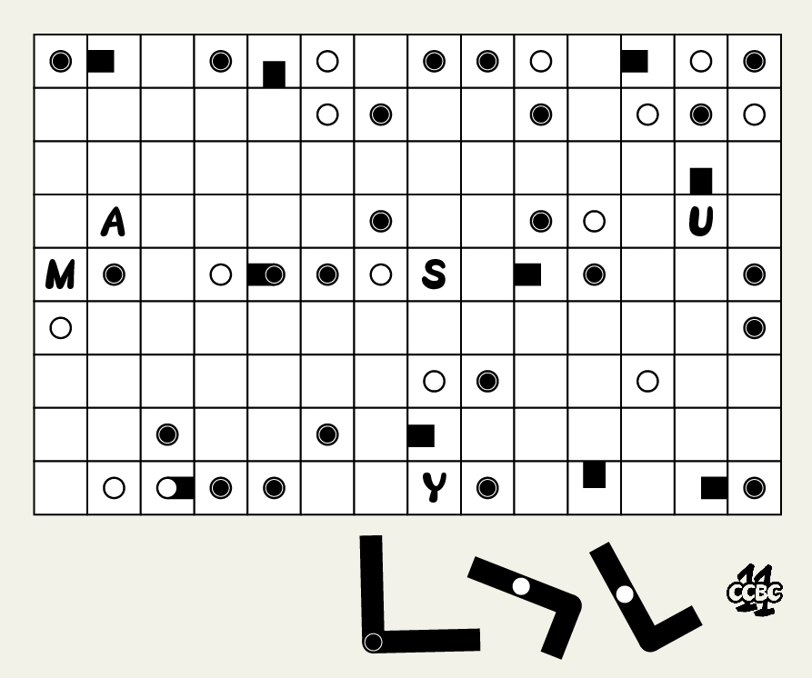
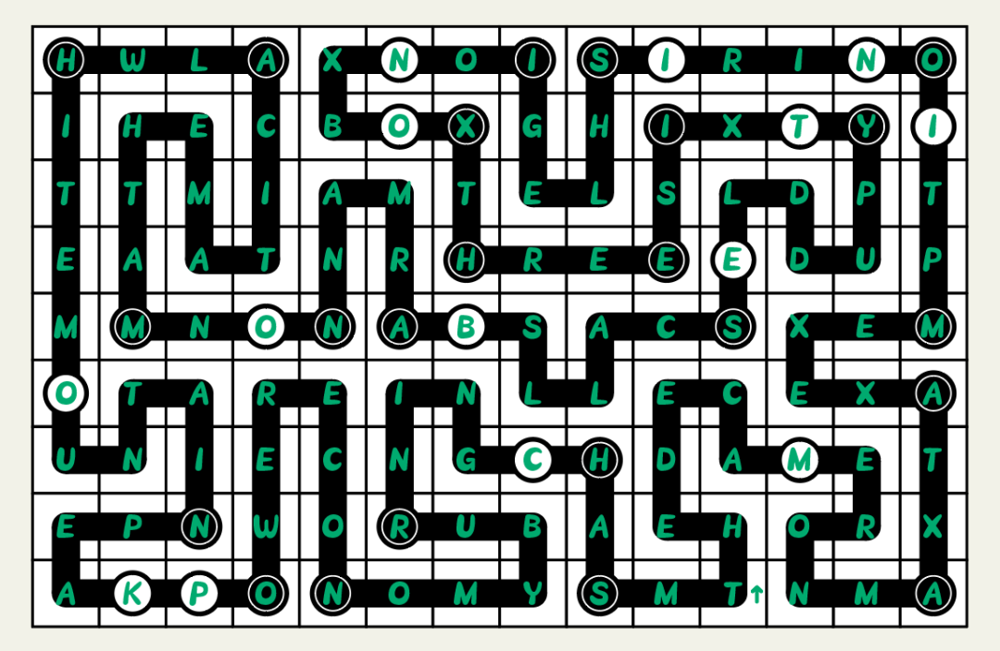

# #12-21小结 - CCBC 11

## 题面

一位技术组的警员：“我们找到了犯罪分子不慎遗留在网上的一张图片。这或许会跟他的计划有关？”

## 解题后内容

“我们找到了嫌疑犯留下的一部笔记本电脑。”

“知道了，立刻把它送到鉴识科请专家分析！”

离罪犯落网似乎又近了一步……

## 答案

`MINI NOTEBOOK PC`

## 解析

这是一道Masyu谜题，题目中保留的字母和右下角的图案对此进行了提示（关于Masyu规则请自行搜索）。（所有小题答案的字母数恰好等于格子的数量，在完全填满的规则下有唯一解）

先将Masyu谜题解完，再将所有12-21题的答案沿线的路径填入（原题中的短线标记了答案的起始位置）。取白珍珠的字母，可得：**MINI NOTEBOOK PC**。

## 提示

### 1. 这是什么？

这是一道masyu题，请搜索规则。

### 2. 解不唯一？

隐藏规则是路线遍历所有格子。

### 3. 关于提取

白圈字母

## 本地附件

- [answerm2.png](../../../assets/archive.cipherpuzzles.com/ccbc11/images/answer/answerm2.png)
- [e2f8a4455245461c98db5807d007b154.jpg](../../../assets/archive.cipherpuzzles.com/ccbc11/images/problems/e2f8a4455245461c98db5807d007b154.jpg)

来源：[https://archive.cipherpuzzles.com/ccbc11/problems/m2.yaml](https://archive.cipherpuzzles.com/ccbc11/problems/m2.yaml)
