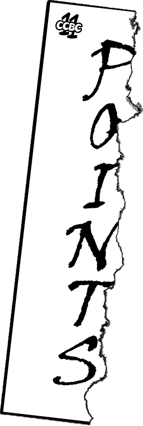
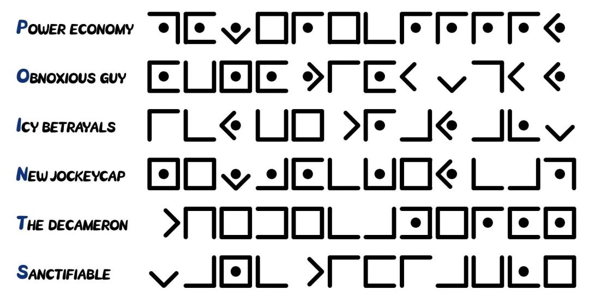
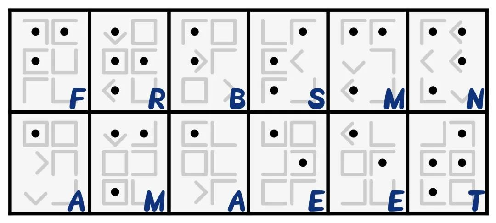

# #作案地点 - CCBC 11

## 题面

“罪犯决定了犯罪地点后就撕毁了证据……“四角分区的特工很遗憾地说，“我们只找到了这张碎片。这张纸还上分析出了一些猪的毛发，也许犯罪地点在一个有猪圈的地方？”

## 解题后内容

你找到了一张西西比农庄（也就是本次博览会举办场所）的地图，准备用来请大家品尝各种红酒的地窖处被人用红笔画了个圈，还加了不少小字注释，看来就是犯人准备下手的场所了。

## 答案

`FARM BASEMENT`

## 解析

根据分组取得小题答案：

**OBNOXIOUS GUY**

**NEW JOCKEYCAP**

**THE DECAMERON**

**POWER ECONOMY**

**ICY BETRAYALS**

**SANCTIFIABLE**

POINTS既代表了**小题的首字母**，也代表了**猪圈中间的点**。六道题的答案均为12个字母，**按照POINTS的顺序**将字母翻译成猪圈密码可得：

按图所示进行分组：

再按照**盲文**进行解答，**竖向**提取字母（也可看做横向提取字母后再进行2栏的栅栏变换），可得答案：**FARM BASEMENT**。

## 提示

### 1. 关于points的含义

既代表了小题的首字母，也代表了猪圈中间的点。先把字母翻译成猪圈看看？

## 本地附件

- [answerm6-1.jpg](../../../assets/archive.cipherpuzzles.com/ccbc11/images/answer/answerm6-1.jpg)
- [answerm6-2.jpg](../../../assets/archive.cipherpuzzles.com/ccbc11/images/answer/answerm6-2.jpg)
- [bb42c88855844e9baa80f831fd243833.png](../../../assets/archive.cipherpuzzles.com/ccbc11/images/problems/bb42c88855844e9baa80f831fd243833.png)

来源：[https://archive.cipherpuzzles.com/ccbc11/problems/m6.yaml](https://archive.cipherpuzzles.com/ccbc11/problems/m6.yaml)
