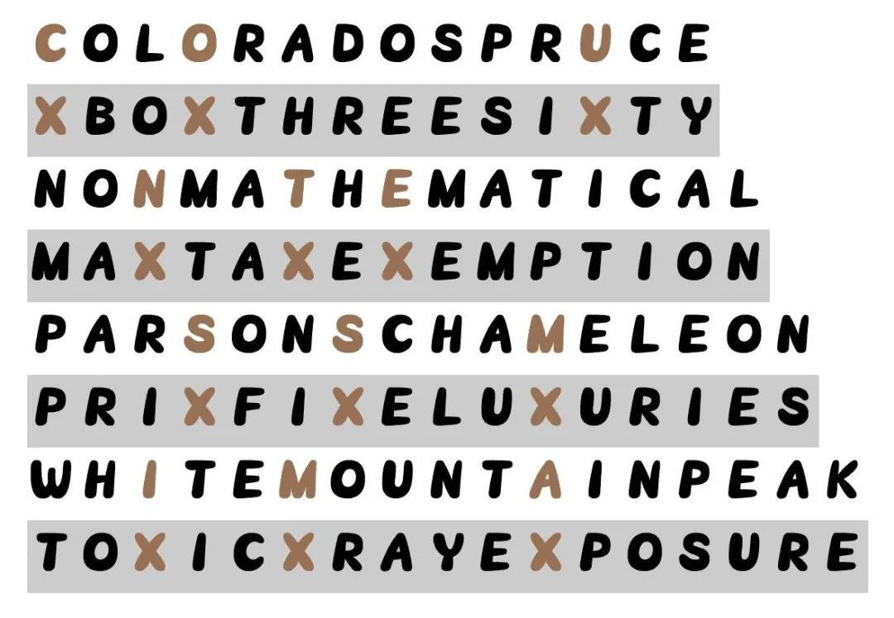

# #作案目标 - CCBC 11

## 题面

四角分区得到的一些线索中提到了一个叫做“目标X”的人物，可能就是这次的作案目标…………

## 解题后内容

这次破坏的对象就是密码伯爵夫人！密码家族在本市有着深厚的根基和人望，不知道是得罪了什么人呢？

警察局长表情凝重：“我这就派人去保护夫人！你继续追查犯人！”

## 答案

`COUNTESS MIMA`

## 解析

根据分组取得小题答案：

**TOXIC XRAY EXPOSURE**

**MAXTAX EXEMPTION**

**XBOX THREE SIXTY**

**NONMATHEMATICAL**

**WHITE MOUNTAIN PEAK**

**PRIX FIXE LUXURIES**

**COLORADO SPRUCE**

**PARSONS CHAMELEON**

根据题目中的提示，发现一半的答案中含有**三个X**。按照单词长度两两分组，取字母X位置的对应的字母：

可得答案：**COUNTESS MIMA**。

## 提示

### 1. 关于要注意的关键点

每两个小题的答案长度两两对应

## 本地附件

- [answerm8.jpg](../../../assets/archive.cipherpuzzles.com/ccbc11/images/answer/answerm8.jpg)

来源：[https://archive.cipherpuzzles.com/ccbc11/problems/m8.yaml](https://archive.cipherpuzzles.com/ccbc11/problems/m8.yaml)
