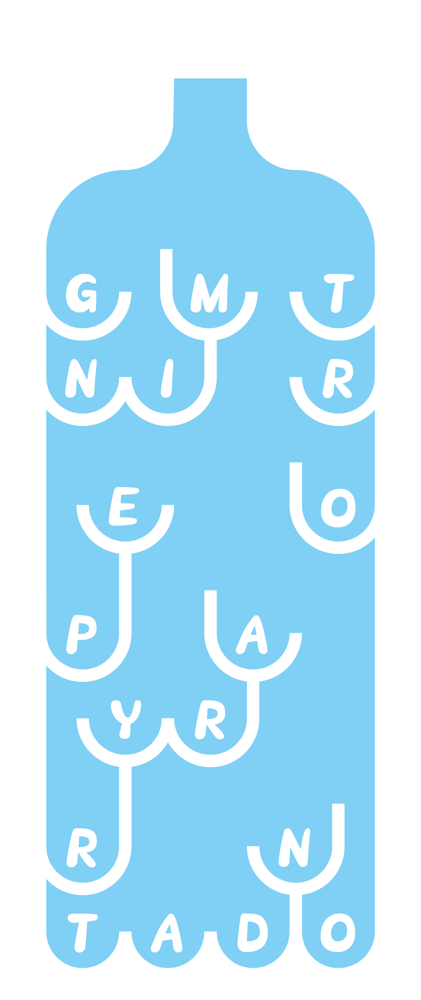
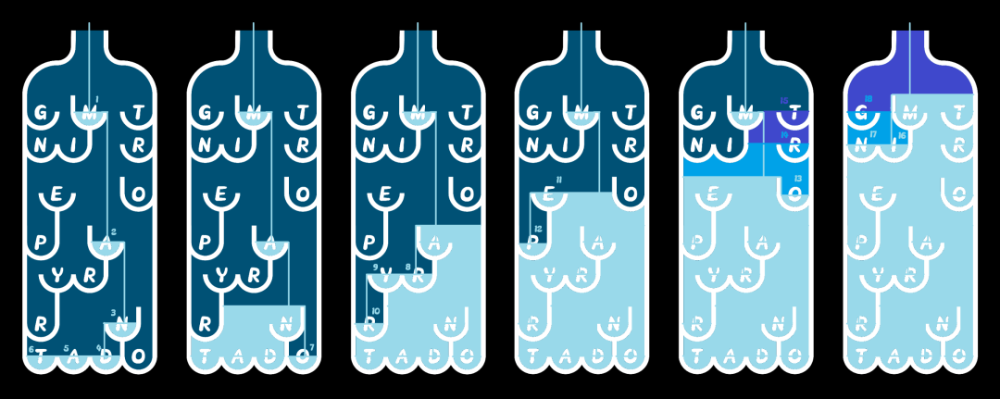

# #1709 奇怪的瓶子 - CCBC 12

## 题面

这个瓶子拥有着不符合时代的审美和工艺。

## 答案

`MANDATORY REPORTING`

## 解析

从瓶口向瓶中倒水，水流会根据隔断的形状逐个填满字母对应的凹槽直至灌满瓶子。按凹槽灌满顺序读取字母可得答案：MANDATORY REPORTING。

[动态答案参考](https://www.bilibili.com/video/BV1zB4y1L7wE)

## 提示

### 1. 我毫无头绪

从瓶口向瓶中倒水，水流会根据隔断的形状逐个填满字母对应的凹槽直至灌满瓶子。按凹槽灌满顺序读取字母可得答案（第一个字母是M，最后一个字母是G）

## 本地附件

- [3b14829320784666a3b2403c12c179ca.webp](../../../assets/archive.cipherpuzzles.com/ccbc12/images/a/3b14829320784666a3b2403c12c179ca.webp)
- [a-1709.png](../../../assets/archive.cipherpuzzles.com/ccbc12/images/answer/a-1709.png)

来源：[https://archive.cipherpuzzles.com/ccbc12/problems/a/p1709.yaml](https://archive.cipherpuzzles.com/ccbc12/problems/a/p1709.yaml)
