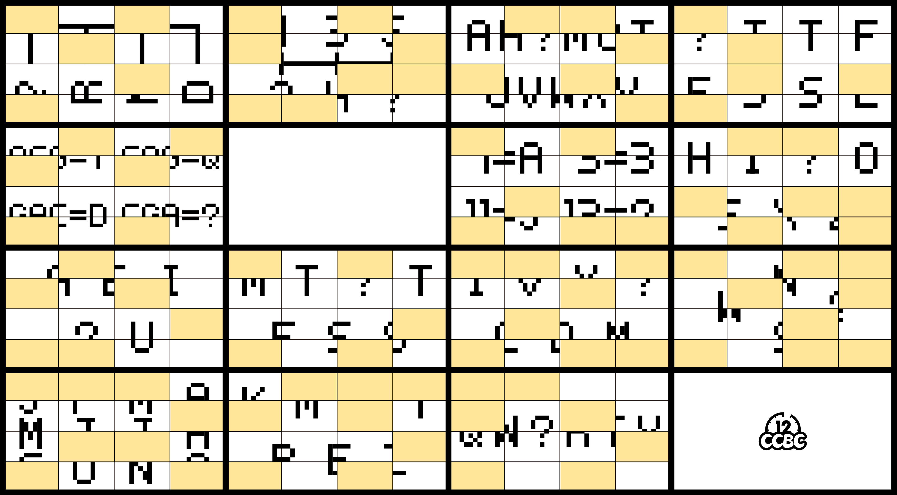
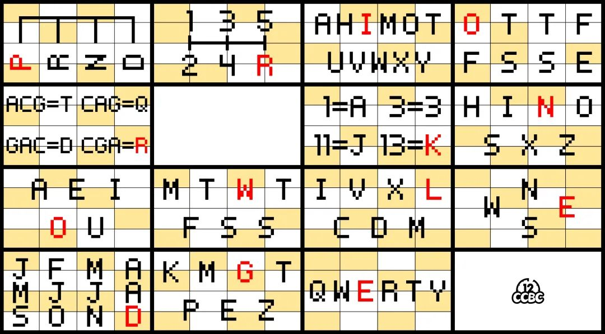

# #1727 丢失的瓷砖 - CCBC 12

## 题面

墙上整齐地镶嵌了许多带图案的瓷砖，其中的一些瓷砖不翼而飞了，漏出了下面泛黄的墙面。

## 答案

`PRIOR KNOWLEDGE`

## 解析

这是由14道迷你HIDDLE题组成的谜题，其中每一道题的答案都是一个字母，分别是：

P（自动挡的档位）

R（手动挡的档位）

I（所有左右对称的字母）

O（英语数字1~8的首字母）

R（RNA转氨基酸的单字母简称）

K（扑克牌里代表1~13的牌）

N（所有中心旋转对称的字母）

O（元音字母）

W（周一到周七的英文首字母）

L（罗马数字使用的字母）

E（表示东西南北的字母）

D（一月到十二月的英文首字母）

G（表示10^(3n)的英文前缀）

E（QWERTY键盘）

按逐行从左到右的顺序得到答案：**PRIOR KNOWLEDGE**。

## 提示

### 1. 我毫无头绪

逐行按从左到右的顺序，有内容的的格子分别对应：自动挡、手动挡、轴对称、数字、氨基酸、扑克、中心对称、元音字母、星期、罗马数字、方向、月份、文件大小、键盘。每个格子的答案都是一个字母。

## 本地附件

- [ee01588251584335aa62630e8b21ebed.webp](../../../assets/archive.cipherpuzzles.com/ccbc12/images/a/ee01588251584335aa62630e8b21ebed.webp)
- [a-1727.jpg](../../../assets/archive.cipherpuzzles.com/ccbc12/images/answer/a-1727.jpg)

来源：[https://archive.cipherpuzzles.com/ccbc12/problems/a/p1727.yaml](https://archive.cipherpuzzles.com/ccbc12/problems/a/p1727.yaml)
