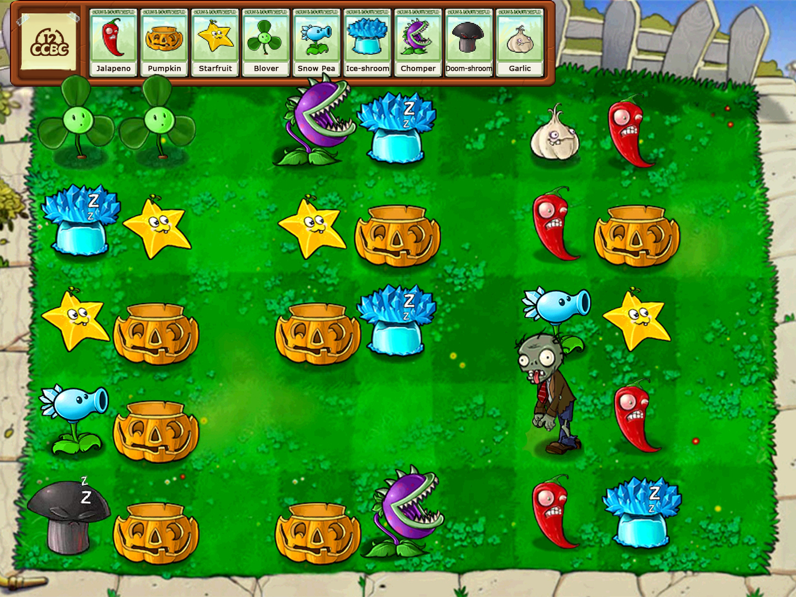
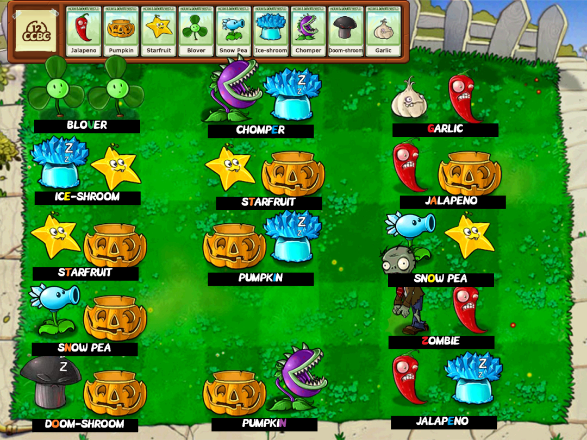

# #1760 植物大战僵尸 - CCBC 12

## 题面

“三叶草和火爆辣椒可不是什么有耐心的植物，你是怎么让他们乖乖留在草坪上的？”向日葵一脸惊讶的看着你。

“因为！”你正想大声解释，却害怕打扰正在熟睡的寒冰菇和毁灭菇，“他们必须在那里呆着（小声）”

## 答案

`VEGETATION ZONE`

## 解析

图中横向每两个单位代表一个字母，根据右侧植物在上方列表中的位置（同时也是植物颜色在彩虹色中的位置），取左侧单位英文名对应的字母，得到答案：**VEGETATION ZONE**。 

## 提示

### 1. 我毫无头绪

按逐行从左到右的顺序，每两个相邻元素为一组。根据右侧植物在植物栏中的顺序提取字母，比如如果左边是火爆辣椒右边是南瓜头，那就在jalapeno里取第二个字母（A）。

## 本地附件

- [7fcbc5f083fc453bb7bfc2d22040256f.webp](../../../assets/archive.cipherpuzzles.com/ccbc12/images/a/7fcbc5f083fc453bb7bfc2d22040256f.webp)
- [a-1760.png](../../../assets/archive.cipherpuzzles.com/ccbc12/images/answer/a-1760.png)

来源：[https://archive.cipherpuzzles.com/ccbc12/problems/a/p1760.yaml](https://archive.cipherpuzzles.com/ccbc12/problems/a/p1760.yaml)
