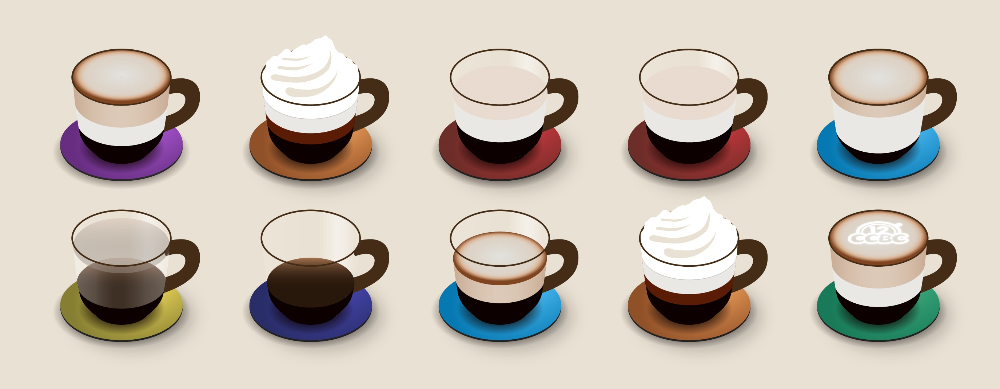

# #1780 咖啡店 - CCBC 12

## 题面

这些咖啡味道醇香，回味悠长。

## 答案

`COFFEE SHOP`

## 解析

按照每杯咖啡的不同成分推测出咖啡的种类，根据彩虹色提取种类的英文字母：

|咖啡种类|颜色|提取字母
|-------|----|-----
|卡布奇诺|紫色（7）|cappuc**C**ino
|摩卡|橙色（2）|m**O**cha
|白咖啡|红色（1）|**F**lat white
|白咖啡|红色（1）|**F**lat white
|拿铁|青色（5）|latt**E**
|美式|黄色（3）|am**E**ricano
|浓缩咖啡|蓝色（6）|espre**S**so
|玛奇朵|青色（5）|macc**H**iato
|摩卡|橙色（2）|m**O**cha
|卡布奇诺|绿色（4）|cap**P**uccino

可得答案：**COFFEE SHOP**。

## 提示

### 1. 我毫无头绪

不同种类的咖啡配方不同，根据咖啡杯内的成分猜测一下这些咖啡的种类吧（例如第一杯是cappuccino，第三杯是flat white，其他咖啡你可以在搜索引擎检索“咖啡配方”获得）。

### 2. 该如何提取

根据杯垫的颜色在彩虹中的顺序提取字母，例如蓝色杯垫就取第六个字母。

## 本地附件

- [1e2b17b0afa24aa2a4a0379dfa650a71.webp](../../../assets/archive.cipherpuzzles.com/ccbc12/images/a/1e2b17b0afa24aa2a4a0379dfa650a71.webp)

来源：[https://archive.cipherpuzzles.com/ccbc12/problems/a/p1780.yaml](https://archive.cipherpuzzles.com/ccbc12/problems/a/p1780.yaml)
