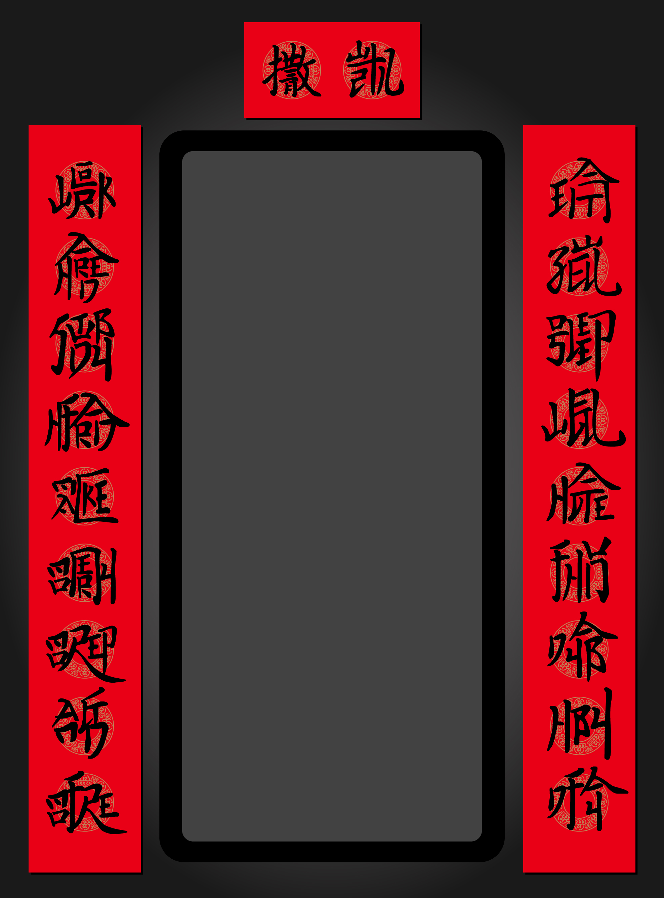
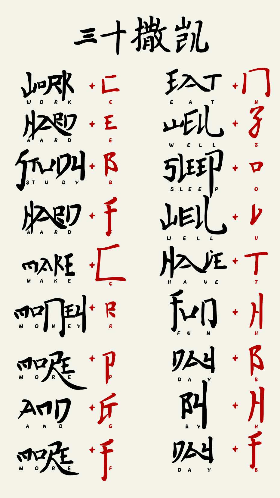

# #1796 春联 - CCBC 12

## 题面

看似普通的春联上却写着十分前卫的文字。

## 答案

`AMBIGUOUS PROSPECTS`

## 解析

春联的上下联都是由看上去像是汉字的英文字母组成，而且每个字都有一个多余的字母：

把多余的字母从上到下、从右到左排列得到NZOVTHBHF CEBFCRPGF。横批两个字分别是“凯+十”和“撒+三”，所以我们把之前得到的字母凯撒移位13位（也就是rot13）得到答案：**AMBIGUOUS PROSPECTS**。

## 提示

### 1. 我毫无头绪

除了横批之外，其他的字都不是由汉字组成的，而且每个字貌似还混进去了什么东西。上下联的原文可以在网上搜到（其中上联的第一个字是EAT）。

### 2. 该如何提取

春联的阅读顺序一般是从上到下、从右到左。横批的内容是“凯撒”+“十三”。最终答案是18个字母。

## 本地附件

- [2464381605b24f1cad680c5102c505a3.webp](../../../assets/archive.cipherpuzzles.com/ccbc12/images/a/2464381605b24f1cad680c5102c505a3.webp)
- [a-1796.png](../../../assets/archive.cipherpuzzles.com/ccbc12/images/answer/a-1796.png)

来源：[https://archive.cipherpuzzles.com/ccbc12/problems/a/p1796.yaml](https://archive.cipherpuzzles.com/ccbc12/problems/a/p1796.yaml)
