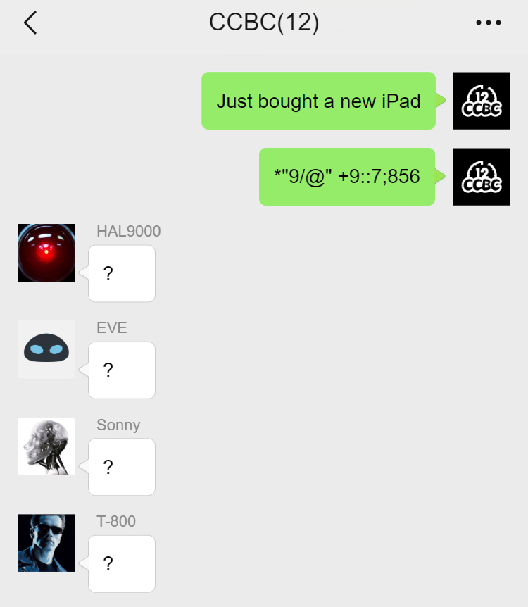
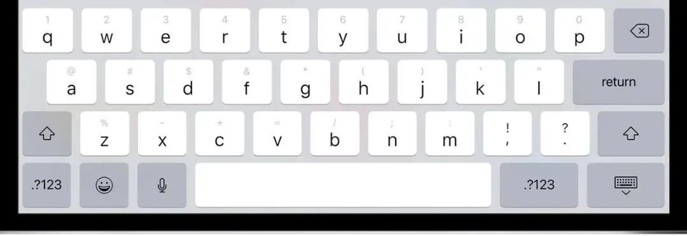

# #2024 微信截图 - CCBC 12

## 题面

一段似乎是网络上常见的微信聊天记录截图。

    
    
CCBC(12)

    
Just bought a new iPad

    
*"9/@" +9::7;856

    
HAL9000

    
?

    
EVE

    
?

    
Sonny

    
?

    
T-800

    
?

## 答案

`GLOBAL COMMUNITY`

## 解析

网上搜索iPad英文键盘，可以发现英文键盘上每个字母都对应一个符号：

把题目中的符号转换回字母得到答案：**GLOBAL COMMUNITY**。

## 提示

### 1. 我毫无头绪

既然是买了新iPad之后再打出来的字，那研究一下iPad默认（英文）键盘上有什么符号和字母的对应吧。

## 本地附件

- [ad22a83d8df7453e8b19ed3a421660e3.webp](../../../assets/archive.cipherpuzzles.com/ccbc12/images/a/ad22a83d8df7453e8b19ed3a421660e3.webp)
- [a-2024.jpg](../../../assets/archive.cipherpuzzles.com/ccbc12/images/answer/a-2024.jpg)

来源：[https://archive.cipherpuzzles.com/ccbc12/problems/a/p2024.yaml](https://archive.cipherpuzzles.com/ccbc12/problems/a/p2024.yaml)
