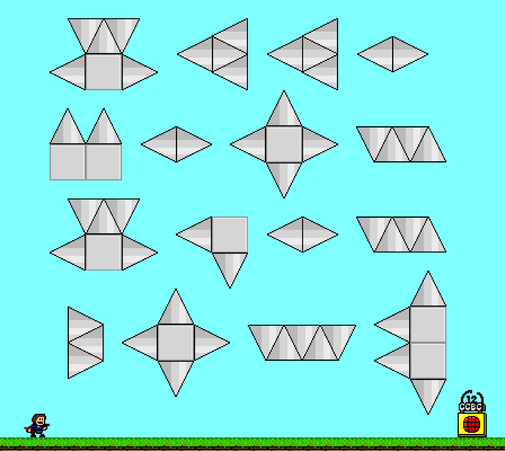
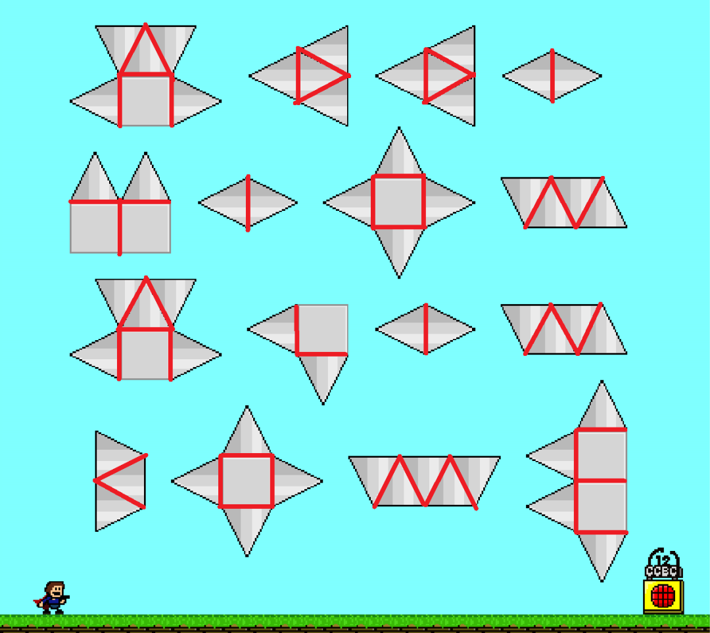

# #2085 I Wanna - CCBC 12

## 题面

名叫I Wanna的系列游戏，难度极高。

## 答案

`ADDITIONAL INCOME`

## 解析

去掉每一个图形最外圈的线条，取内部的分割线象形，得到答案：**ADDITIONAL INCOME**。

你也可以查看视频题解： https://www.bilibili.com/video/BV1xg411D7PT

## 提示

### 1. 我毫无头绪

把所有图形（三角形、正方形）之间的缝隙描一遍，看看都像些什么字母？

## 本地附件

- [54034e9da52242f49e1c9e5f0fb0cc65.webp](../../../assets/archive.cipherpuzzles.com/ccbc12/images/a/54034e9da52242f49e1c9e5f0fb0cc65.webp)
- [a-2085.png](../../../assets/archive.cipherpuzzles.com/ccbc12/images/answer/a-2085.png)

来源：[https://archive.cipherpuzzles.com/ccbc12/problems/a/p2085.yaml](https://archive.cipherpuzzles.com/ccbc12/problems/a/p2085.yaml)
