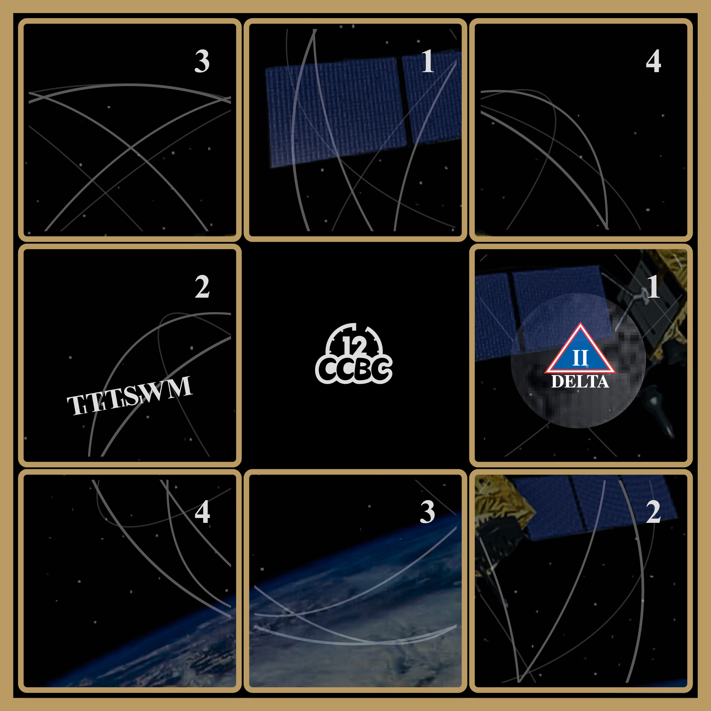
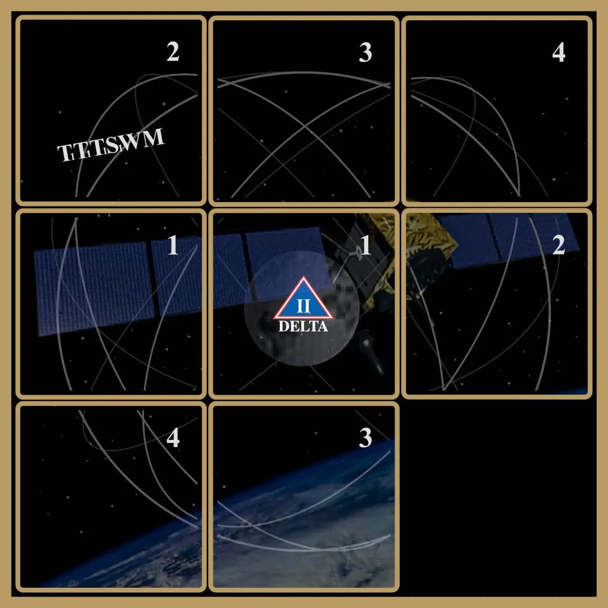
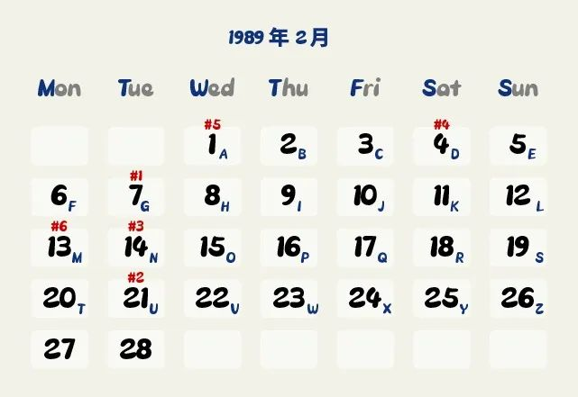

# #1989 破碎的海报 - CCBC 12

## 题面

1989年某本挂历上的海报，但是谁把海报撕碎了呢？

## 答案

`GUNDAM`

## 解析

观察图片，找到正确的残片顺序后通过华容道方式将图片还原，得到最优解顺序为“下右上左左上”，并可以根据所移动的六块残片得到六个数字132112。

结合题目1989年以及图中Logo提示，得知时间为1989年2月（首个Delta II卫星发射月份），
所以利用图片上的字母解日历密码（在日历上取这个月内第X个星期Y的日期数，其中T1=星期二，S1=星期六），得到：**GUNDAM**。

## 提示

### 1. 我毫无头绪

先滑动残片，用最短的步数（6步）把图片拼好吧。每一步滑动的残片上的数字之后会用。

### 2. 该如何提取

图片结合年份指代了某个月份。某一块残片上的六个字母结合第一步得到的六个数字是某种和日历有关的加密方式。

## 本地附件

- [b-1989-1.jpg](../../../assets/archive.cipherpuzzles.com/ccbc12/images/answer/b-1989-1.jpg)
- [b-1989-2.jpg](../../../assets/archive.cipherpuzzles.com/ccbc12/images/answer/b-1989-2.jpg)
- [372a75bdec5c447699b54ecf355f1e71.webp](../../../assets/archive.cipherpuzzles.com/ccbc12/images/b/372a75bdec5c447699b54ecf355f1e71.webp)

来源：[https://archive.cipherpuzzles.com/ccbc12/problems/b/p1989.yaml](https://archive.cipherpuzzles.com/ccbc12/problems/b/p1989.yaml)
