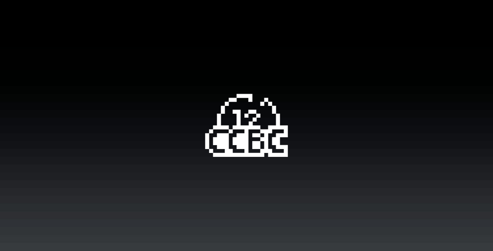
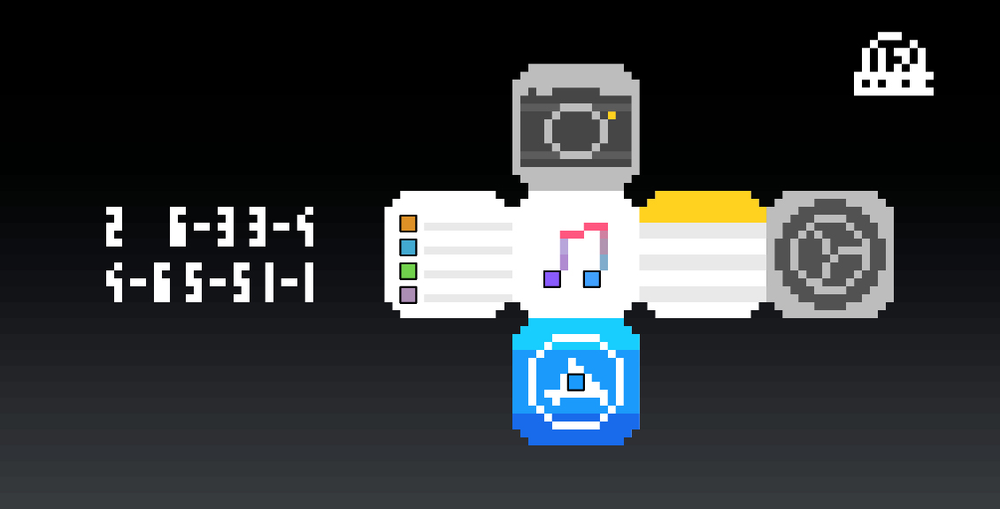
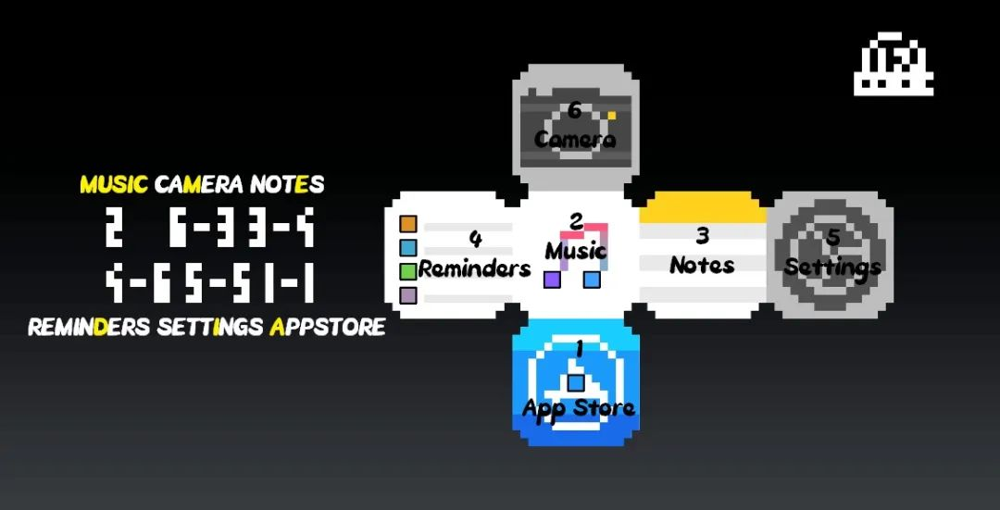

# #2016 幻灯片 - CCBC 12

## 题面

2016年某场发布会的幻灯片文件副本，只是图像质量有所压缩。

<div>
  
  
</div>

## 交互源码

### javascript

```javascript
(function (){
  const logo= document.getElementById("logo");
  const puzzle= document.getElementById("puzzle");
  logo.style.display = "block";
  puzzle.style.display = "none";
  logo.onclick = function(){
    logo.style.display = "none";
    puzzle.style.display = "block"
  }
  puzzle.onclick = function(){
    puzzle.style.display = "none";
    logo.style.display = "block"
  }
})();
```


## 答案

`MUSIC MEDIA`

## 解析

图中像素化的icon对应2016年期间ios9或ios10（秋季发布）系统中的原生应用图标（由上至下，由左至右）：Camera、Reminders、Music、Notes、Settings、App Store。

将六个图标视作一个骰子展开图，其中App Store、Music、Reminders上面的黑边方块提示这三面分别对应骰子的1、2、4点，所以他们的对面分别是6、5、3点。根据左侧数字取应用英文名全部或第x个字母，得到答案：**MUSIC MEDIA**。



## 提示

### 1. 我毫无头绪

可以点击鼠标左键查看下一张幻灯片，第二张幻灯片中的图标是2016年iOS系统（iOS9/10）中的原生应用图标。

### 2. 该如何提取

六个图标构成了一个六面骰的平面展开图，其中有三个图标已经标出对应几点了。左边数字中没有横线就取全名，有横线就根据横线后面的数字取字母。


## 本地附件

- [b-2016.jpg](../../../assets/archive.cipherpuzzles.com/ccbc12/images/answer/b-2016.jpg)
- [1603d42e8b4d42a7922fbe491b95405b.webp](../../../assets/archive.cipherpuzzles.com/ccbc12/images/b/1603d42e8b4d42a7922fbe491b95405b.webp)
- [6d9d3760ea8844988caadc6eab74c5e1.webp](../../../assets/archive.cipherpuzzles.com/ccbc12/images/b/6d9d3760ea8844988caadc6eab74c5e1.webp)

来源：[https://archive.cipherpuzzles.com/ccbc12/problems/b/p2016.yaml](https://archive.cipherpuzzles.com/ccbc12/problems/b/p2016.yaml)
