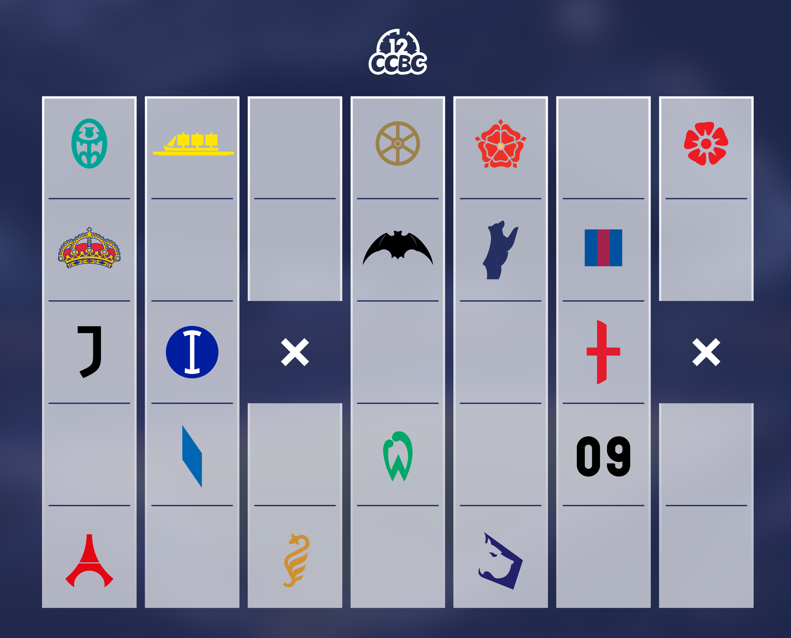
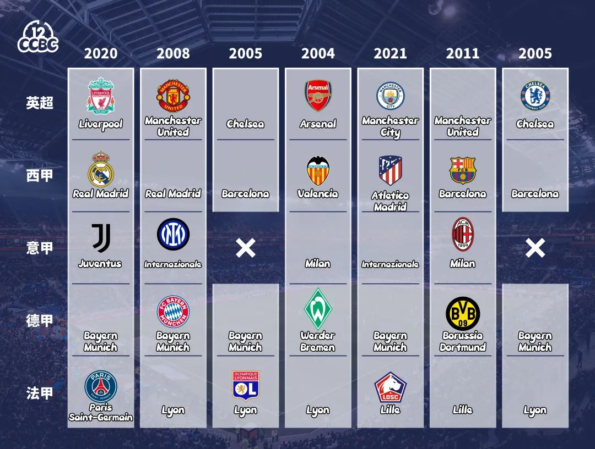

# #2058 徽章收纳盒 - CCBC 12

## 题面

哇，这些都是冠军的徽章吗，可是那两个叉是什么意思呢？

## 答案

`THE DUKE`

## 解析

观察可以发现，每一个图标是某个欧洲足球球队队徽的一部分，而且每行球队均来自同一个足球联赛（从上至下分别为：英超、西甲、意甲、德甲、法甲）并都取得过联赛冠军。找出21世纪每列球队同时在各自联赛夺冠的年份（打叉处为空缺），把年份后两位转字母得到答案：**THE DUKE**。

## 提示

### 1. 我毫无头绪

这些图案都出自欧洲足球五大联赛球队的队徽，而且这些球队都得过联赛冠军。

### 2. 该如何提取

每列都可以根据内容确定一个21世纪的年份（打叉处则为空缺），把年份的后两位转化成字母。

## 本地附件

- [b-2058.jpg](../../../assets/archive.cipherpuzzles.com/ccbc12/images/answer/b-2058.jpg)
- [7e795e49d5b8438d98083dcbcd406b5e.webp](../../../assets/archive.cipherpuzzles.com/ccbc12/images/b/7e795e49d5b8438d98083dcbcd406b5e.webp)

来源：[https://archive.cipherpuzzles.com/ccbc12/problems/b/p2058.yaml](https://archive.cipherpuzzles.com/ccbc12/problems/b/p2058.yaml)
