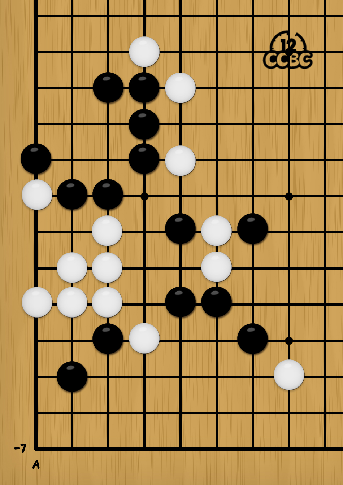
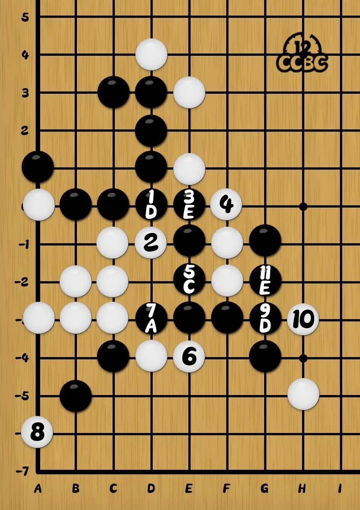

# #1799 棋盘一角 - CCBC 12

## 题面

一盘还没有下完的棋，但结局也许已经注定……

## 答案

`DECADE`

## 解析

执黑下五子棋，黑棋想获胜只有唯一最优解（遵循禁手规则）。黑棋落子的坐标依次为：(D,0)、 (E,0)、 (E,-2)、 (D,-3)、 (G,-3)、 (G,-2)，下到活四为止。将横坐标用纵坐标凯撒移位得到答案：**DECADE**。

## 提示

### 1. 我毫无头绪

这是一盘五子棋。现在是黑方行动，有最优（步数最少）的必胜策略。

### 2. 该如何提取

棋盘每个点都有横纵坐标，可以把获胜方每一步下的位置变成字母（不包括最后一步）。

## 本地附件

- [c-1799.jpg](../../../assets/archive.cipherpuzzles.com/ccbc12/images/answer/c-1799.jpg)
- [47dd40b380c44a10b00ec364dd35f96a.webp](../../../assets/archive.cipherpuzzles.com/ccbc12/images/c/47dd40b380c44a10b00ec364dd35f96a.webp)

来源：[https://archive.cipherpuzzles.com/ccbc12/problems/c/p1799.yaml](https://archive.cipherpuzzles.com/ccbc12/problems/c/p1799.yaml)
