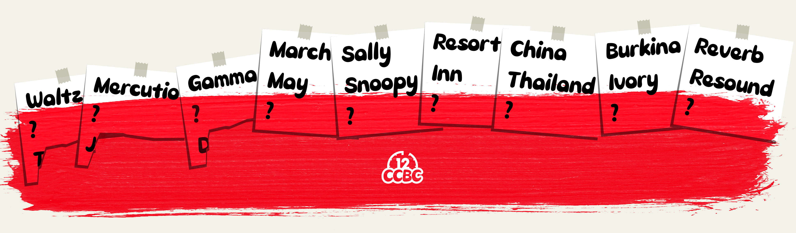

# #1893 红色便签纸 - CCBC 12

## 题面

谁刷墙这么不小心，都把便签纸刷红了，还撕下来了一些。

## 答案

`FRANCHISE`

## 解析

通过观察，发现九张便签上都是三个相关的单词，但是被涂红的要么是问号要么只有首字母。这些红色词语中几个比较好确认的有Tango、Romeo+Juliet、Delta、Charlie、Hotel、Echo，通过搜索可以发现被涂红的部分都是北约音标字母（NATO phonetic alphabet），然后借此确认其他的问号：

- Waltz, **Foxtrot**, Tango （摩登舞舞种）
- Mercutio, **Romeo**, Juliett（《罗密欧和朱丽叶》里的人物）
- Gamma, **Alfa**, Delta（希腊字母）
- March, May, **November**（月份）
- Sally, Snoopy, **Charlie**（《花生漫画》里的人物）
- Resort, Inn, **Hotel**（不同种类的旅馆）
- China, Thailand, **India**（亚洲国家）
- Burkina, Ivory, **Sierra**（两个单词的非洲国家名中的第一个词）
- Reverb, Resound, **Echo**（回声）

把问号代替的单词的首字母连起来得到答案：FRANCHISE。

## 提示

### 1. 我毫无头绪

三个被撕下来的单词分别是Tango, Juliette, Delta。试着把这三个词一起搜一下？

## 本地附件

- [95ef365a81b746568ffc8df75048f372.webp](../../../assets/archive.cipherpuzzles.com/ccbc12/images/c/95ef365a81b746568ffc8df75048f372.webp)

来源：[https://archive.cipherpuzzles.com/ccbc12/problems/c/p1893.yaml](https://archive.cipherpuzzles.com/ccbc12/problems/c/p1893.yaml)
