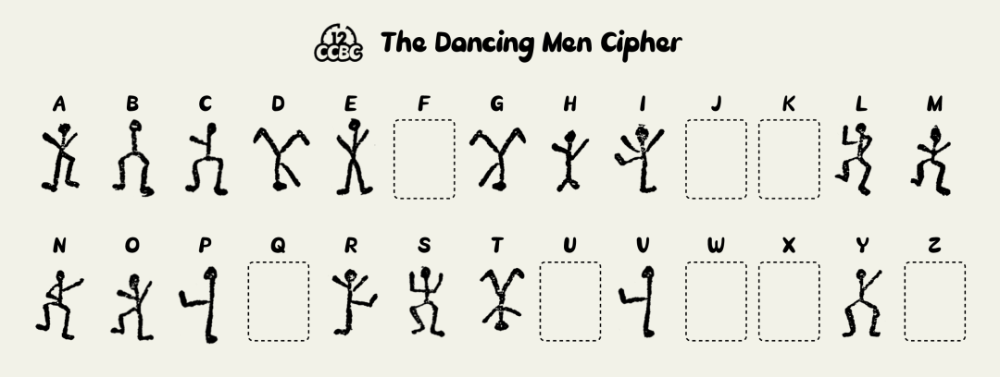
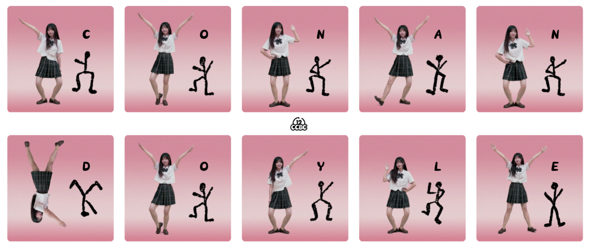

# #1957 舞蹈MV - CCBC 12

## 题面

哇，这个年代就有真人翻拍的动画了吗？

<video src="../../../assets/archive.cipherpuzzles.com/ccbc12/images/c/aee436760cb14702b53786b4a7fca705.mp4" controls style="width: 100%"></video>

（你也可以在Bilibili观看此视频：https://www.bilibili.com/video/BV1oa4y1f7Gp ）

## 答案

`CONAN DOYLE`

## 解析

把视频中31-44秒以及59-74秒钟的动作，按照《福尔摩斯》里的跳舞的人密码转成字母：

虚线为未在原著中出现的字母

原著中字母N的左臂是伸直的
但是网上能搜到的大部分对照表都是弯曲的
好在不影响识别

转换后可得到答案：**CONAN DOYLE**。

## 提示

### 1. 我毫无头绪

视频31秒后每个动作代表一个字母。加密方式可以参见福尔摩斯探案集。

### 2. 有小姐姐的联系方式吗

有的！

## 本地附件

- [c-1957-1.png](../../../assets/archive.cipherpuzzles.com/ccbc12/images/answer/c-1957-1.png)
- [c-1957-2.png](../../../assets/archive.cipherpuzzles.com/ccbc12/images/answer/c-1957-2.png)
- [aee436760cb14702b53786b4a7fca705.mp4](../../../assets/archive.cipherpuzzles.com/ccbc12/images/c/aee436760cb14702b53786b4a7fca705.mp4)

来源：[https://archive.cipherpuzzles.com/ccbc12/problems/c/p1957.yaml](https://archive.cipherpuzzles.com/ccbc12/problems/c/p1957.yaml)
