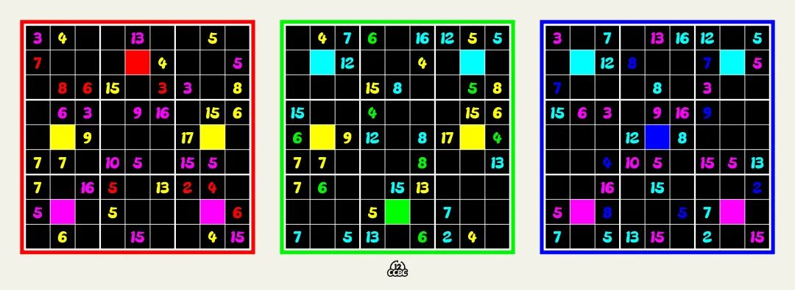
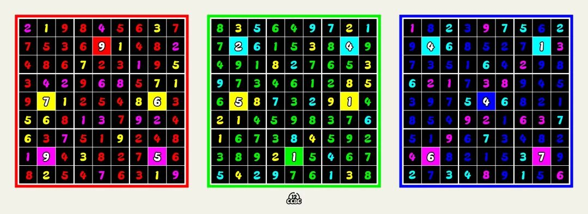
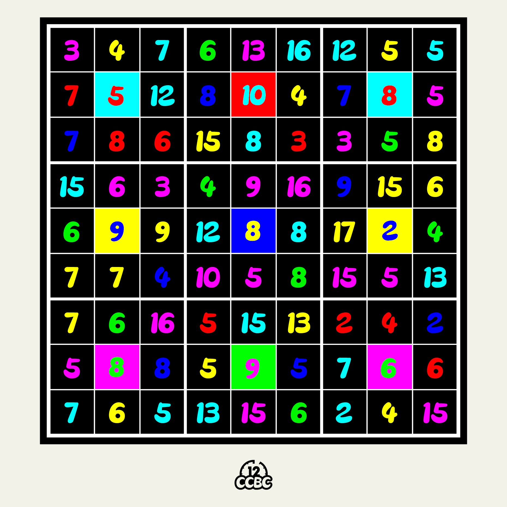

# #1984 霓虹显示屏 - CCBC 12

## 题面

十分高端的显示器，能够做到每个数独立控制颜色。

## 答案

`FIELD GOAL`

## 解析

观察发现这是一个数独表格，其中给出的数字都是光学的三原色（红、绿、蓝）或者间色（黄、青、品红），其中原色数字不超过9，间色数字的范围不超过18，所以考虑间色数字是两个组成色数字的和，也就是说这个表格是三个数独叠加而成的结果。

三个数独需要借助间色数字来缩减候选数。解出来的结果如下：

表格中还有九个涂色的方块，计算这些方块转成同位置、同色的数字和（例如黄色方块就计算红色数字和绿色数字的和），可以得到2+4=6, 9, 4+1=5, 7+5=12, 4, 6+1=7, 9+6=15, 1, 5+7=12，转成字母得到答案：**FIELD GOAL**。

## 提示

### 1. 我毫无头绪

这不是一个数独，而是三个数独。注意到红绿蓝三原色的数字都在1\~9之间，而三个混合色的数字都在2\~18之间。

### 2. 能简化一下吗

这里是一张简化后的图片。

### 3. 该如何提取

如果要在每个涂色的格子里填这个颜色的数字，那么应该填什么呢？把这些数字转成字母就可以了。

## 本地附件

- [c-1984-1.jpg](../../../assets/archive.cipherpuzzles.com/ccbc12/images/answer/c-1984-1.jpg)
- [c-1984-2.jpg](../../../assets/archive.cipherpuzzles.com/ccbc12/images/answer/c-1984-2.jpg)
- [2937569377a3420e96ca46be61895584.webp](../../../assets/archive.cipherpuzzles.com/ccbc12/images/c/2937569377a3420e96ca46be61895584.webp)
- [b558d0ee227f4dcc967ff1a18da547fa.webp](../../../assets/archive.cipherpuzzles.com/ccbc12/images/c/b558d0ee227f4dcc967ff1a18da547fa.webp)

来源：[https://archive.cipherpuzzles.com/ccbc12/problems/c/p1984.yaml](https://archive.cipherpuzzles.com/ccbc12/problems/c/p1984.yaml)
