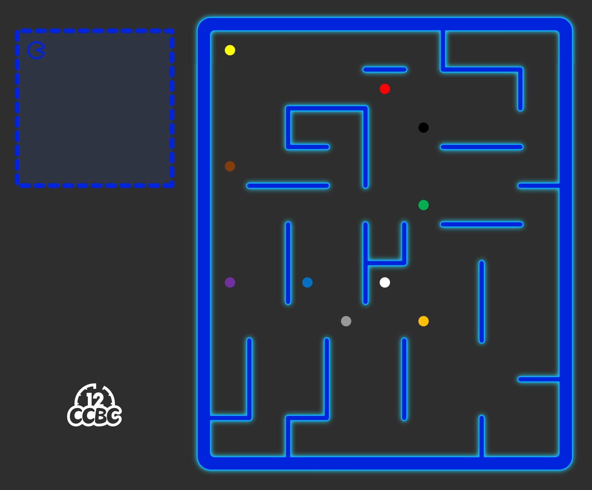
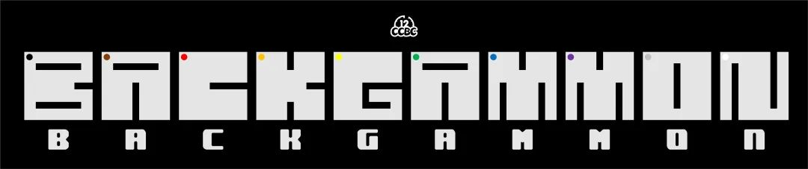

# #1986 吃豆人 - CCBC 12

## 题面

没有了讨厌的章鱼怪，吃豆人可以一次吃个够了吧。

## 答案

`BACKGAMMON`

## 解析

按照左上角提示，根据电阻色环顺序，依次以每个颜色的点为锚点，绘制虚线大小的方框，将方框套入右侧的图形中。方框内空白部分象形得到答案：**BACKGAMMON**。

## 提示

### 1. 我毫无头绪

把吃豆人和虚线框一起放进右侧迷宫中，让吃豆人吃到豆子（位置与豆子重合）。

### 2. 该如何提取

把象形得到的字母按照电阻色环顺序，由黑至白排序（比如第一个字母是B）。

## 本地附件

- [c-1986.jpg](../../../assets/archive.cipherpuzzles.com/ccbc12/images/answer/c-1986.jpg)
- [16e02c837a234f33addba63c76528320.webp](../../../assets/archive.cipherpuzzles.com/ccbc12/images/c/16e02c837a234f33addba63c76528320.webp)

来源：[https://archive.cipherpuzzles.com/ccbc12/problems/c/p1986.yaml](https://archive.cipherpuzzles.com/ccbc12/problems/c/p1986.yaml)
