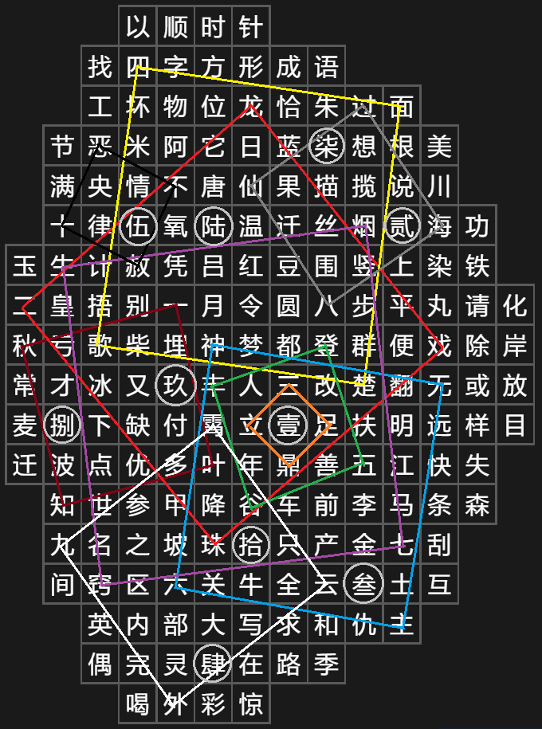

# #1715 活字印刷版 - CCBC 12

## 题面

桌子上整齐地摆放着一盘涂好油墨的活字版。

<table class="content-table">
    <tr>
        <td></td>
        <td></td>
        <td></td>
        <td>以</td>
        <td>顺</td>
        <td>时</td>
        <td>针</td>
        <td></td>
        <td></td>
        <td></td>
        <td></td>
        <td></td>
        <td></td>
        <td></td>
    </tr>
    <tr>
        <td></td>
        <td></td>
        <td>找</td>
        <td>四</td>
        <td>字</td>
        <td>方</td>
        <td>形</td>
        <td>成</td>
        <td>语</td>
        <td></td>
        <td></td>
        <td></td>
        <td></td>
        <td></td>
    </tr>
    <tr>
        <td></td>
        <td></td>
        <td>工</td>
        <td>坏</td>
        <td>物</td>
        <td>位</td>
        <td>龙</td>
        <td>恰</td>
        <td>朱</td>
        <td>过</td>
        <td>面</td>
        <td></td>
        <td></td>
        <td></td>
    </tr>
    <tr>
        <td></td>
        <td>节</td>
        <td>恶</td>
        <td>米</td>
        <td>阿</td>
        <td>它</td>
        <td>日</td>
        <td>蓝</td>
        <td>柒</td>
        <td>想</td>
        <td>根</td>
        <td>美</td>
        <td></td>
        <td></td>
    </tr>
    <tr>
        <td></td>
        <td>满</td>
        <td>央</td>
        <td>情</td>
        <td>不</td>
        <td>唐</td>
        <td>仙</td>
        <td>果</td>
        <td>描</td>
        <td>揽</td>
        <td>说</td>
        <td>川</td>
        <td></td>
        <td></td>
    </tr>
    <tr>
        <td></td>
        <td>十</td>
        <td>律</td>
        <td>伍</td>
        <td>氧</td>
        <td>陆</td>
        <td>温</td>
        <td>迁</td>
        <td>丝</td>
        <td>烟</td>
        <td>贰</td>
        <td>海</td>
        <td>功</td>
        <td></td>
    </tr>
    <tr>
        <td>玉</td>
        <td>生</td>
        <td>计</td>
        <td>赦</td>
        <td>凭</td>
        <td>吕</td>
        <td>红</td>
        <td>豆</td>
        <td>围</td>
        <td>竖</td>
        <td>上</td>
        <td>染</td>
        <td>铁</td>
        <td></td>
    </tr>
    <tr>
        <td>二</td>
        <td>皇</td>
        <td>捂</td>
        <td>别</td>
        <td>一</td>
        <td>月</td>
        <td>令</td>
        <td>圆</td>
        <td>八</td>
        <td>步</td>
        <td>平</td>
        <td>丸</td>
        <td>请</td>
        <td>化</td>
    </tr>
    <tr>
        <td>秋</td>
        <td>亏</td>
        <td>歌</td>
        <td>柴</td>
        <td>埋</td>
        <td>神</td>
        <td>梦</td>
        <td>都</td>
        <td>登</td>
        <td>群</td>
        <td>便</td>
        <td>戏</td>
        <td>除</td>
        <td>岸</td>
    </tr>
    <tr>
        <td>常</td>
        <td>才</td>
        <td>冰</td>
        <td>又</td>
        <td>玖</td>
        <td>丰</td>
        <td>人</td>
        <td>三</td>
        <td>改</td>
        <td>楚</td>
        <td>翻</td>
        <td>无</td>
        <td>或</td>
        <td>放</td>
    </tr>
    <tr>
        <td>麦</td>
        <td>捌</td>
        <td>下</td>
        <td>缺</td>
        <td>付</td>
        <td>霄</td>
        <td>立</td>
        <td>壹</td>
        <td>足</td>
        <td>扶</td>
        <td>明</td>
        <td>远</td>
        <td>样</td>
        <td>目</td>
    </tr>
    <tr>
        <td>迁</td>
        <td>波</td>
        <td>点</td>
        <td>优</td>
        <td>多</td>
        <td>叶</td>
        <td>年</td>
        <td>鼎</td>
        <td>善</td>
        <td>五</td>
        <td>江</td>
        <td>快</td>
        <td>失</td>
        <td></td>
    </tr>
    <tr>
        <td></td>
        <td>知</td>
        <td>世</td>
        <td>参</td>
        <td>甲</td>
        <td>降</td>
        <td>谷</td>
        <td>车</td>
        <td>前</td>
        <td>李</td>
        <td>马</td>
        <td>条</td>
        <td>森</td>
        <td></td>
    </tr>
    <tr>
        <td></td>
        <td>九</td>
        <td>名</td>
        <td>之</td>
        <td>坡</td>
        <td>珠</td>
        <td>拾</td>
        <td>只</td>
        <td>产</td>
        <td>金</td>
        <td>七</td>
        <td>刮</td>
        <td></td>
        <td></td>
    </tr>
    <tr>
        <td></td>
        <td>间</td>
        <td>窍</td>
        <td>区</td>
        <td>六</td>
        <td>关</td>
        <td>牛</td>
        <td>全</td>
        <td>云</td>
        <td>叁</td>
        <td>土</td>
        <td>互</td>
        <td></td>
        <td></td>
    </tr>
    <tr>
        <td></td>
        <td></td>
        <td>英</td>
        <td>内</td>
        <td>部</td>
        <td>大</td>
        <td>写</td>
        <td>求</td>
        <td>和</td>
        <td>仇</td>
        <td>主</td>
        <td></td>
        <td></td>
        <td></td>
    </tr>
    <tr>
        <td></td>
        <td></td>
        <td>偶</td>
        <td>完</td>
        <td>灵</td>
        <td>肆</td>
        <td>在</td>
        <td>路</td>
        <td>季</td>
        <td></td>
        <td></td>
        <td></td>
        <td></td>
        <td></td>
    </tr>
    <tr>
        <td></td>
        <td></td>
        <td></td>
        <td>喝</td>
        <td>外</td>
        <td>彩</td>
        <td>惊</td>
        <td></td>
        <td></td>
        <td></td>
        <td></td>
        <td></td>
        <td></td>
        <td></td>
    </tr>
</table>

## 答案

`QUARANTINE`

## 解析

因为是活字印刷版，字是反向的，需要把所有文字左右翻转，得到印在纸上的表格。注意到前两行字“以顺时针找四字方形成语”提示了第一步：在表格中共有十个四字成语，把这四个字的中心点按照顺序相连之后可以得到一个正方形，而且四个字按照顺时针排列。

另外，注意到表格里还有十个大写数字，下方还有一个提示“内部大写求和”，所以我们把十个正方形内部的大写数字分别求和（内外判定以中心点为准），然后转成字母得到答案：**QUARANTINE**。

<table cellspacing="0" cellpadding="0" style="visibility: visible;"><tbody style="margin: 0px; padding: 0px; max-width: 100%; overflow-wrap: break-word !important; box-sizing: content-box !important; visibility: visible;"><tr style="margin: 0px; padding: 0px; max-width: 100%; height: 11.35pt; overflow-wrap: break-word !important; box-sizing: content-box !important; visibility: visible;"><td width="71" height="11" style="margin: 0px; padding: 0cm 5.4pt; border-width: 1pt; border-style: solid; border-color: rgb(203, 205, 209); max-width: 100%; word-break: break-all; overflow-wrap: break-word !important; box-sizing: content-box !important; visibility: visible;"><section style="margin: 0px; padding: 0px; max-width: 100%; text-align: center; line-height: 1.75em; overflow-wrap: break-word !important; box-sizing: content-box !important; visibility: visible;"><strong style="margin: 0px; padding: 0px; max-width: 100%; overflow-wrap: break-word !important; box-sizing: content-box !important; visibility: visible;">一</strong>叶知秋 </section></td><td width="104" height="11" style="margin: 0px; padding: 0cm 5.4pt; border-top: 1pt solid rgb(203, 205, 209); border-right: 1pt solid rgb(203, 205, 209); border-bottom: 1pt solid rgb(203, 205, 209); border-left: none; max-width: 100%; overflow-wrap: break-word !important; box-sizing: content-box !important; visibility: visible;"><section style="margin: 0px; padding: 0px; max-width: 100%; text-align: center; line-height: 1.75em; overflow-wrap: break-word !important; box-sizing: content-box !important; visibility: visible;">玖+捌=17</section></td><td width="20" height="11" style="margin: 0px; padding: 0cm 5.4pt; border-top: 1pt solid rgb(203, 205, 209); border-right: 1pt solid rgb(203, 205, 209); border-bottom: 1pt solid rgb(203, 205, 209); border-left: none; max-width: 100%; background: rgb(233, 233, 233); overflow-wrap: break-word !important; box-sizing: content-box !important; visibility: visible;"><section style="margin: 0px; padding: 0px; max-width: 100%; text-align: center; line-height: 1.75em; overflow-wrap: break-word !important; box-sizing: content-box !important; visibility: visible;"><strong style="margin: 0px; padding: 0px; max-width: 100%; overflow-wrap: break-word !important; box-sizing: content-box !important; visibility: visible;">Q</strong></section></td></tr><tr style="margin: 0px; padding: 0px; max-width: 100%; height: 11.35pt; overflow-wrap: break-word !important; box-sizing: content-box !important; visibility: visible;"><td width="71" height="11" style="margin: 0px; padding: 0cm 5.4pt; border-top: none; border-right: 1pt solid rgb(203, 205, 209); border-bottom: 1pt solid rgb(203, 205, 209); border-left: 1pt solid rgb(203, 205, 209); max-width: 100%; overflow-wrap: break-word !important; box-sizing: content-box !important; visibility: visible;"><section style="margin: 0px; padding: 0px; max-width: 100%; text-align: center; line-height: 1.75em; overflow-wrap: break-word !important; box-sizing: content-box !important; visibility: visible;"><strong style="margin: 0px; padding: 0px; max-width: 100%; overflow-wrap: break-word !important; box-sizing: content-box !important; visibility: visible;">二</strong>龙戏珠</section></td><td width="99" height="11" style="margin: 0px; padding: 0cm 5.4pt; border-top: none; border-right: 1pt solid rgb(203, 205, 209); border-bottom: 1pt solid rgb(203, 205, 209); border-left: none; max-width: 100%; overflow-wrap: break-word !important; box-sizing: content-box !important; visibility: visible;"><section style="margin: 0px; padding: 0px; max-width: 100%; text-align: center; line-height: 1.75em; overflow-wrap: break-word !important; box-sizing: content-box !important; visibility: visible;">伍+陆+玖+壹=21</section></td><td width="20" height="11" style="margin: 0px; padding: 0cm 5.4pt; border-top: none; border-right: 1pt solid rgb(203, 205, 209); border-bottom: 1pt solid rgb(203, 205, 209); border-left: none; max-width: 100%; background: rgb(233, 233, 233); overflow-wrap: break-word !important; box-sizing: content-box !important; visibility: visible;"><section style="margin: 0px; padding: 0px; max-width: 100%; text-align: center; line-height: 1.75em; overflow-wrap: break-word !important; box-sizing: content-box !important; visibility: visible;"><strong style="margin: 0px; padding: 0px; max-width: 100%; overflow-wrap: break-word !important; box-sizing: content-box !important; visibility: visible;">U</strong></section></td></tr><tr style="margin: 0px;padding: 0px;max-width: 100%;overflow-wrap: break-word !important;box-sizing: content-box !important;height: 11.35pt;"><td width="71" height="11" style="margin: 0px;padding: 0cm 5.4pt;border-top: none;border-right: 1pt solid rgb(203, 205, 209);border-bottom: 1pt solid rgb(203, 205, 209);border-left: 1pt solid rgb(203, 205, 209);max-width: 100%;overflow-wrap: break-word !important;box-sizing: content-box !important;"><section style="margin: 0px;padding: 0px;max-width: 100%;overflow-wrap: break-word !important;box-sizing: content-box !important;text-align: center;line-height: 1.75em;"><strong style="margin: 0px;padding: 0px;max-width: 100%;overflow-wrap: break-word !important;box-sizing: content-box !important;">三</strong>足鼎立</section></td><td width="104" height="11" style="margin: 0px;padding: 0cm 5.4pt;border-top: none;border-right: 1pt solid rgb(203, 205, 209);border-bottom: 1pt solid rgb(203, 205, 209);border-left: none;max-width: 100%;overflow-wrap: break-word !important;box-sizing: content-box !important;"><section style="margin: 0px;padding: 0px;max-width: 100%;overflow-wrap: break-word !important;box-sizing: content-box !important;text-align: center;line-height: 1.75em;">壹=1</section></td><td width="20" height="11" style="margin: 0px;padding: 0cm 5.4pt;border-top: none;border-right: 1pt solid rgb(203, 205, 209);border-bottom: 1pt solid rgb(203, 205, 209);border-left: none;max-width: 100%;background: rgb(233, 233, 233);overflow-wrap: break-word !important;box-sizing: content-box !important;"><section style="margin: 0px;padding: 0px;max-width: 100%;overflow-wrap: break-word !important;box-sizing: content-box !important;text-align: center;line-height: 1.75em;"><strong style="margin: 0px;padding: 0px;max-width: 100%;overflow-wrap: break-word !important;box-sizing: content-box !important;">A</strong></section></td></tr><tr style="margin: 0px;padding: 0px;max-width: 100%;overflow-wrap: break-word !important;box-sizing: content-box !important;height: 11.35pt;"><td width="71" height="11" style="margin: 0px;padding: 0cm 5.4pt;border-top: none;border-right: 1pt solid rgb(203, 205, 209);border-bottom: 1pt solid rgb(203, 205, 209);border-left: 1pt solid rgb(203, 205, 209);max-width: 100%;overflow-wrap: break-word !important;box-sizing: content-box !important;"><section style="margin: 0px;padding: 0px;max-width: 100%;overflow-wrap: break-word !important;box-sizing: content-box !important;text-align: center;line-height: 1.75em;"><strong style="margin: 0px;padding: 0px;max-width: 100%;overflow-wrap: break-word !important;box-sizing: content-box !important;">四</strong>面楚歌</section></td><td width="104" height="11" style="margin: 0px;padding: 0cm 5.4pt;border-top: none;border-right: 1pt solid rgb(203, 205, 209);border-bottom: 1pt solid rgb(203, 205, 209);border-left: none;max-width: 100%;overflow-wrap: break-word !important;box-sizing: content-box !important;"><section style="margin: 0px;padding: 0px;max-width: 100%;overflow-wrap: break-word !important;box-sizing: content-box !important;text-align: center;line-height: 1.75em;">柒+伍+陆=18</section></td><td width="20" height="11" style="margin: 0px;padding: 0cm 5.4pt;border-top: none;border-right: 1pt solid rgb(203, 205, 209);border-bottom: 1pt solid rgb(203, 205, 209);border-left: none;max-width: 100%;background: rgb(233, 233, 233);overflow-wrap: break-word !important;box-sizing: content-box !important;"><section style="margin: 0px;padding: 0px;max-width: 100%;overflow-wrap: break-word !important;box-sizing: content-box !important;text-align: center;line-height: 1.75em;"><strong style="margin: 0px;padding: 0px;max-width: 100%;overflow-wrap: break-word !important;box-sizing: content-box !important;">R</strong></section></td></tr><tr style="margin: 0px;padding: 0px;max-width: 100%;overflow-wrap: break-word !important;box-sizing: content-box !important;height: 11.35pt;"><td width="71" height="11" style="margin: 0px;padding: 0cm 5.4pt;border-top: none;border-right: 1pt solid rgb(203, 205, 209);border-bottom: 1pt solid rgb(203, 205, 209);border-left: 1pt solid rgb(203, 205, 209);max-width: 100%;overflow-wrap: break-word !important;box-sizing: content-box !important;"><section style="margin: 0px;padding: 0px;max-width: 100%;overflow-wrap: break-word !important;box-sizing: content-box !important;text-align: center;line-height: 1.75em;"><strong style="margin: 0px;padding: 0px;max-width: 100%;overflow-wrap: break-word !important;box-sizing: content-box !important;">五</strong>谷丰登</section></td><td width="104" height="11" style="margin: 0px;padding: 0cm 5.4pt;border-top: none;border-right: 1pt solid rgb(203, 205, 209);border-bottom: 1pt solid rgb(203, 205, 209);border-left: none;max-width: 100%;overflow-wrap: break-word !important;box-sizing: content-box !important;"><section style="margin: 0px;padding: 0px;max-width: 100%;overflow-wrap: break-word !important;box-sizing: content-box !important;text-align: center;line-height: 1.75em;">壹=1</section></td><td width="20" height="11" style="margin: 0px;padding: 0cm 5.4pt;border-top: none;border-right: 1pt solid rgb(203, 205, 209);border-bottom: 1pt solid rgb(203, 205, 209);border-left: none;max-width: 100%;background: rgb(233, 233, 233);overflow-wrap: break-word !important;box-sizing: content-box !important;"><section style="margin: 0px;padding: 0px;max-width: 100%;overflow-wrap: break-word !important;box-sizing: content-box !important;text-align: center;line-height: 1.75em;"><strong style="margin: 0px;padding: 0px;max-width: 100%;overflow-wrap: break-word !important;box-sizing: content-box !important;">A</strong></section></td></tr><tr style="margin: 0px;padding: 0px;max-width: 100%;overflow-wrap: break-word !important;box-sizing: content-box !important;height: 11.35pt;"><td width="71" height="11" style="margin: 0px;padding: 0cm 5.4pt;border-top: none;border-right: 1pt solid rgb(203, 205, 209);border-bottom: 1pt solid rgb(203, 205, 209);border-left: 1pt solid rgb(203, 205, 209);max-width: 100%;overflow-wrap: break-word !important;box-sizing: content-box !important;"><section style="margin: 0px;padding: 0px;max-width: 100%;overflow-wrap: break-word !important;box-sizing: content-box !important;text-align: center;line-height: 1.75em;"><strong style="margin: 0px;padding: 0px;max-width: 100%;overflow-wrap: break-word !important;box-sizing: content-box !important;">六</strong>神无主</section></td><td width="104" height="11" style="margin: 0px;padding: 0cm 5.4pt;border-top: none;border-right: 1pt solid rgb(203, 205, 209);border-bottom: 1pt solid rgb(203, 205, 209);border-left: none;max-width: 100%;overflow-wrap: break-word !important;box-sizing: content-box !important;"><section style="margin: 0px;padding: 0px;max-width: 100%;overflow-wrap: break-word !important;box-sizing: content-box !important;text-align: center;line-height: 1.75em;">壹+拾+叁=14</section></td><td width="20" height="11" style="margin: 0px;padding: 0cm 5.4pt;border-top: none;border-right: 1pt solid rgb(203, 205, 209);border-bottom: 1pt solid rgb(203, 205, 209);border-left: none;max-width: 100%;background: rgb(233, 233, 233);overflow-wrap: break-word !important;box-sizing: content-box !important;"><section style="margin: 0px;padding: 0px;max-width: 100%;overflow-wrap: break-word !important;box-sizing: content-box !important;text-align: center;line-height: 1.75em;"><strong style="margin: 0px;padding: 0px;max-width: 100%;overflow-wrap: break-word !important;box-sizing: content-box !important;">N</strong></section></td></tr><tr style="margin: 0px;padding: 0px;max-width: 100%;overflow-wrap: break-word !important;box-sizing: content-box !important;height: 11.35pt;"><td width="71" height="11" style="margin: 0px;padding: 0cm 5.4pt;border-top: none;border-right: 1pt solid rgb(203, 205, 209);border-bottom: 1pt solid rgb(203, 205, 209);border-left: 1pt solid rgb(203, 205, 209);max-width: 100%;overflow-wrap: break-word !important;box-sizing: content-box !important;"><section style="margin: 0px;padding: 0px;max-width: 100%;overflow-wrap: break-word !important;box-sizing: content-box !important;text-align: center;line-height: 1.75em;"><strong style="margin: 0px;padding: 0px;max-width: 100%;overflow-wrap: break-word !important;box-sizing: content-box !important;">七</strong>窍生烟</section></td><td width="104" height="11" style="margin: 0px;padding: 0cm 5.4pt;border-top: none;border-right: 1pt solid rgb(203, 205, 209);border-bottom: 1pt solid rgb(203, 205, 209);border-left: none;max-width: 100%;overflow-wrap: break-word !important;box-sizing: content-box !important;"><section style="margin: 0px;padding: 0px;max-width: 100%;overflow-wrap: break-word !important;box-sizing: content-box !important;text-align: center;line-height: 1.75em;">玖+壹+拾=20</section></td><td width="20" height="11" style="margin: 0px;padding: 0cm 5.4pt;border-top: none;border-right: 1pt solid rgb(203, 205, 209);border-bottom: 1pt solid rgb(203, 205, 209);border-left: none;max-width: 100%;background: rgb(233, 233, 233);overflow-wrap: break-word !important;box-sizing: content-box !important;"><section style="margin: 0px;padding: 0px;max-width: 100%;overflow-wrap: break-word !important;box-sizing: content-box !important;text-align: center;line-height: 1.75em;"><strong style="margin: 0px;padding: 0px;max-width: 100%;overflow-wrap: break-word !important;box-sizing: content-box !important;">T</strong></section></td></tr><tr style="margin: 0px;padding: 0px;max-width: 100%;overflow-wrap: break-word !important;box-sizing: content-box !important;height: 11.35pt;"><td width="71" height="11" style="margin: 0px;padding: 0cm 5.4pt;border-top: none;border-right: 1pt solid rgb(203, 205, 209);border-bottom: 1pt solid rgb(203, 205, 209);border-left: 1pt solid rgb(203, 205, 209);max-width: 100%;overflow-wrap: break-word !important;box-sizing: content-box !important;"><section style="margin: 0px;padding: 0px;max-width: 100%;overflow-wrap: break-word !important;box-sizing: content-box !important;text-align: center;line-height: 1.75em;"><strong style="margin: 0px;padding: 0px;max-width: 100%;overflow-wrap: break-word !important;box-sizing: content-box !important;">八</strong>仙过海</section></td><td width="104" height="11" style="margin: 0px;padding: 0cm 5.4pt;border-top: none;border-right: 1pt solid rgb(203, 205, 209);border-bottom: 1pt solid rgb(203, 205, 209);border-left: none;max-width: 100%;overflow-wrap: break-word !important;box-sizing: content-box !important;"><section style="margin: 0px;padding: 0px;max-width: 100%;overflow-wrap: break-word !important;box-sizing: content-box !important;text-align: center;line-height: 1.75em;">柒+贰=9</section></td><td width="20" height="11" style="margin: 0px;padding: 0cm 5.4pt;border-top: none;border-right: 1pt solid rgb(203, 205, 209);border-bottom: 1pt solid rgb(203, 205, 209);border-left: none;max-width: 100%;background: rgb(233, 233, 233);overflow-wrap: break-word !important;box-sizing: content-box !important;"><section style="margin: 0px;padding: 0px;max-width: 100%;overflow-wrap: break-word !important;box-sizing: content-box !important;text-align: center;line-height: 1.75em;"><strong style="margin: 0px;padding: 0px;max-width: 100%;overflow-wrap: break-word !important;box-sizing: content-box !important;">I</strong></section></td></tr><tr style="margin: 0px;padding: 0px;max-width: 100%;overflow-wrap: break-word !important;box-sizing: content-box !important;height: 11.35pt;"><td width="71" height="11" style="margin: 0px;padding: 0cm 5.4pt;border-top: none;border-right: 1pt solid rgb(203, 205, 209);border-bottom: 1pt solid rgb(203, 205, 209);border-left: 1pt solid rgb(203, 205, 209);max-width: 100%;overflow-wrap: break-word !important;box-sizing: content-box !important;"><section style="margin: 0px;padding: 0px;max-width: 100%;overflow-wrap: break-word !important;box-sizing: content-box !important;text-align: center;line-height: 1.75em;"><strong style="margin: 0px;padding: 0px;max-width: 100%;overflow-wrap: break-word !important;box-sizing: content-box !important;">九</strong>霄云外</section></td><td width="104" height="11" style="margin: 0px;padding: 0cm 5.4pt;border-top: none;border-right: 1pt solid rgb(203, 205, 209);border-bottom: 1pt solid rgb(203, 205, 209);border-left: none;max-width: 100%;overflow-wrap: break-word !important;box-sizing: content-box !important;"><section style="margin: 0px;padding: 0px;max-width: 100%;overflow-wrap: break-word !important;box-sizing: content-box !important;text-align: center;line-height: 1.75em;">拾+肆=14</section></td><td width="20" height="11" style="margin: 0px;padding: 0cm 5.4pt;border-top: none;border-right: 1pt solid rgb(203, 205, 209);border-bottom: 1pt solid rgb(203, 205, 209);border-left: none;max-width: 100%;background: rgb(233, 233, 233);overflow-wrap: break-word !important;box-sizing: content-box !important;"><section style="margin: 0px;padding: 0px;max-width: 100%;overflow-wrap: break-word !important;box-sizing: content-box !important;text-align: center;line-height: 1.75em;"><strong style="margin: 0px;padding: 0px;max-width: 100%;overflow-wrap: break-word !important;box-sizing: content-box !important;">N</strong></section></td></tr><tr style="margin: 0px;padding: 0px;max-width: 100%;overflow-wrap: break-word !important;box-sizing: content-box !important;height: 11.35pt;"><td width="71" height="11" style="margin: 0px;padding: 0cm 5.4pt;border-top: none;border-right: 1pt solid rgb(203, 205, 209);border-bottom: 1pt solid rgb(203, 205, 209);border-left: 1pt solid rgb(203, 205, 209);max-width: 100%;overflow-wrap: break-word !important;box-sizing: content-box !important;"><section style="margin: 0px;padding: 0px;max-width: 100%;overflow-wrap: break-word !important;box-sizing: content-box !important;text-align: center;line-height: 1.75em;"><strong style="margin: 0px;padding: 0px;max-width: 100%;overflow-wrap: break-word !important;box-sizing: content-box !important;">十</strong>恶不赦</section></td><td width="104" height="11" style="margin: 0px;padding: 0cm 5.4pt;border-top: none;border-right: 1pt solid rgb(203, 205, 209);border-bottom: 1pt solid rgb(203, 205, 209);border-left: none;max-width: 100%;overflow-wrap: break-word !important;box-sizing: content-box !important;"><section style="margin: 0px;padding: 0px;max-width: 100%;overflow-wrap: break-word !important;box-sizing: content-box !important;text-align: center;line-height: 1.75em;">伍=5</section></td><td width="20" height="11" style="margin: 0px;padding: 0cm 5.4pt;border-top: none;border-right: 1pt solid rgb(203, 205, 209);border-bottom: 1pt solid rgb(203, 205, 209);border-left: none;max-width: 100%;background: rgb(233, 233, 233);overflow-wrap: break-word !important;box-sizing: content-box !important;"><section style="margin: 0px;padding: 0px;max-width: 100%;overflow-wrap: break-word !important;box-sizing: content-box !important;text-align: center;line-height: 1.75em;"><strong style="margin: 0px;padding: 0px;max-width: 100%;overflow-wrap: break-word !important;box-sizing: content-box !important;">E</strong></section></td></tr></tbody></table>

## 提示

### 1. 我毫无头绪

先左右翻转整个字阵，然后根据前两行提示找四字成语。一共需要找十个成语，其中第一个成语是“一叶知秋”。

### 2. 该如何提取

根据倒数第三行提示，寻找字阵里的十个大写数字，然后把每个方形里面的大写数字求和转字母。

## 本地附件

- [d-1715.png](../../../assets/archive.cipherpuzzles.com/ccbc12/images/answer/d-1715.png)

来源：[https://archive.cipherpuzzles.com/ccbc12/problems/d/p1715.yaml](https://archive.cipherpuzzles.com/ccbc12/problems/d/p1715.yaml)
