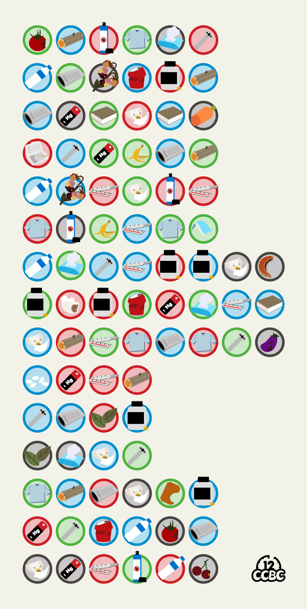
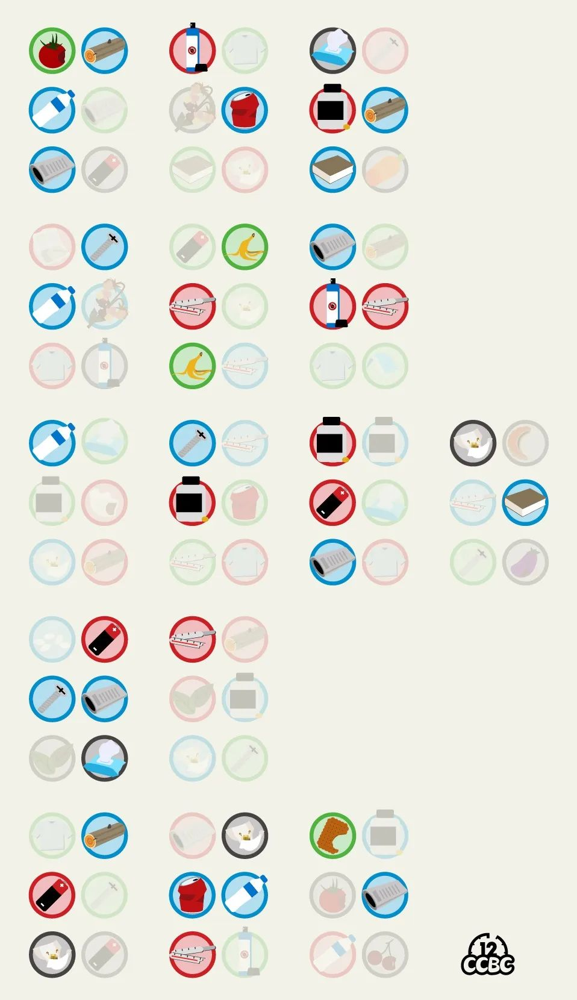
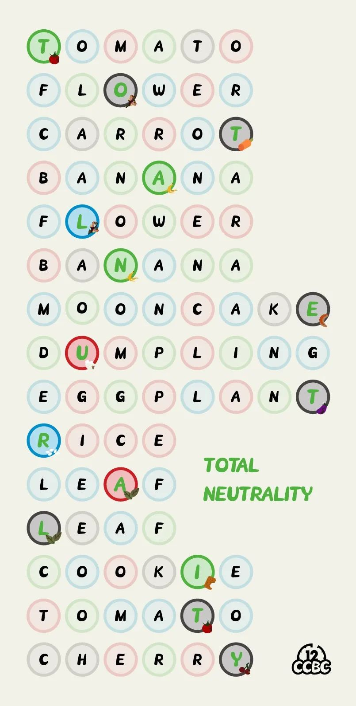

# #1868 灰红蓝绿 - CCBC 12

## 题面

我的天！怎么全部混到一起了……

## 答案

`TOTAL NEUTRALITY`

## 解析

先根据剧情和圆圈颜色联想到垃圾分类（灰红蓝绿分别对应干垃圾、有害垃圾、可回收物、湿垃圾），然后把正确分类的圆圈标出来，通过盲文得到信息：**PERISHABLE WASTE**，也就是湿垃圾。

根据提示寻找图中的湿垃圾，发现每行恰有一个，而且其英文名和其所在行的长度相同，将英文填入每行的空格内，根据湿垃圾所在的位置取字母得到答案：**TOTAL NEUTRALITY**。

## 提示

### 1. 我毫无头绪

注意到这些都是垃圾，而圆圈分为灰红蓝绿四类。有哪些圆圈是垃圾的正确分类呢？

### 2. 做完第一步后该怎么办

把正确的圆圈按照盲文转成字母，得到的信息提示了每一行的某一个物品。

### 3. 该如何提取

注意到每一行的关键物品的单词长度和其所在行的长度相同，所以每行可以提取出一个字母。

## 本地附件

- [d-1868-1.jpg](../../../assets/archive.cipherpuzzles.com/ccbc12/images/answer/d-1868-1.jpg)
- [d-1868-2.jpg](../../../assets/archive.cipherpuzzles.com/ccbc12/images/answer/d-1868-2.jpg)
- [b45b5221c5b64a99beeeeca2ac66473b.webp](../../../assets/archive.cipherpuzzles.com/ccbc12/images/d/b45b5221c5b64a99beeeeca2ac66473b.webp)

来源：[https://archive.cipherpuzzles.com/ccbc12/problems/d/p1868.yaml](https://archive.cipherpuzzles.com/ccbc12/problems/d/p1868.yaml)
