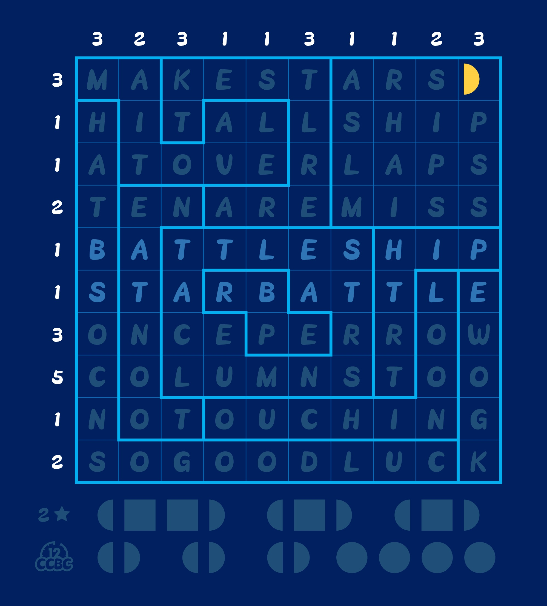
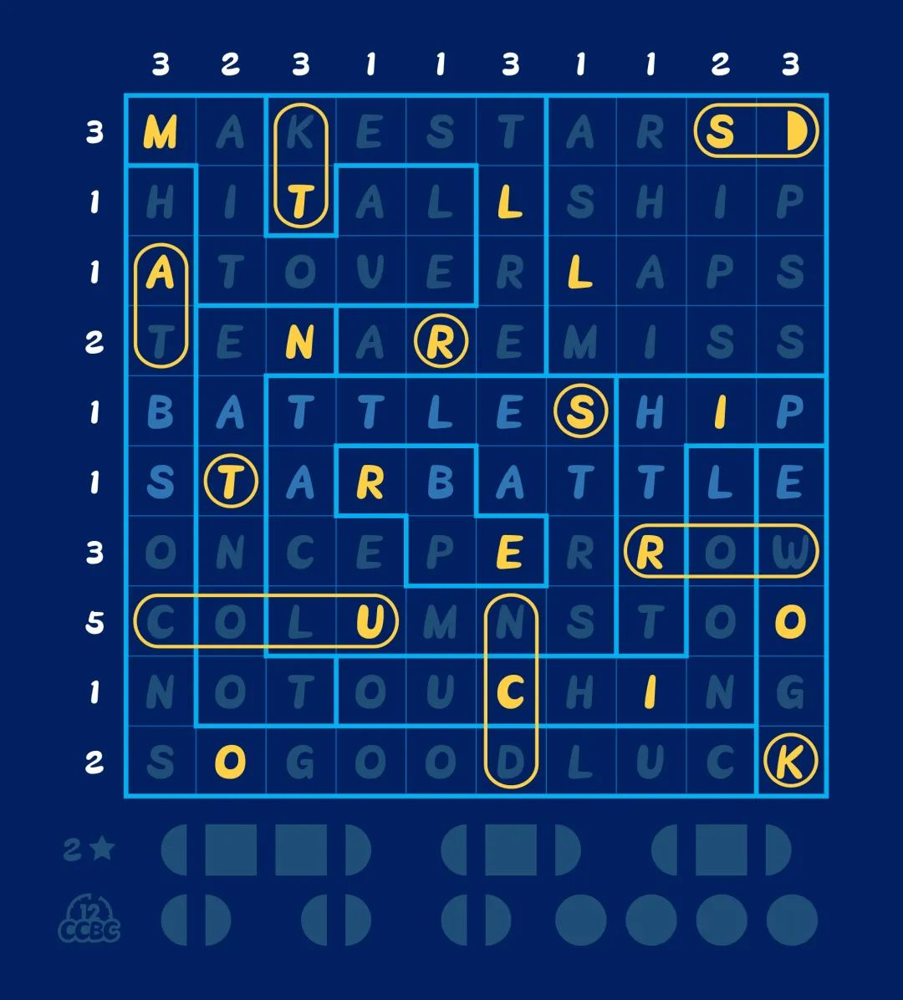
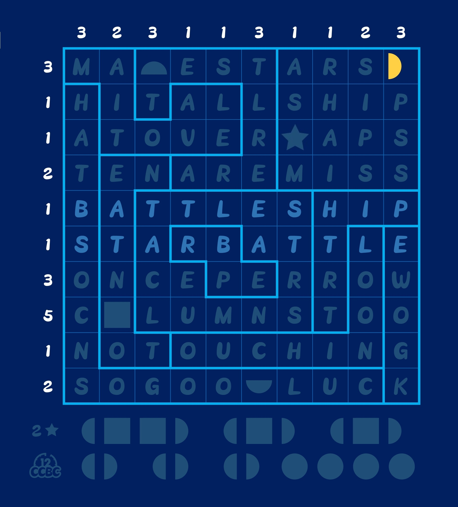

# #1963 星际战舰 - CCBC 12

## 题面

在深蓝色的背景下，一场战争即将上演……

## 答案

`STAR STRUCK`

## 解析

谜题中央高亮的两行分别是Battleship和Star Battle，是两种逻辑谜题的名字。在Battleship中，玩家需要把下方给出的十艘船放在表格中，使得每一行/列的船占据的格数等于左侧/上方的数字，而且任意两艘船之间不能接触（包括对角线）。在Star Battle中，玩家需要在每行/列/区域中放两颗星，使得任意两颗星之间不能接触（包括对角线）。

除此之外，其他几行提示了两个谜题合并起来时的附加规则：

- Make stars hit all ship at overlaps：星星和船的重叠处为“打击点”。

- Ten are miss once per row columns too：每一行/列都有一个星星没有打中船（也就是说每一行/列也都有一个星星打中了船）。

- No touching：两个单独谜题中船和船以及星和星不能接触的规则依然有效。（其实并不算附加规则）

借助这些附加规则，可以同时解开两个谜题。

把所有打击点所在的字母从上到下读出答案：**STAR-STRUCK**。

（一个有用的入手点是：如果一行/列只有一个船格，那么这个格子里必须也有一颗星）

## 提示

### 1. 我毫无头绪

Star Battle和Battleship是两种逻辑谜题的类型，而这道题是这两种类型的混合。其他几行字母也解释了混合后的附加规则。

### 2. 能简化一下吗

这里是一张简化后的图片。

### 3. 该如何提取

把所有重合的地方的字母从上到下排列。

## 本地附件

- [d-1963.jpg](../../../assets/archive.cipherpuzzles.com/ccbc12/images/answer/d-1963.jpg)
- [214d5c12608a42cd99e55f95d341e9ec.webp](../../../assets/archive.cipherpuzzles.com/ccbc12/images/d/214d5c12608a42cd99e55f95d341e9ec.webp)
- [4d83da2bceb6407a976fa48ec3f1f406.webp](../../../assets/archive.cipherpuzzles.com/ccbc12/images/d/4d83da2bceb6407a976fa48ec3f1f406.webp)

来源：[https://archive.cipherpuzzles.com/ccbc12/problems/d/p1963.yaml](https://archive.cipherpuzzles.com/ccbc12/problems/d/p1963.yaml)
