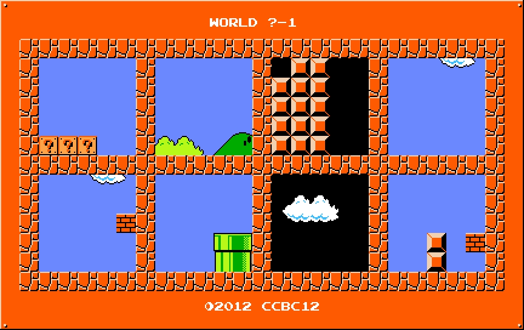
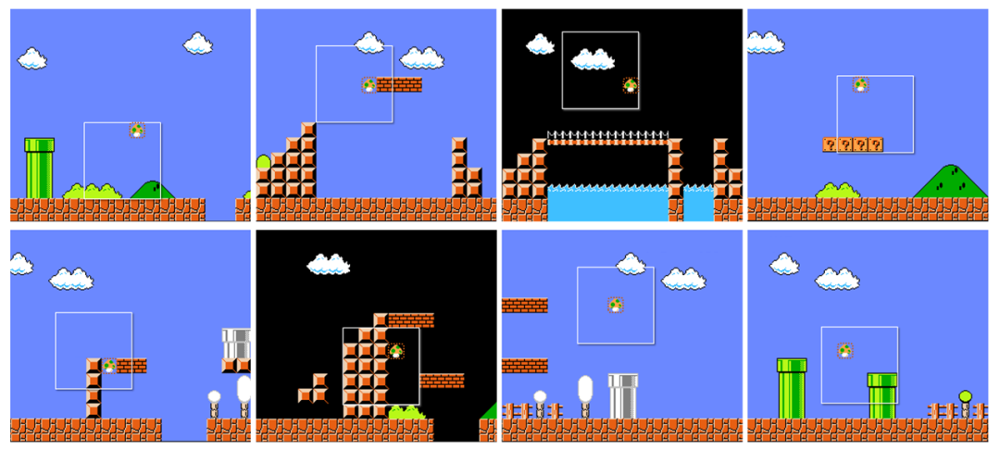

# #2012 经典游戏 - CCBC 12

## 题面

这些看似随手截取的图片里，仿佛隐藏着什么？

## 答案

`DOUBTING`

## 解析

根据经典红白机超级玛丽1-1至8-1每关中隐藏奖命蘑菇的位置，解棋盘密码后，按照关卡顺序排序得到答案：**DOUBTING**。

## 提示

### 1. 我毫无头绪

这些图片均来自经典的红白机超级玛丽关卡，并且都是各自关卡中隐藏了命菇的位置。

### 2. 该如何提取

每张图片都是由5*5的方格构成，解棋盘密码，然后根据关卡1-1、2-1、...8-1排序。

## 本地附件

- [d-2012.png](../../../assets/archive.cipherpuzzles.com/ccbc12/images/answer/d-2012.png)
- [2ef113b9bd5f45b78c6c2f3a137a1256.webp](../../../assets/archive.cipherpuzzles.com/ccbc12/images/d/2ef113b9bd5f45b78c6c2f3a137a1256.webp)

来源：[https://archive.cipherpuzzles.com/ccbc12/problems/d/p2012.yaml](https://archive.cipherpuzzles.com/ccbc12/problems/d/p2012.yaml)
