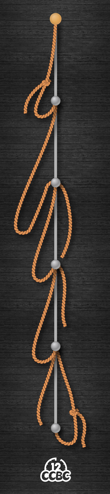
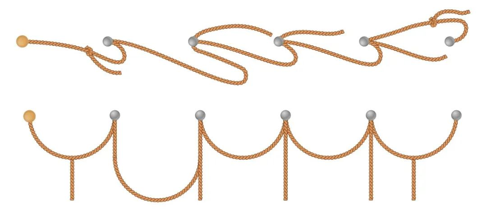

# #2088 绳串 - CCBC 12

## 题面

一串被固定在杆子上的绳子在风中摇曳。

## 答案

`YUMMY`

## 解析

把绳串水平放置后绳子会受重力自然下垂，象形得到答案：**YUMMY**。

你也可以查看视频题解： https://www.bilibili.com/video/BV1JP4y1m7J6

## 提示

### 1. 我毫无头绪

如果整个绳串以黄色钉子为轴，向右侧旋转至水平位置，会发生什么呢？

## 本地附件

- [d-2088.jpg](../../../assets/archive.cipherpuzzles.com/ccbc12/images/answer/d-2088.jpg)
- [943ba0e7c77446be9bacd903f733f92a.webp](../../../assets/archive.cipherpuzzles.com/ccbc12/images/d/943ba0e7c77446be9bacd903f733f92a.webp)

来源：[https://archive.cipherpuzzles.com/ccbc12/problems/d/p2088.yaml](https://archive.cipherpuzzles.com/ccbc12/problems/d/p2088.yaml)
