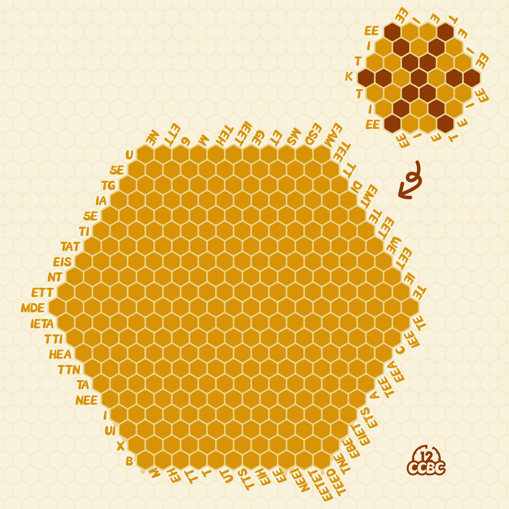
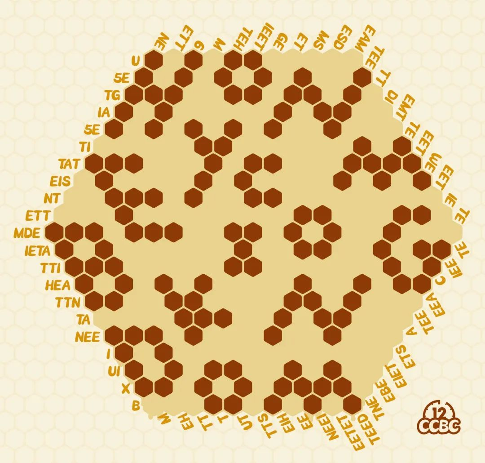
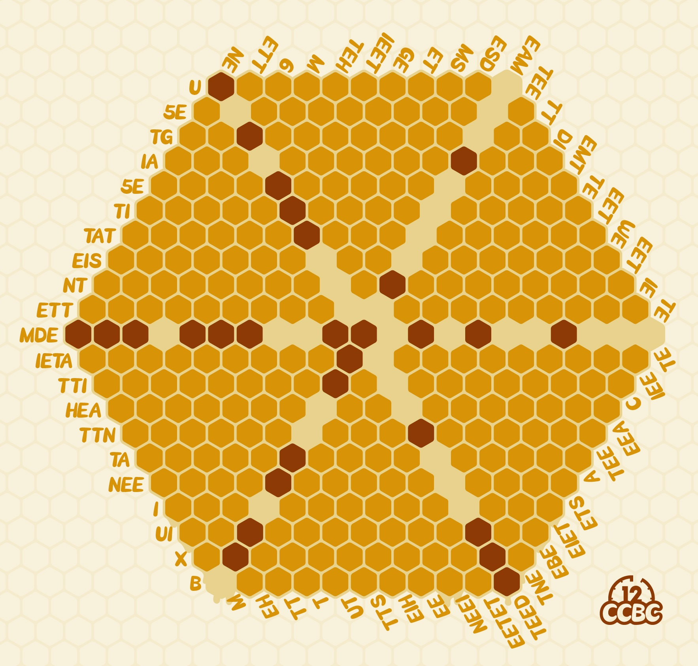

# #1722 巨型蜂巢 - CCBC 12

## 题面

这是一个被保存得非常完整的巨型蜂巢，里面的蜂蜜都淌了出来。

## 解题后内容

你得到了一个神秘的数字：8.16

## 答案

`HONEYCOMB KINGDOM`

## 解析

根据例题可以看出，这是一个变种nonogram：每一行的提示转成莫斯密码后对应这一行的格子分布：一格的深色格子对应“点”，两格以上的深色对应“划”，一格浅色对应点划之间的分割，两格以上的浅色对应字符之间的分割。根据推导出的规则可以解出谜题（一个合适的入手点是第二行的5E），深色格子象形得出答案：**HONEYCOMB KINGDOM**。

## 提示

### 1. 我毫无头绪

这是一道Nonogram题，但是每一行的提示是摩尔斯密码。右上角的例题可以帮助你确定转换方式。

### 2. 能简化一下吗

这里是一张简化后的图片。

## 本地附件

- [e-1722.jpg](../../../assets/archive.cipherpuzzles.com/ccbc12/images/answer/e-1722.jpg)
- [380c4f29c31848068c0510f178393634.webp](../../../assets/archive.cipherpuzzles.com/ccbc12/images/e/380c4f29c31848068c0510f178393634.webp)
- [a0639e63b34a4705a1a8006b1eb4df33.webp](../../../assets/archive.cipherpuzzles.com/ccbc12/images/e/a0639e63b34a4705a1a8006b1eb4df33.webp)

来源：[https://archive.cipherpuzzles.com/ccbc12/problems/e/p1722.yaml](https://archive.cipherpuzzles.com/ccbc12/problems/e/p1722.yaml)
