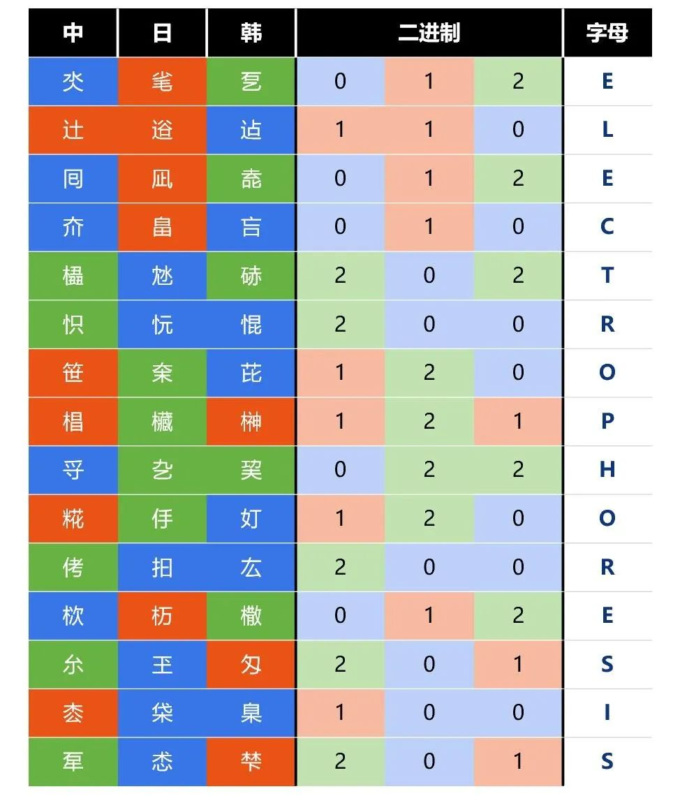

# #1753 新·三字经 - CCBC 12

## 题面

这个时代的文人对古代经典的拙劣模仿，难怪没有流传至今。

 

氼毟乭，辻逧迠，囘凪唟，夼畠吂，橻沊硳，怾忨惃，笹㭐芘，椙欌榊，寽㐇巭，糀㐿奵，侤抇厷，栨杤橵，厼玊匁，枩柋臬，㸴怸梺。

## 解题后内容

你得到了一个神秘的数字：261.77

## 答案

`ELECTROPHORESIS`

## 解析

通过搜索部分汉字，可以发现给出的字中有一些属于日语或者韩语里有但汉语里没有的字（又称为“和制汉字”和“朝鲜国字”）。将每一个汉字对应来源的语言后，三个一组用三进制转换成字母（中、日、韩->0、1、2）得到答案：**ELECTROPHORESIS**。

## 提示

### 1. 我毫无头绪

有大约三分之二的字不会在中国使用。

### 2. 该如何提取

使用三进制，比如 中日韩=5。

## 本地附件

- [e-1753.jpg](../../../assets/archive.cipherpuzzles.com/ccbc12/images/answer/e-1753.jpg)

来源：[https://archive.cipherpuzzles.com/ccbc12/problems/e/p1753.yaml](https://archive.cipherpuzzles.com/ccbc12/problems/e/p1753.yaml)
