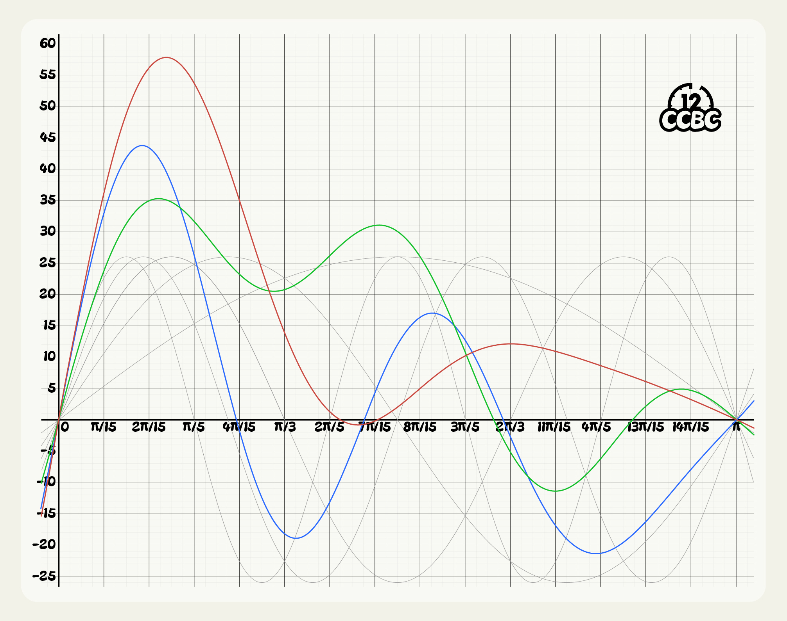

# #1899 函数 - CCBC 12

## 题面

你的分析仪告诉你，这些都是周期为2π的奇函数。

## 解题后内容

你得到了一个神秘的数字：5.91

## 答案

`SOUNDTRACK ALBUM`

## 解析

一般来说，周期为2π的奇函数可以表示成形如`a1*sin(x)+a2*sin(2x)+...`的傅里叶级数。通过取图像里的一些特殊点解方程，我们可以发现每一个图像都是五项的傅里叶级数（图中用灰色细线表示了`26*sin(x)`到`26*sin(5x)`的图像），而且系数都是1\~26之间的正整数。

- 红色：`y=19*sin(x)+15*sin(2x)+21*sin(3x)+14*sin(4x)+4*sin(5x)`

- 绿色：`y=20*sin(x)+18*sin(2x)+1*sin(3x)+3*sin(4x)+11*sin(5x)`

- 蓝色：`y=1*sin(x)+12*sin(2x)+2*sin(3x)+21*sin(4x)+13*sin(5x)`

把傅里叶级数的系数转换成英文字母，然后按照RGB顺序得到答案：**SOUNDTRACK ALBUM**。

## 提示

### 1. 我毫无头绪

三个有颜色的函数都是形如A\*sin(x)+B\*sin(2x)+C\*sin(3x)+D\*sin(4x)+E\*sin(5x)的形式。

### 2. 该如何提取

把三个颜色分别对应的五个系数转成字母按1\~5的顺序排列，然后按红绿蓝的顺序连在一起。每个系数都是1\~26之间的整数。

## 本地附件

- [e8bc2f8a39f64b9bbeb79d6118faba95.webp](../../../assets/archive.cipherpuzzles.com/ccbc12/images/e/e8bc2f8a39f64b9bbeb79d6118faba95.webp)

来源：[https://archive.cipherpuzzles.com/ccbc12/problems/e/p1899.yaml](https://archive.cipherpuzzles.com/ccbc12/problems/e/p1899.yaml)
