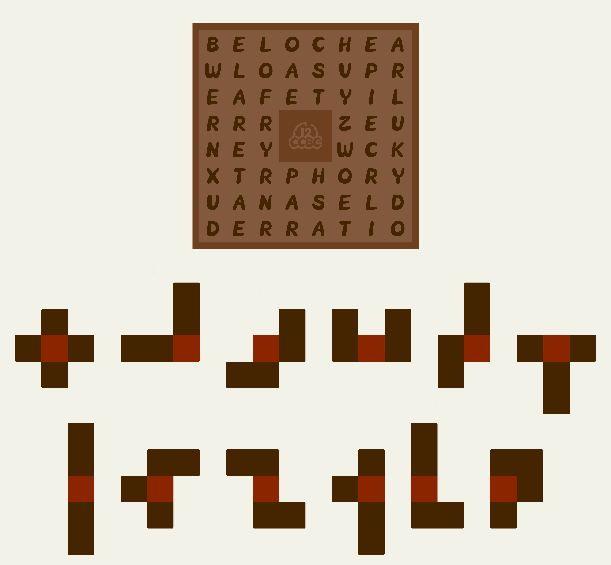
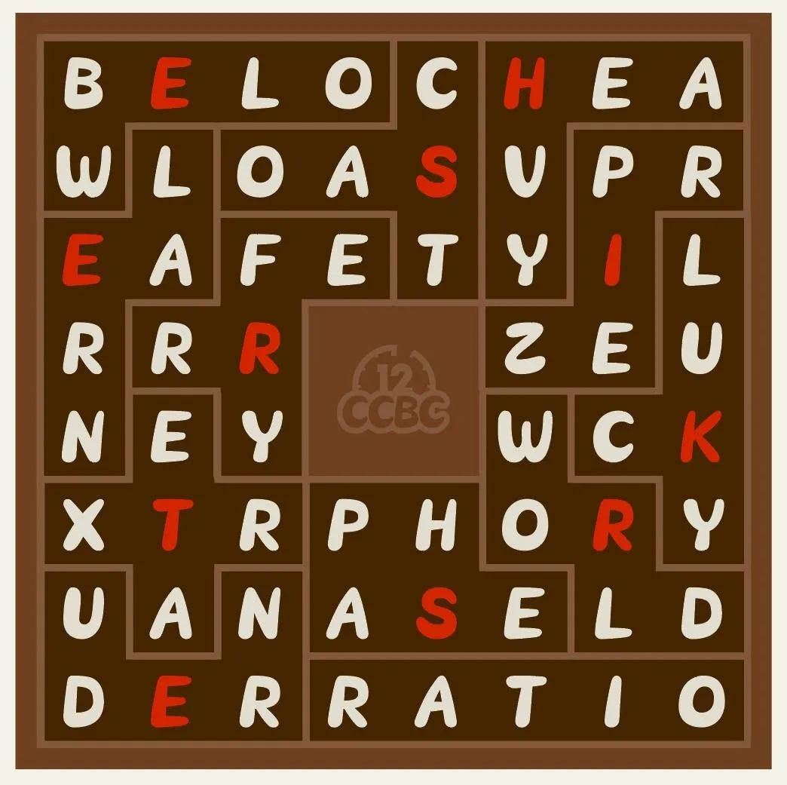

# #1974 积木 - CCBC 12

## 题面

地上摆着一些积木，似乎是从盒子里散落出来的。

## 解题后内容

你得到了一个神秘的数字：15.41

## 答案

`THREE STRIKES`

## 解析

这是一个“伤脑筋十二块”谜题，但是每一块覆盖的字母必须从左到右、从上到下形成一个英语单词。（作为额外的提示，每一块覆盖的单词都包含这一块对应的字母。）把每一块中高亮格覆盖的字母按照给出的顺序可以排列成答案：**THREE STRIKES**。

## 提示

### 1. 我毫无头绪

这是一道伤脑筋十二块谜题，要把所有积木放进中心镂空的盒子里。每个积木覆盖的格子需要是一个英语单词。

### 2. 该如何提取

每一个积木中间都有一个比较亮的格子，把这些格子盖住的字母按照积木排列的顺序提取。

## 本地附件

- [e-1974.jpg](../../../assets/archive.cipherpuzzles.com/ccbc12/images/answer/e-1974.jpg)
- [6d8f712c11064bd6b60502d8a5abdd61.webp](../../../assets/archive.cipherpuzzles.com/ccbc12/images/e/6d8f712c11064bd6b60502d8a5abdd61.webp)

来源：[https://archive.cipherpuzzles.com/ccbc12/problems/e/p1974.yaml](https://archive.cipherpuzzles.com/ccbc12/problems/e/p1974.yaml)
