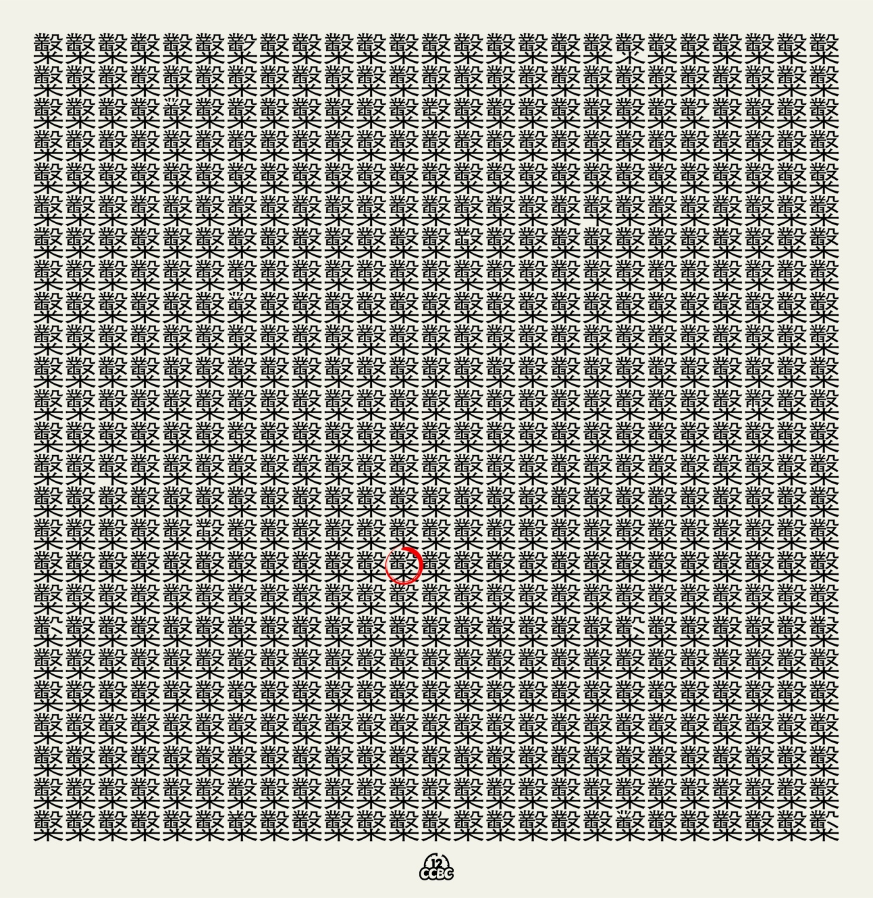
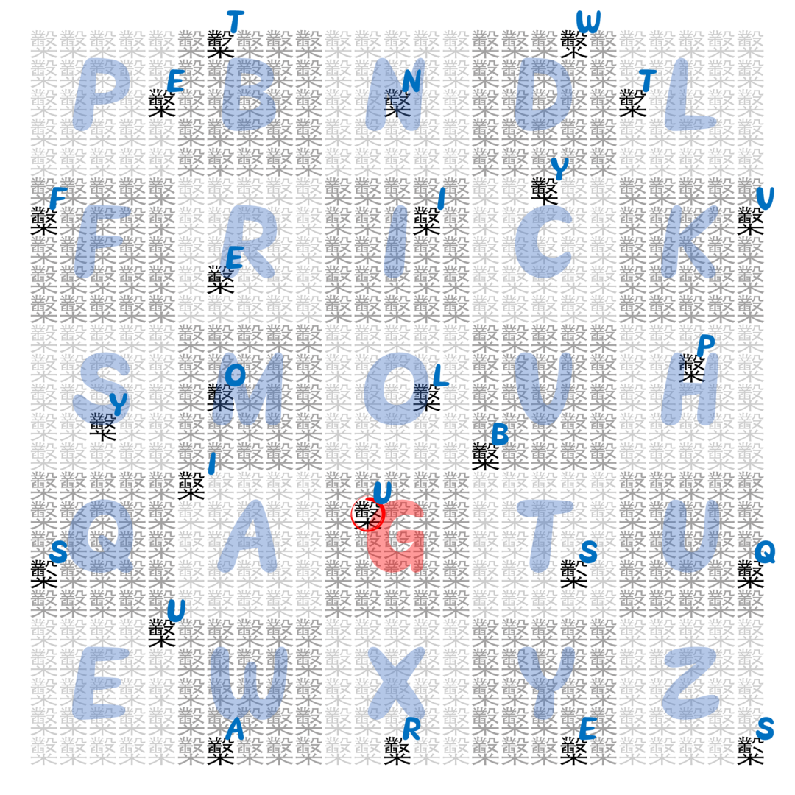

# #2066 糳糳糳糳糳... - CCBC 12

## 题面

来自某出题组成员的留言：“当年CCBC X的时候输入了三百多个‘糳’，结果搞崩了服务器，之后他们就不让我写‘糳’了。终于等到了我能够报仇的一天，我要让‘糳’铺满这个世界！！！哈哈哈哈哈哈哈哈哈哈！！！”

这人怎么这么喜欢“糳”，是不是有什么特殊癖好！还有抄错的，让人给圈出来了。

## 解题后内容

你得到了一个神秘的数字：48.19

## 答案

`GRAPHIC NOVELS`

## 解析

找出所有缺少笔画的“糳”，数出缺少的是第n笔后，数字转字母得到中间提示“Twenty-five Polybius Squares"（注意糳刚好有26画）。

根据提示，将25×25个”糳“分割成25个棋盘密码，根据缺笔画字的位置解出字母，形成一个新的棋盘密码。从被圈出的字作为起点，依次读取当前字母在棋盘密码中对应位置的字母，直至回到起点，可得答案：**GRAPHIC NOVELS**。（其他的字母都在原来的位置）

## 提示

### 1. 我毫无头绪

找到所有缺少笔画的“糳”，把缺少的笔画序数转换成字母，按照从上到下为主，从左到右为辅的方法排序。（注意“糳”有26画。）

### 2. 做完第一步后该怎么做

把整个字阵分成小方阵。每个小方阵中有一个特殊的位置，进而能得到一个新的（没有重复字母的）字母阵。

### 3. 该如何提取

从被圈出的字作为起点，依次读取当前字母在棋盘密码中对应位置的字母，直至回到起点。

## 本地附件

- [e-2066.png](../../../assets/archive.cipherpuzzles.com/ccbc12/images/answer/e-2066.png)
- [c626220ee50241538731d91426b3c560.webp](../../../assets/archive.cipherpuzzles.com/ccbc12/images/e/c626220ee50241538731d91426b3c560.webp)

来源：[https://archive.cipherpuzzles.com/ccbc12/problems/e/p2066.yaml](https://archive.cipherpuzzles.com/ccbc12/problems/e/p2066.yaml)
