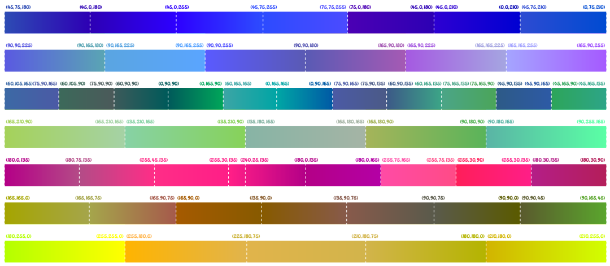
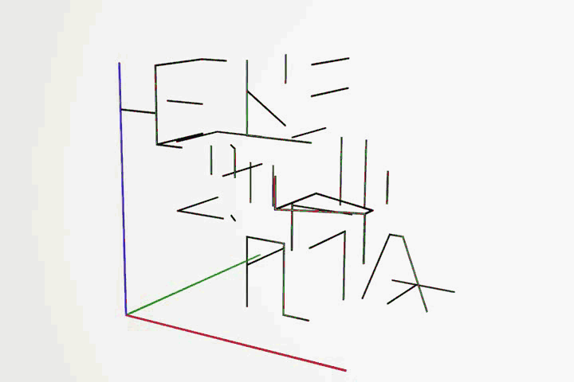
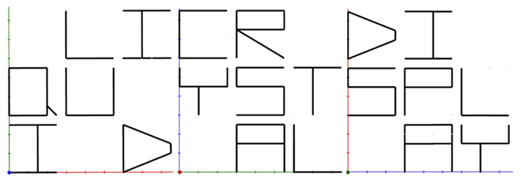

# #1817 彩虹旗 - CCBC 12

## 题面

一面五颜六色的旗帜，色彩比想象中还要丰富。

## 答案

`LIQUID CRYSTAL DISPLAY`

## 解析

题面图片被分成七行，每行又被均匀分割成若干块色块。通过提取RGB值，发现每一个色块的颜色变化都是线性的，于是考虑将所有色块的RGB值画在三个坐标系上（每一个色块对应一条线段）。

通过三视图象形得到三个词，连起来得到答案：**LIQUID CRYSTAL DISPLAY**。

每一行颜色在三个词里分别对应一个字母

除了第一个词中有两个U叠在一起

你还可以查看视频题解： https://www.bilibili.com/video/BV1fg411e7hM

## 提示

### 1. 我毫无头绪

每一个小色块的RGB值都是线性变化的，试着把所有色块的颜色在同一个空间里表示出来？

### 2. 该如何提取

R-G平面、G-B平面、B-R平面分别对应一个单词，按照顺序连在一起。

## 本地附件

- [f-1817-1.png](../../../assets/archive.cipherpuzzles.com/ccbc12/images/answer/f-1817-1.png)
- [f-1817-2.gif](../../../assets/archive.cipherpuzzles.com/ccbc12/images/answer/f-1817-2.gif)
- [f-1817-3.png](../../../assets/archive.cipherpuzzles.com/ccbc12/images/answer/f-1817-3.png)
- [67cdd994586b4193897253216a0a2963.webp](../../../assets/archive.cipherpuzzles.com/ccbc12/images/f/67cdd994586b4193897253216a0a2963.webp)

来源：[https://archive.cipherpuzzles.com/ccbc12/problems/f/p1817.yaml](https://archive.cipherpuzzles.com/ccbc12/problems/f/p1817.yaml)
