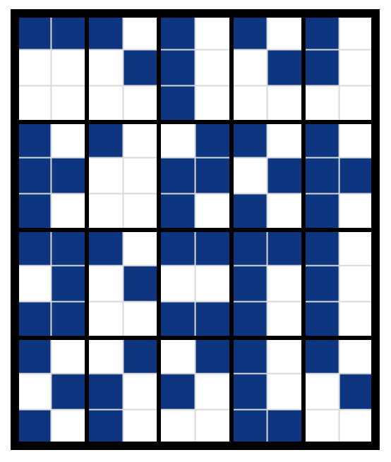

# #1876 灯泡矩阵 - CCBC 12

## 题面

<!--use lightgame-->
这房间怎么这么多灯，亮瞎眼了，快都关掉！

## 交互源码

### javascript

```javascript
(function(){
const lightInitData =
//请将从Excel复制来的内容粘贴在下面↓↓↓
[	333	,
  787	,
  652	,
  500	,
  114	,
  994	,
  637	,
  1023	,
  963	,
  336	,
  761	,
  891	]
//请将从Excel复制来的内容粘贴在上面↑↑↑
;(function (e){
if(!window.lightGameInit) {console.log("Warning: no game wrapper."); return;}
window.lightGameInit(e, 10);
})(lightInitData);
})();
```

### component_LightGame

```text
<template>
    <div class="light-game-area">
        <div class="light-game-wrapper">
            <div class="light-game-row" v-for="(r, i) in gameBoard">
                <div class="light-game-cell" v-for="(c, j) in r" :class="[ c === 1 ? 'light-on' : 'light-off']" @click="clickLight(i, j)"></div>
            </div>
        </div>
        <div style="text-align: center; margin-top: 15px;">
            <button class="btn btn-primary" @click="resetGame">重置</button>
        </div>
    </div>
</template>

<style lang="scss" scoped>
.light-game-wrapper {
    .light-game-row {
        display: flex;
        flex-direction: row;
        justify-content: center;
        align-items: center;
        .light-game-cell {
            background-size: 35px 35px;
            background-repeat: no-repeat;
            background-position: center;
            width: 45px;
            height: 45px;
            transition: all 0.15s ease-in-out;
            cursor: pointer;
            border: 1px solid #ababab;
        }
        .light-on {
            background-image: url('../../../assets/archive.cipherpuzzles.com/ccbc12/assets/icon/light_on.png');
            &:hover{
                filter: brightness(0.6);
            }
        }
        .light-off {
            background-image: url('../../../assets/archive.cipherpuzzles.com/ccbc12/assets/icon/light_off.png');
            &:hover{
                filter: brightness(1.4);
            }
        }
    }
}
</style>

<script lang="ts" setup>
import { ref } from 'vue';

const gameBoard = ref<number[][]>([]);
const gameInitBoard = ref<number[][]>([]);
async function gameInit(initArr: number[], colLength: number) {
    let tempGameInitBoard = [];
    for (let n of initArr) {
        //convert n to binary, leftpad to colLength, then slice into 0/1 array.
        let binary = (n >>> 0).toString(2);
        let binaryArr = binary.padStart(colLength, "0").split("").map(x => parseInt(x));
        tempGameInitBoard.push(binaryArr);
    }
    gameInitBoard.value = deepClone2DArray(tempGameInitBoard);
    gameBoard.value = tempGameInitBoard;
}
async function resetGame() {
    gameBoard.value = deepClone2DArray(gameInitBoard.value);
}
async function clickLight(i: number, j: number) {
    //get cow, rol number
    let colLength = gameInitBoard.value[0].length;
    let rowLength = gameInitBoard.value.length;

    //invert gameBoard(i, j)
    let tempGameBoard = gameBoard.value;
    tempGameBoard[i][j] = tempGameBoard[i][j] === 1 ? 0 : 1;
    if (i - 1 >= 0) {
        tempGameBoard[i - 1][j] = tempGameBoard[i - 1][j] === 1 ? 0 : 1;
    }
    if (i + 1 < rowLength) {
        tempGameBoard[i + 1][j] = tempGameBoard[i + 1][j] === 1 ? 0 : 1;
    }
    if (j - 1 >= 0) {
        tempGameBoard[i][j - 1] = tempGameBoard[i][j - 1] === 1 ? 0 : 1;
    }
    if (j + 1 < colLength) {
        tempGameBoard[i][j + 1] = tempGameBoard[i][j + 1] === 1 ? 0 : 1;
    }
    gameBoard.value = tempGameBoard;
}

function deepClone2DArray(arr: number[][]): number[][] {
    let tempArr = [];
    for (let r of arr) {
        tempArr.push(r.slice());
    }
    return tempArr;
}

(window as any)["lightGameInit"] = gameInit;
</script>
```


## 答案

`CELEBRATORY EXPLOSIVE`

## 解析

这道题是经典的关灯游戏（Lights Out），不过尺寸从5x5变成了12x10。根据剧情提示，我们需要把所有灯都关掉。这种游戏可以通过解一个在二元域F2下的线性方程得到解法，也可以通过"Light chasing"将情况简化至只剩下最后一行有亮灯的情况（从第二行开始，通过按上一行所有亮灯下面的键使得上面一行没有亮灯，直到最后一行），然后通过试验第一行对最后一行的影响得到解法。



PS: 网上有解决这类问题的计算器，例如 https://www.dcode.fr/lights-out-solver

把所有灯按灭后，我们标注所有按过的按钮（注意按了偶数次和没按是等价的），然后根据剧情里“亮瞎眼”的提示把12x10的表格分成20个3x2的小块，然后通过盲文转成答案：**CELEBRATORY EXPLOSIVE**。

## 提示

### 1. 我毫无头绪

你应该按照指示把灯都关了。第一行中需要按的按钮是第1、2、3、5、7、9个。

### 2. 该如何提取

把矩阵分成若干个3x2的小长方形，然后把按过的按钮位置按盲文转成字母。


## 本地附件

- [light_off.png](../../../assets/archive.cipherpuzzles.com/ccbc12/assets/icon/light_off.png)
- [light_on.png](../../../assets/archive.cipherpuzzles.com/ccbc12/assets/icon/light_on.png)
- [f-1876.png](../../../assets/archive.cipherpuzzles.com/ccbc12/images/answer/f-1876.png)

来源：[https://archive.cipherpuzzles.com/ccbc12/problems/f/p1876.yaml](https://archive.cipherpuzzles.com/ccbc12/problems/f/p1876.yaml)
