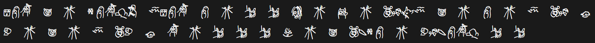

# #2040 硅基生物计算器 - CCBC 12

## 题面

<!--use calc-->
桌子上放着一个计算器，还有一张纸条，上面写着一些怪异的...文字？

<div style="font-family: ccbc12symbols; font-size: 30px;">

ɇɉɊ ɏ ч ɈɉɊɋɌ ɆɇɉɊ ɉ ч х х ɍ ч Ɏ ч ɀɃɅɆ ɏ ч ɉ ч Ɇ ɀɃ ц ɂ ч ɏ ч Ɇ ɀɂ ц Ɋ ч х х х ɐ ч ɏ ɀɄɈɉ ч ɂɃɄɉɊɋ х х

</div>


<!--  -->


“这不是大热的科幻小说《硅基生物计算器》中的计算器吗？做的真还原啊。”

<div style="color: #999999">

《硅基生物计算器》出版于2040年。那是一个AI刚刚兴起，人类还妄想和AI和平相处的年代。小说的故事主要内容为一个发生在同时存在硅基生物文明和碳基生物文明的星球上，两种不同文明发展水平差不多，互相发现之后从开始交流到世界大战，再到互相和解共同走向宇宙的史诗般的故事。因作者对两种不同的生物的语言、文字乃至文化、体制、发展水平等完备而详尽的想象和设定，吸引了很多“硬科幻”爱好者。

标题中的“计算器”是一个为了方便硅基生物和碳基生物进行贸易时快速结算的工具。由于两种生物的文化差异过大，语言中表达数字的逻辑完全不一样，所以当地的人们发明出一种输入自己语言的算式表达，输出另一种语言中结果的计算器，成了两种文明间贸易的纽带。

小说从一个想要逃离村子单调生活的硅基生物男主角“拜纳瑞”的故事展开。拜纳瑞为了逃离村子，从家里找出了一个“计算器”，以“计算人助理”的身份混入了商队。但是他的计算器上坏了两个键，因为这两个不能用的按键，他的身份遭到质疑，差一点遭到牢狱之灾。但他用数学技巧机智地解决了所有问题，成功到达大城市，并最终成为一名远航飞船上的工程师。

</div>

<br><br>
<div>
<p>这是《计算器使用说明》的一部分</p>
<p>2. 屏幕右侧的8个指示灯说明当前已入栈的数字数量。亮起一个灯表示内存中已经存入了一个操作数。计算器最多在栈中暂存8个数字。</p>
<p>3. 当计算出错时，左侧的五盏红灯中的其中一盏将会亮起。不同的灯表示不同的错误，从上到下分别是“算数溢出”“除0”“操作数不足”“栈溢出”和“内部计算出错”。不管是哪种问题，你都可以简单的按下红色的“AC”键来解除错误。</p>
</div>

## 交互源码

### css

```css
@font-face {
    font-family: 'ccbc12symbols';
    src: url('../../../assets/archive.cipherpuzzles.com/ccbc12/assets/ccbc12symbols-Regular-SVG.woff2') format('woff2'), /* Modern Browsers */
        url('../../../assets/archive.cipherpuzzles.com/ccbc12/assets/ccbc12symbols-Regular-SVG.otf') format('opentype'); /* Safari, Android, iOS */
    font-style: normal;
    font-weight: normal;
    text-rendering: optimizeLegibility;
}
```

### component_C12Calc

```text
<template>
    <div class="calc-warpper">
        <div class="error-light-area">
            <div class="error-light" :class="[ context.error === 1 ? 'light-on' : '']"></div>
            <div class="error-light" :class="[ context.error === 2 ? 'light-on' : '']"></div>
            <div class="error-light" :class="[ context.error === 3 ? 'light-on' : '']"></div>
            <div class="error-light" :class="[ context.error === 4 ? 'light-on' : '']"></div>
            <div class="error-light" :class="[ context.error === 5 ? 'light-on' : '']"></div>
        </div>
        <div class="status-light-area">
            <div class="status-light" :class="[ context.buffer.length >= 1 ? 'light-on' : '']"></div>
            <div class="status-light" :class="[ context.buffer.length >= 2 ? 'light-on' : '']"></div>
            <div class="status-light" :class="[ context.buffer.length >= 3 ? 'light-on' : '']"></div>
            <div class="status-light" :class="[ context.buffer.length >= 4 ? 'light-on' : '']"></div>
            <div class="status-light" :class="[ context.buffer.length >= 5 ? 'light-on' : '']"></div>
            <div class="status-light" :class="[ context.buffer.length >= 6 ? 'light-on' : '']"></div>
            <div class="status-light" :class="[ context.buffer.length >= 7 ? 'light-on' : '']"></div>
            <div class="status-light" :class="[ context.buffer.length >= 8 ? 'light-on' : '']"></div>
        </div>
        <div class="calc-screen">
            <div class="calc-screen-content" v-if="context.error === 0">
                {{ context.screen }}
            </div>
            <div class="calc-screen-content error-text" v-else>?!</div>
        </div>
        <div class="calc-logo">
            
        </div>
        <div class="calc-buttons-area">
            <div class="calc-button" @click="CalcButton('ɋ')">ɋ</div>
            <div class="calc-button" @click="CalcButton('Ɍ')">Ɍ</div>
            <div class="calc-button" @click="CalcButton('ɍ')">ɍ</div>
            <div class="calc-button" @click="CalcButton('Ɏ')">Ɏ</div>
            <div class="calc-button" @click="CalcButton('ɏ')">ɏ</div>
            <div class="calc-button" @click="CalcButton('ɐ')">ɐ</div>
            <div class="calc-button calc-button-ac" @click="CalcButton('\r')">.</div>
            <div class="calc-button" @click="CalcButton('Ɇ')">Ɇ</div>
            <div class="calc-button" @click="CalcButton('ɇ')">ɇ</div>
            <div class="calc-button" @click="CalcButton('Ɉ')">Ɉ</div>
            <div class="calc-button" @click="CalcButton('ɉ')">ɉ</div>
            <div class="calc-button" @click="CalcButton('Ɋ')">Ɋ</div>
            <div class="calc-button" @click="CalcButton('ч')">ч</div>
            <div class="calc-button" @click="CalcButton('х')">х</div>
            <div class="calc-button" @click="CalcButton('Ɂ')">Ɂ</div>
            <div class="calc-button" @click="CalcButton('ɂ')">ɂ</div>
            <div class="calc-button" @click="CalcButton('Ƀ')">Ƀ</div>
            <div class="calc-button" @click="CalcButton('Ʉ')">Ʉ</div>
            <div class="calc-button" @click="CalcButton('Ʌ')">Ʌ</div>
            <div class="calc-button calc-button-broken">ш</div>
            <div class="calc-button" @click="CalcButton('ц')">ц</div>
            <div class="calc-button" @click="CalcButton('~')">~</div>
            <div class="calc-button calc-button-space" @click="CalcButton(' ')"> </div>
            <div class="calc-button calc-button-broken">ɀ</div>
            <div class="calc-button" @click="CalcButton('щ')">щ</div>
        </div>
    </div>
</template>

<style lang="scss" scoped>
@font-face {
    font-family: 'ccbc12symbols';
    src: url('../../../assets/archive.cipherpuzzles.com/ccbc12/assets/ccbc12symbols-Regular-SVG.woff2') format('woff2'), /* Modern Browsers */
         url('../../../assets/archive.cipherpuzzles.com/ccbc12/assets/ccbc12symbols-Regular-SVG.otf') format('opentype'); /* Safari, Android, iOS */
    font-style: normal;
    font-weight: normal;
    text-rendering: optimizeLegibility;
}
.calc-warpper{
    width: 720px;
    height: 400px;
    background-color: #4a4a4a;
    box-shadow: 0 0 10px #000000;
    border-radius: 5px;
    border-bottom: 1px solid #000000;
    border-right: 1px solid #000000;
    border-left: 1px solid #cccccc;
    border-top: 1px solid #cccccc;
    position: relative;
}
.status-light-area {
    position: absolute;
    top: 22px;
    left: 686px;
    width: 22px;
    height: 72px;
    display: flex;
    flex-direction: column;
    justify-content: space-between;
    .status-light {
        height: 7px;
        width: 22px;
        background-color: #000000;
        border-radius: 1px;
        border-bottom: 1px solid #000000;
        border-right: 1px solid #000000;
        border-left: 1px solid #6b6b6b; 
        border-top: 1px solid #9b9b9b;
        transition: all 0.5s ease-in-out;
    }
    .light-on {
        background: radial-gradient(ellipse 22px 7px, #49d819, #051c02);
    }
}
.error-light-area {
    position: absolute;
    top: 22px;
    left: 12px;
    width: 22px;
    height: 72px;
    display: flex;
    flex-direction: column;
    justify-content: space-between;
    .error-light {
        height: 7px;
        width: 22px;
        background-color: #000000;
        border-radius: 1px;
        border-bottom: 1px solid #000000;
        border-right: 1px solid #000000;
        border-left: 1px solid #6b6b6b; 
        border-top: 1px solid #9b9b9b;
        transition: all 0.5s ease-in-out;
    }
    .light-on {
        background: radial-gradient(ellipse 22px 7px, #dc3222, #051c02);
    }
}
.calc-screen {
    position: absolute;
    width: 628px;
    height: 72px;
    background-color: rgb(158, 173, 168);
    top: 22px;
    left: 46px;
    border-top: 2px solid #000000;
    border-left: 2px solid #000000;
    border-right: 2px solid #cccccc;
    border-bottom: 2px solid #cccccc;
    .calc-screen-content {
        position: absolute;
        font-family: 'ccbc12symbols';
        width: 100%;
        height: 100%;
        padding-right: 8px;
        text-align: right;
        line-height: 72px;
        font-size: 48px;
        color: #000000;
        z-index: 2;
        &::selection {
            background: rgba(255, 47, 109, 0.6);
        }
    }
    .error-text {
        color: #dc3222;
    }
}
.calc-logo {
    position: absolute;
    top: 347px;
    left: 633px;
    user-select: none;
}
.calc-buttons-area {
    position: absolute;
    width: 700px;
    height: 270px;
    top: 115px;
    left: 10px;
    display: flex;
    flex-wrap: wrap;
    .calc-button {
        width: 90px;
        height: 60px;
        border-left: 2px solid #cccccc;
        border-top: 2px solid #cccccc;
        border-right: 2px solid #000000;
        border-bottom: 2px solid #000000;
        margin-right: 10px;
        margin-top: 10px;
        border-radius: 11px;
        cursor: pointer;
        font-family: 'ccbc12symbols';
        font-size: 38px;
        text-align: center;
        line-height: 50px;
        user-select: none;
        transition: all 0.1s ease-in-out;
        &:hover {
            background-color: #5e5e5e;
        }
        &:active {
            border-left: 2px solid #000000;
            border-top: 2px solid #000000;
            border-right: 2px solid #cccccc;
            border-bottom: 2px solid #cccccc;
        }
    }
    .calc-button-space {
        width: 290px;
    }
    .calc-button-ac {
        background-color: #871d14;
    }
    .calc-button-broken {
        background-color: #3b3b3b;
        transform: rotate(2deg);
        border-left: 2px solid #000000;
        border-top: 2px solid #000000;
        border-right: 2px solid #cccccc;
        border-bottom: 2px solid #cccccc;
        &:hover {
            background-color: #3b3b3b;
        }
    }
}
</style>

<script setup lang="ts">
import { ref } from 'vue';
import message from '../utils/message';

interface PartNumber {
    type: number;
    content: string;
}

interface CalcContext {
    screen: string;
    input_buffer: string;
    buffer: PartNumber[];
    error: number;
}

interface CalcResponse {
    context: CalcContext;
    status: number;
    message: string;
    location?: string;
}

const context = ref<CalcContext>({
    screen: '',
    input_buffer: '',
    buffer: [],
    error: 0
});

async function CalcButton(input: string) {
    let api = "https://apiv2.cipherpuzzles.com/api/v1/puzzle-backend/calc";
    let bodyData = {
        current_input: input,
        context: context.value
    };
    let bodyString = JSON.stringify(bodyData);

    try {
        let res = await fetch(api, {
            method: 'POST',
            headers: {
                'Content-Type': "application/json"
            },
            body: bodyString
        });
        let data = await res.json() as CalcResponse;

        if (data.status === 1) {
            context.value = data.context;
        } else {
            message("danger", "调用API出错：" + data.message);
        }
    } catch (err) {
        message("danger", "调用API失败：" + err);
        throw err;
    }
    
}
</script>

```


## 答案

`HOME MAINTENANCE`

## 解析

怪异的文字只是套用了特殊字体，并未特殊加密。对比计算器键盘可以发现这些怪异的文字都在计算器键盘上。说明题目的目标即为使用这个计算器算出上面算式的结果。（当然这一点可能不是很明显，需要结合剧情文本才能发现神秘文字是算式）。

根据部分计算器使用说明，红色按钮含义为AC，即让计算器内部状态归零。

接下来尝试直接使用计算器输入式子。当输入前三个“单词”后，计算器显示一行符号，这些符号是之前没见过的。结合剧情可以发现结果的表示使用另一套符号系统。（这里未特殊加密，可以尝试复制出来，为“a-z”的26个字母）

继续尝试输入式子一段时间后，画面显示为两个红色符号（?!），同时左边第一盏灯亮起，结合下方说明可以知道当前是“算数溢出”状态。可以知道计算器存在表达数字上限，而给出的式子是超过这个上限的，无法用计算器直接计算。所以目标是破解计算器上两种数字的表达逻辑。

在AC状态下输入单个字母，观察屏幕显示逻辑，发现有以下几种模式：

1. 屏幕按输入的符号回显，这些应该是基础数字。（方便起见，我们把这些数字称作0123456789ABCDEFG。）
1. 空格，无特别用处，但是在输入一个数字后按，右上角绿灯会亮。可以猜测空格是两个数字之间的分隔符。
1. 输入х ц ч – 四个字符会直接报错。报错是第三盏灯“操作数不足”。说明这几个符号功能是运算符（后面可以发现这四个运算符分别是+, -, *, %）。
1. ~，无特别用处，但是在输入一个数字后按，可以在数字前切换这个字符的存在。可以猜测这个符号应当是负号，按钮功能为切换当前数字的正负。
1. .，唯一一个标红的按钮，题目里已经给出，功能为AC。

接下来根据上面算式本体的符号排列，以及在计算器上尝试输入一个数字后按运算符，也会报错“操作数不足”，输入两个数字后按运算符则会计算出结果。可以知道算式是逆波兰式写法，每次运算都会取出栈里最上面的两个数字，把运算结果放回运算栈里。

很容易想到，输入一个数字和它的相反数，求和，结果是0。比如输入1 -1 +，屏幕显示a，可得a = 0。

经过试验，可以发现输入的数字是指数形式：例如如果输入了124，那么代表的数字就是2^1+2^2+2^4=22。（输入的数字没有顺序要求，所以输入124和输入412的效果是一样的。）A-G分别代表10-16。输出的数字则是普通的26进制，其中a=0, z=25。

顺带一提，坏掉的按键分别是0（代表2^0=1）和除法。

了解表达逻辑之后，可以自行计算谜题开头的算式，得到最后的输出应该是：

```
ɇɉɊ ɏ ч ɈɉɊɋɌ ɆɇɉɊ ɉ ч х х ɍ ч Ɏ ч ɀɃɅɆ ɏ ч ɉ ч Ɇ ɀɃ ц ɂ ч ɏ ч Ɇ ɀɂ ц Ɋ ч х х х ɐ ч ɏ ɀɄɈɉ ч ɂɃɄɉɊɋ х х
->
79A F * 89ABC 679A 9 * + + D * E * 0356 F * 9 * 6 03 - 2 * F * 6 02 - A * + + + G * F 0489 * 2349AB + +
->
1664 32768 * 7936 1728 512 * + + 8192 * 16384 * 105 32768 * 512 * 64 9 - 4 * 32768 * 64 5 - 1024 * + + + 65536 * 32768 785 * 3612 + +
->
(((((((1664*32768)+(7936+(1728*512)))*8192)*16384)+(((105*32768)*512)+((((64-9)*4)*32768)+((64-5)*1024))))*65536)+((32768*785)+3612)) 

=487467487791921270300=homemaintenance
```

所以答案是：**HOME MAINTENANCE**。

## 提示

### 1. 我毫无头绪

计算器的输入是硅基生物的数字，表达方式和指数有关（而且每个数字的表达方式不唯一）。输出是碳基生物的数字，是正常的某进制。这个计算器采用逆波兰式输入（运算符在两个数字后面），数字结束要加空格。另外，输出结果是可以复制的。

### 2. 该如何提取

把纸条上的文字用计算器的算法算一遍（计算器本身算不了这么大的数字，所以需要自己算），然后把结果用计算器的显示方式表示，每个字符按照代表的数字大小转成英文字母。（这里a=0。）


## 本地附件

- [ccbc12symbols-Regular-SVG.otf](../../../assets/archive.cipherpuzzles.com/ccbc12/assets/ccbc12symbols-Regular-SVG.otf)
- [ccbc12symbols-Regular-SVG.woff2](../../../assets/archive.cipherpuzzles.com/ccbc12/assets/ccbc12symbols-Regular-SVG.woff2)
- [logo_w.png](../../../assets/archive.cipherpuzzles.com/ccbc12/assets/icon/logo_w.png)
- [10e827393f874c8fba08627790d8b9f1.webp](../../../assets/archive.cipherpuzzles.com/ccbc12/images/f/10e827393f874c8fba08627790d8b9f1.webp)

来源：[https://archive.cipherpuzzles.com/ccbc12/problems/f/p2040.yaml](https://archive.cipherpuzzles.com/ccbc12/problems/f/p2040.yaml)
