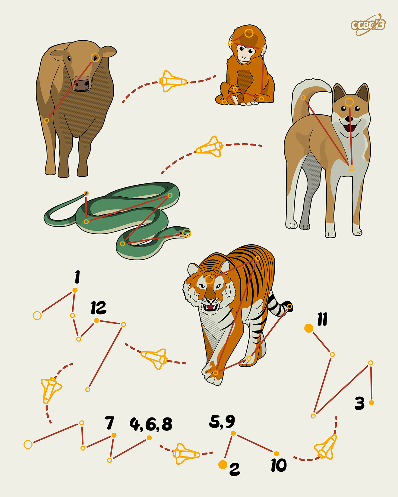

# ⭐

## 题面

## 答案

`OPENING NIGHT`

## 解析

_官方存档未填写解析。_

## 提示

### 1. 题目里的图片分别对应什么单词？

OX, MONKEY, DOG, SNAKE, TIGER

### 2. 还有额外的提示吗？

生肖里的“鸡”一般翻译成ROOSTER。

## 本地附件

- [9610e59a82ac4291a57706a442da6755.webp](../../../assets/archive.cipherpuzzles.com/ccbc13/images/asteroid/9610e59a82ac4291a57706a442da6755.webp)

来源：[https://archive.cipherpuzzles.com/ccbc13/problems/asteroid/102.yaml](https://archive.cipherpuzzles.com/ccbc13/problems/asteroid/102.yaml)
