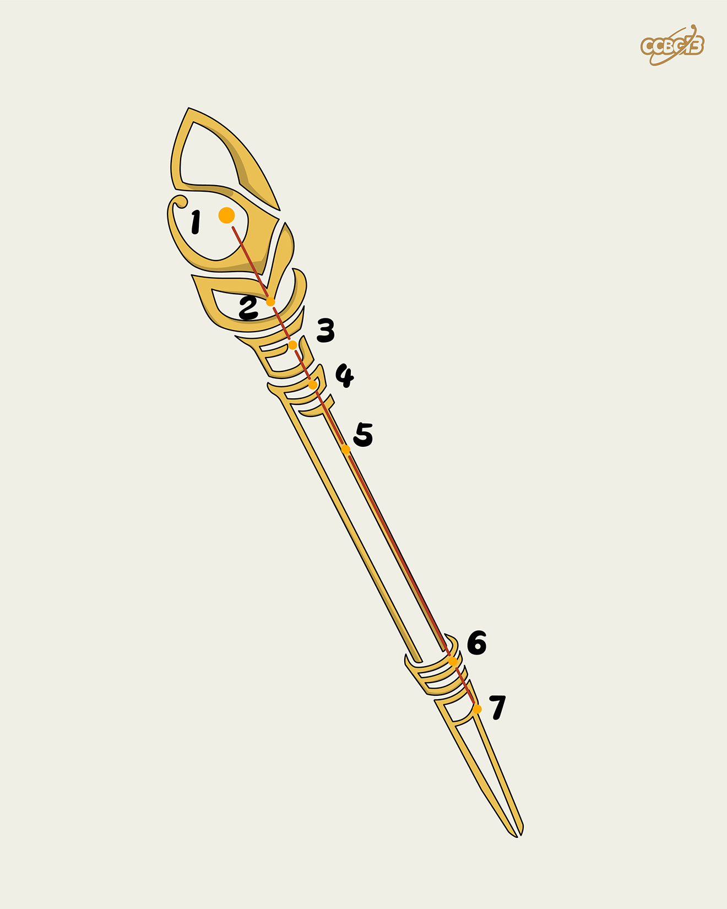

# ⭐

## 题面

## 答案

`SCEPTER`

## 解析

_官方存档未填写解析。_

## 提示

### 1. 我毫无思路

题目里的图片是由字母拼成的。

## 本地附件

- [e50dede2816a48e3839483704cad3177.webp](../../../assets/archive.cipherpuzzles.com/ccbc13/images/asteroid/e50dede2816a48e3839483704cad3177.webp)

来源：[https://archive.cipherpuzzles.com/ccbc13/problems/asteroid/103.yaml](https://archive.cipherpuzzles.com/ccbc13/problems/asteroid/103.yaml)
