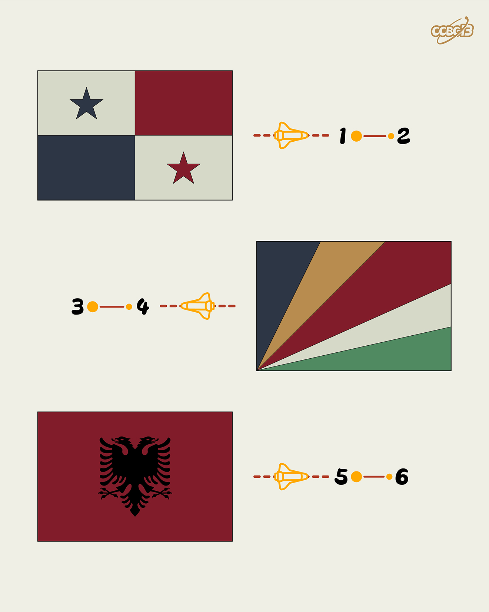

# ⭐

## 题面

## 答案

`PASCAL`

## 解析

_官方存档未填写解析。_

## 提示

### 1. 我毫无思路

有一种方式可以用两位英文字母来表示一个国家

## 本地附件

- [034b5deb13cb4d459249b62d2f053d16.webp](../../../assets/archive.cipherpuzzles.com/ccbc13/images/asteroid/034b5deb13cb4d459249b62d2f053d16.webp)

来源：[https://archive.cipherpuzzles.com/ccbc13/problems/asteroid/104.yaml](https://archive.cipherpuzzles.com/ccbc13/problems/asteroid/104.yaml)
